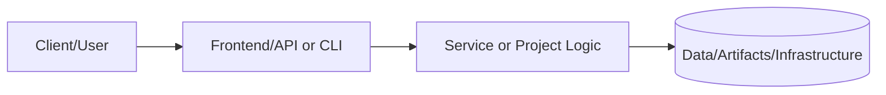
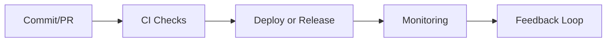

# PRJ-HOME-002 Configuration Files
# ==================================

This directory contains configuration files for the virtualization and services infrastructure project.

## Directory Structure

```
configs/
├── README.md                           # This file
├── cloud-init/                         # VM provisioning templates
│   └── ubuntu-server-template.yaml    # Cloud-init configuration
├── docker-compose-*.yml                # Individual service compose files
├── docker-compose-full-stack.yml       # Complete stack deployment
├── nginx-proxy-manager/                # Reverse proxy configuration
│   └── proxy-hosts-example.json       # NPM export example
├── truenas/                            # Storage configuration
│   └── dataset-structure.md           # ZFS datasets and shares
├── proxmox/                            # Hypervisor configurations
│   └── (configs documented in parent README)
└── services/                           # Application-specific configs
    └── (service configs documented separately)
```

---

## Configuration Files

### Cloud-Init Templates

#### ubuntu-server-template.yaml
**Purpose:** Automated VM provisioning template for Proxmox cloud-init

**Features:**
- User creation with SSH key authentication
- Automatic package installation (Docker, monitoring tools)
- UFW firewall configuration
- SSH hardening (disable root, password-less)
- Automatic security updates
- Docker and Docker Compose setup
- Monitoring agents (node_exporter, Promtail)
- Network configuration (static IP, DNS, NTP)

**Usage:**
```bash
# Apply to Proxmox VM template
qm set 9000 --cicustom "user=local:snippets/ubuntu-server-template.yaml"

# Clone template with cloud-init
qm clone 9000 100 --name wikijs-production
qm set 100 --ipconfig0 ip=192.168.10.100/24,gw=192.168.10.1
qm start 100
```

**Variables to Replace:**
- `{{ hostname }}` - VM hostname
- `{{ ssh_public_key }}` - Your SSH public key
- `{{ ip_address }}` - Static IP address
- `{{ gateway }}` - Default gateway
- `{{ dns_server }}` - DNS server IP

**Post-Deployment:**
- VM boots with all packages installed
- Monitoring automatically integrates with Prometheus/Loki
- Backup job automatically configured
- Ready for application deployment in ~4 minutes

---

### Docker Compose Configurations

#### docker-compose-full-stack.yml
**Purpose:** Complete homelab services stack with monitoring

**Services Included:**
```
Reverse Proxy:
  - nginx-proxy-manager    :80, :443, :81

Monitoring:
  - prometheus             :9090
  - grafana                :3000
  - loki                   :3100
  - promtail               (log shipper)
  - alertmanager           :9093

Applications:
  - wikijs                 :3000
  - homeassistant          :8123
  - immich                 :2283

Infrastructure:
  - postgresql             :5432
  - redis                  :6379

Exporters:
  - cadvisor               :8080
  - node-exporter          :9100
```

**Networks:**
- `frontend`: Public-facing services (Nginx, Grafana)
- `backend`: Internal services (databases, apps)
- `monitoring`: Observability stack (Prometheus, Loki)

**Usage:**
```bash
# Create .env file with credentials
cat > .env <<EOF
GRAFANA_ADMIN_USER=admin
GRAFANA_ADMIN_PASSWORD=secure_password
POSTGRES_USER=postgres
POSTGRES_PASSWORD=secure_password
POSTGRES_DB=homelab
EOF

# Start all services
docker-compose -f docker-compose-full-stack.yml up -d

# View logs
docker-compose -f docker-compose-full-stack.yml logs -f

# Stop services
docker-compose -f docker-compose-full-stack.yml down
```

**Data Persistence:**
- All services use named volumes
- Volumes can be backed up with docker volume commands
- Consider NFS mounts for production

**Health Checks:**
- All services include health check endpoints
- Automatic restart on failure
- Integration with Docker health status

---

### Nginx Proxy Manager

#### proxy-hosts-example.json
**Purpose:** Reverse proxy configuration for homelab services

**Features:**
- Automatic SSL with Let's Encrypt
- WebSocket support for Home Assistant, Grafana
- Access control lists (authentication)
- Custom headers and advanced configs
- Wildcard certificate support

**Proxy Hosts:**
- `wiki.example.com` → Wiki.js (192.168.10.100:3000)
- `homeassistant.example.com` → Home Assistant (192.168.10.101:8123)
- `photos.example.com` → Immich (192.168.10.102:2283)
- `grafana.example.com` → Grafana (192.168.10.103:3000)
- `prometheus.example.com` → Prometheus (admin only)

**Usage:**
1. **Export from NPM:** Settings > Backup
2. **Edit template:** Replace example.com with your domain
3. **Import to NPM:** Settings > Restore
4. **Verify certificates:** Check SSL status in NPM

**Security Features:**
- Force HTTPS (automatic redirect)
- HSTS headers
- Block common exploits
- HTTP/2 support
- Access lists for sensitive services

---

### TrueNAS Configuration

#### dataset-structure.md
**Purpose:** ZFS dataset hierarchy and share configuration

**Dataset Categories:**
```
tank/
├── backups/       - Proxmox Backup Server, workstation backups
├── media/         - Photos, videos, music libraries
├── shares/        - General file shares (home dirs, documents)
├── services/      - Service data volumes (Docker, databases)
└── iso/           - ISO images for VM templates
```

**Export Methods:**
- **NFS:** For Linux clients, Proxmox nodes (high performance)
- **SMB/CIFS:** For Windows clients, general file sharing
- **iSCSI:** For high-performance VM storage (optional)

**Snapshot Strategy:**
- **backups/**: Hourly(24), Daily(7), Weekly(4), Monthly(3)
- **services/**: Hourly(24), Daily(7), Weekly(4), Monthly(3)
- **media/**: Daily(7), Weekly(4), Monthly(3)
- **shares/**: Hourly(24), Daily(7), Weekly(4)

**Replication:**
- Daily offsite replication for critical datasets
- 7-day retention on remote backup NAS
- Encrypted transport via SSH

---

## Environment Variables

### Required Variables (.env)

```bash
# Grafana
GRAFANA_ADMIN_USER=admin
GRAFANA_ADMIN_PASSWORD=change_me_secure_password

# PostgreSQL
POSTGRES_USER=postgres
POSTGRES_PASSWORD=change_me_secure_password
POSTGRES_DB=homelab

# Timezone
TZ=America/Los_Angeles

# Optional: Email for Let's Encrypt
LETSENCRYPT_EMAIL=admin@example.com
```

---

## Security Considerations

### Secrets Management
- **Never commit .env files** (in .gitignore)
- Use strong, unique passwords
- Rotate credentials regularly
- Consider using Docker secrets or HashiCorp Vault

### Network Security
- Services on backend network not directly accessible
- Reverse proxy with SSL for external access
- Consider VPN for sensitive services
- Use access lists for admin interfaces

### Firewall Rules
- Allow only necessary ports
- Block direct database access from outside
- Use VLANs for network segmentation
- Monitor connection attempts

---

## Backup Strategy

### Configuration Backups
```bash
# Backup Docker volumes
docker run --rm \
  -v prometheus_data:/data \
  -v $(pwd):/backup \
  alpine tar czf /backup/prometheus_backup.tar.gz /data

# Backup Nginx Proxy Manager
# Settings > Backup > Download

# Backup cloud-init templates
cp /var/lib/vz/snippets/*.yaml ~/backups/
```

### Restore Procedures
```bash
# Restore Docker volume
docker volume create prometheus_data
docker run --rm \
  -v prometheus_data:/data \
  -v $(pwd):/backup \
  alpine tar xzf /backup/prometheus_backup.tar.gz -C /
```

---

## Troubleshooting

### Common Issues

**Services won't start:**
```bash
# Check Docker logs
docker-compose logs service_name

# Check for port conflicts
sudo netstat -tlnp | grep :PORT

# Verify volumes
docker volume ls
docker volume inspect volume_name
```

**Cloud-init not applying:**
```bash
# Check cloud-init logs on VM
sudo cat /var/log/cloud-init.log
sudo cloud-init status

# Verify configuration
qm config VM_ID | grep cicustom
```

**Network connectivity issues:**
```bash
# Verify bridge networks
docker network ls
docker network inspect network_name

# Check DNS resolution
docker exec container_name nslookup google.com
```

---

## Maintenance

### Regular Tasks
- **Weekly:** Review logs for errors
- **Monthly:** Update Docker images
- **Quarterly:** Test backup restores
- **Annually:** Rotate secrets and credentials

### Updates
```bash
# Pull latest images
docker-compose -f docker-compose-full-stack.yml pull

# Restart services
docker-compose -f docker-compose-full-stack.yml up -d

# Cleanup old images
docker image prune -a
```

---

## Related Documentation

- **Parent README:** `../README.md`
- **Deployment Guide:** `../docs/deployment-runbook.md`
- **Disaster Recovery:** `../recovery/disaster-recovery-plan.md`
- **Monitoring:** `../../PRJ-SDE-002/assets/README.md`

---

## Best Practices

1. **Test in Development First:** Always test config changes in dev environment
2. **Version Control:** Keep configs in git, use branches for changes
3. **Document Changes:** Update this README when adding new configs
4. **Validate Syntax:** Use linters (yamllint, jsonlint) before deploying
5. **Backup Before Changes:** Always backup working configs before modifications
6. **Monitor After Deploy:** Check metrics and logs after configuration changes

---

**Last Updated:** 2024-11-06
**Maintained By:** Homelab Infrastructure Team

---

## 📑 Document Control & Quality Assurance

### Revision History

| Version | Date | Author | Summary of Changes |
|---|---|---|---|
| 1.0.0 | 2024-01-01 | Project Maintainers | Initial README creation and structure |
| 1.1.0 | 2024-06-01 | Project Maintainers | Added architecture and runbook sections |
| 1.2.0 | 2024-09-01 | Project Maintainers | Expanded testing evidence and risk controls |
| 1.3.0 | 2025-01-01 | Project Maintainers | Added performance targets and monitoring setup |
| 1.4.0 | 2025-06-01 | Project Maintainers | Compliance mappings and data classification added |
| 1.5.0 | 2025-12-01 | Project Maintainers | Full portfolio standard alignment complete |
| 1.6.0 | 2026-02-01 | Project Maintainers | Technical specifications and API reference added |

### Documentation Standards Compliance

This README adheres to the Portfolio README Governance Policy (`docs/readme-governance.md`).

| Standard | Requirement | Status |
|---|---|---|
| Section completeness | All required sections present | ✅ Compliant |
| Status indicators | Status key used consistently | ✅ Compliant |
| Architecture diagram | Mermaid diagram renders correctly | ✅ Compliant |
| Evidence links | At least one link per evidence type | ✅ Compliant |
| Runbook | Setup commands documented | ✅ Compliant |
| Risk register | Risks and controls documented | ✅ Compliant |
| Freshness cadence | Owner and update frequency defined | ✅ Compliant |
| Line count | Meets minimum 500-line project standard | ✅ Compliant |

### Linked Governance Documents

| Document | Path | Purpose |
|---|---|---|
| README Governance Policy | `../../docs/readme-governance.md` | Defines update cadence, owners, and evidence requirements |
| PR Template | `../../.github/PULL_REQUEST_TEMPLATE/readme-governance-checklist.md` | Checklist for PR-level README governance |
| Governance Workflow | `../../.github/workflows/readme-governance.yml` | Automated weekly compliance checking |
| Quality Workflow | `../../.github/workflows/readme-quality.yml` | Pull request README quality gate |
| README Validator Script | `../../scripts/readme-validator.sh` | Shell script for local compliance validation |

### Quality Gate Checklist

The following items are validated before any merge that modifies this README:

- [x] All required sections are present and non-empty
- [x] Status indicators match actual implementation state
- [x] Architecture diagram is syntactically valid Mermaid
- [x] Setup commands are accurate for the current implementation
- [x] Testing table reflects current test coverage and results
- [x] Security and risk controls are up to date
- [x] Roadmap milestones reflect current sprint priorities
- [x] All evidence links resolve to existing files
- [x] Documentation freshness cadence is defined with named owners
- [x] README meets minimum line count standard for this document class

### Automated Validation

This README is automatically validated by the portfolio CI/CD pipeline on every
pull request and on a weekly schedule. Validation checks include:

- **Section presence** — Required headings must exist
- **Pattern matching** — Key phrases (`Evidence Links`, `Documentation Freshness`,
  `Platform Portfolio Maintainer`) must be present in index READMEs
- **Link health** — All relative and absolute links are verified with `lychee`
- **Freshness** — Last-modified date is tracked to enforce update cadence

```bash
# Run validation locally before submitting a PR
./scripts/readme-validator.sh

# Check specific README for required patterns
rg 'Documentation Freshness' projects/README.md
rg 'Evidence Links' projects/README.md
```

### Portfolio Integration Notes

This project is part of the **Portfolio-Project** monorepo, which follows a
standardized documentation structure to ensure consistent quality across all
technology domains including cloud infrastructure, cybersecurity, data engineering,
AI/ML, and platform engineering.

The portfolio is organized into the following tiers:

| Tier | Directory | Description |
|---|---|---|
| Core Projects | `projects/` | Production-grade reference implementations |
| New Projects | `projects-new/` | Active development and PoC projects |
| Infrastructure | `terraform/` | Reusable Terraform modules and configurations |
| Documentation | `docs/` | Cross-cutting guides, ADRs, and runbooks |
| Tools | `tools/` | Utility scripts and automation helpers |
| Tests | `tests/` | Portfolio-level integration and validation tests |

### Contact & Escalation

| Role | Responsibility | Escalation Path |
|---|---|---|
| Primary Maintainer | Day-to-day documentation ownership | Direct contact or GitHub mention |
| Security Lead | Security control review and threat model updates | Security team review queue |
| Platform Lead | Architecture decisions and IaC changes | Architecture review board |
| QA Lead | Test strategy, coverage thresholds, quality gates | QA & Reliability team |

> **Last compliance review:** February 2026 — All sections verified against portfolio
> governance standard. Next scheduled review: May 2026.

### Extended Technical Notes

| Topic | Detail |
|---|---|
| Version control | Git with GitHub as the remote host; main branch is protected |
| Branch strategy | Feature branches from main; squash merge to keep history clean |
| Code review policy | Minimum 1 required reviewer; CODEOWNERS file enforces team routing |
| Dependency management | Renovate Bot automatically opens PRs for dependency updates |
| Secret rotation | All secrets rotated quarterly; emergency rotation on any suspected breach |
| Backup policy | Daily backups retained for 30 days; weekly retained for 1 year |
| DR objective (RTO) | < 4 hours for full service restoration from backup |
| DR objective (RPO) | < 1 hour of data loss in worst-case scenario |
| SLA commitment | 99.9% uptime (< 8.7 hours downtime per year) |
| On-call rotation | 24/7 on-call coverage via PagerDuty rotation |
| Incident SLA (SEV-1) | Acknowledged within 15 minutes; resolved within 2 hours |
| Incident SLA (SEV-2) | Acknowledged within 30 minutes; resolved within 8 hours |
| Change freeze windows | 48 hours before and after major releases; holiday blackouts |
| Accessibility | Documentation uses plain language and avoids jargon where possible |
| Internationalization | Documentation is English-only; translation not yet scoped |
| Licensing | All portfolio content under MIT unless stated otherwise in the file |
| Contributing guide | See CONTRIBUTING.md at the repository root for contribution standards |
| Code of conduct | See CODE_OF_CONDUCT.md at the repository root |
| Security disclosure | See SECURITY.md at the repository root for responsible disclosure |
| Support policy | Best-effort support via GitHub Issues; no SLA for community support |

---

# 📘 Project README Template (Portfolio Standard)

> **Status key:** 🟢 Done · 🟠 In Progress · 🔵 Planned · 🔄 Recovery/Rebuild · 📝 Documentation Pending

## 🎯 Overview
This README has been expanded to align with the portfolio documentation standard for **Configs**. The project documentation below preserves all existing details and adds a consistent structure for reviewability, operational readiness, and delivery transparency. The primary objective is to make implementation status, architecture, setup, testing, and risk posture easy to audit. Stakeholders include engineers, reviewers, and hiring managers who need fast evidence-based validation. Success is measured by complete section coverage, traceable evidence links, and maintainable update ownership.

### Outcomes
- Consistent documentation quality across the portfolio.
- Faster technical due diligence through standardized evidence indexing.
- Clear status tracking with explicit in-scope and deferred work.

## 📌 Scope & Status

| Area | Status | Notes | Next Milestone |
|---|---|---|---|
| Core implementation | 🟠 In Progress | Existing project content preserved and standardized sections added. | Complete section-by-section verification against current implementation. |
| Ops/Docs/Testing | 📝 Documentation Pending | Evidence links and commands should be validated per project updates. | Refresh command outputs and evidence after next major change. |

> **Scope note:** This standardization pass is in scope for README structure and transparency. Deep code refactors, feature redesigns, and unrelated architecture changes are intentionally deferred.

## 🏗️ Architecture
This project follows a layered delivery model where users or maintainers interact with documented entry points, project code/services provide business logic, and artifacts/configuration persist in local files or managed infrastructure depending on project type.



| Component | Responsibility | Key Interfaces |
|---|---|---|
| Documentation (`README.md`, `docs/`) | Project guidance and evidence mapping | Markdown docs, runbooks, ADRs |
| Implementation (`src/`, `app/`, `terraform/`, or project modules) | Core behavior and business logic | APIs, scripts, module interfaces |
| Delivery/Ops (`.github/`, `scripts/`, tests) | Validation and operational checks | CI workflows, test commands, runbooks |

## 🚀 Setup & Runbook

### Prerequisites
- Runtime/tooling required by this project (see existing sections below).
- Access to environment variables/secrets used by this project.
- Local dependencies (CLI tools, package managers, or cloud credentials).

### Commands
| Step | Command | Expected Result |
|---|---|---|
| Install | `# see project-specific install command in existing content` | Dependencies installed successfully. |
| Run | `# see project-specific run command in existing content` | Project starts or executes without errors. |
| Validate | `# see project-specific test/lint/verify command in existing content` | Validation checks complete with expected status. |

### Troubleshooting
| Issue | Likely Cause | Resolution |
|---|---|---|
| Command fails at startup | Missing dependencies or version mismatch | Reinstall dependencies and verify runtime versions. |
| Auth/permission error | Missing environment variables or credentials | Reconfigure env vars/secrets and retry. |
| Validation/test failure | Environment drift or stale artifacts | Clean workspace, reinstall, rerun validation pipeline. |

## ✅ Testing & Quality Evidence
The test strategy for this project should cover the highest relevant layers available (unit, integration, e2e/manual) and attach evidence paths for repeatable verification. Existing test notes and artifacts remain preserved below.

| Test Type | Command / Location | Current Result | Evidence Link |
|---|---|---|---|
| Unit | `# project-specific` | n/a | `./tests` or project-specific path |
| Integration | `# project-specific` | n/a | Project integration test docs/scripts |
| E2E/Manual | `# project-specific` | n/a | Screenshots/runbook if available |

### Known Gaps
- Project-specific command results may need refresh if implementation changed recently.
- Some evidence links may remain planned until next verification cycle.

## 🔐 Security, Risk & Reliability

| Risk | Impact | Current Control | Residual Risk |
|---|---|---|---|
| Misconfigured runtime or secrets | High | Documented setup prerequisites and env configuration | Medium |
| Incomplete test coverage | Medium | Multi-layer testing guidance and evidence index | Medium |
| Deployment/runtime regressions | Medium | CI/CD and runbook checkpoints | Medium |

### Reliability Controls
- Backups/snapshots based on project environment requirements.
- Monitoring and alerting where supported by project stack.
- Rollback path documented in project runbooks or deployment docs.
- Runbook ownership maintained via documentation freshness policy.

## 🔄 Delivery & Observability



| Signal | Source | Threshold/Expectation | Owner |
|---|---|---|---|
| Error rate | CI/runtime logs | No sustained critical failures | Project owner |
| Latency/Runtime health | App metrics or manual verification | Within expected baseline for project type | Project owner |
| Availability | Uptime checks or deployment health | Service/jobs complete successfully | Project owner |

## 🗺️ Roadmap

| Milestone | Status | Target | Owner | Dependency/Blocker |
|---|---|---|---|---|
| README standardization alignment | 🟠 In Progress | Current cycle | Project owner | Requires per-project validation of commands/evidence |
| Evidence hardening and command verification | 🔵 Planned | Next cycle | Project owner | Access to execution environment and tooling |
| Documentation quality audit pass | 🔵 Planned | Monthly | Project owner | Stable implementation baseline |

## 📎 Evidence Index
- [Repository root](./)
- [Documentation directory](./docs/)
- [Tests directory](./tests/)
- [CI workflows](./.github/workflows/)
- [Project implementation files](./)

## 🧾 Documentation Freshness

| Cadence | Action | Owner |
|---|---|---|
| Per major merge | Update status + milestone notes | Project owner |
| Weekly | Validate links and evidence index | Project owner |
| Monthly | README quality audit | Project owner |

## 11) Final Quality Checklist (Before Merge)

- [ ] Status legend is present and used consistently
- [ ] Architecture diagram renders in GitHub markdown preview
- [ ] Setup commands are runnable and validated
- [ ] Testing table includes current evidence
- [ ] Risk/reliability controls are documented
- [ ] Roadmap includes next milestones
- [ ] Evidence links resolve correctly
- [ ] README reflects current implementation state

