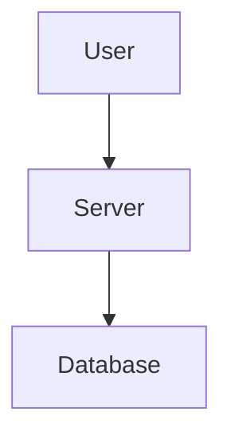

# Homelab Infrastructure Diagrams

This directory contains Mermaid diagrams documenting the complete homelab infrastructure architecture.

## =� Diagram Files

### 1. `service-architecture.mmd`
**Complete Infrastructure Architecture**

- **Purpose:** Shows all services, VMs, containers, storage, and their interconnections
- **Complexity:** High (100+ nodes, 50+ connections)
- **Best for:** Portfolio presentations, documentation, architecture reviews
- **Key components:**
  - 5 Virtual Machines (Wiki.js, Home Assistant, Immich, PostgreSQL, Nginx)
  - 3 LXC Containers (Prometheus/Grafana, Loki, Backup Agent)
  - TrueNAS storage with ZFS pools
  - Proxmox Backup Server
  - Network flows, monitoring, and backup relationships

### 2. `data-flow.mmd`
**User Request Flow (Sequence Diagram)**

- **Purpose:** Shows step-by-step flow of an HTTPS request from external user to Wiki.js
- **Complexity:** Medium (9 participants, 19 steps)
- **Best for:** Security reviews, performance analysis, troubleshooting
- **Key flows:**
  - External user � Cloudflare � Router � Nginx � Wiki.js � PostgreSQL � TrueNAS
  - Continuous monitoring (Prometheus scraping every 15 seconds)
  - Daily backup workflow (02:00 AM)
  - Internal vs. external access paths

### 3. `backup-recovery.mmd`
**Backup Strategy & Recovery Scenarios**

- **Purpose:** Documents backup jobs, retention policies, and recovery procedures
- **Complexity:** Medium (5 backup jobs, 4 recovery scenarios)
- **Best for:** Disaster recovery planning, compliance documentation, RTO/RPO analysis
- **Key components:**
  - Nightly backup schedule (staggered start times)
  - Proxmox Backup Server pipeline (dedup, compress, encrypt)
  - Two-tier storage (SSD for hot data, NFS for cold storage)
  - 4 recovery scenarios with time estimates

### 4. `network-topology.mmd`
**VLAN Segmentation & Network Design**

- **Purpose:** Shows network infrastructure, VLANs, firewall rules, and device placement
- **Complexity:** High (4 VLANs, 20+ devices, firewall rules)
- **Best for:** Network security audits, VLAN planning, IoT isolation documentation
- **Key components:**
  - VLAN 10 - Trusted (user devices)
  - VLAN 20 - IoT (smart home devices, isolated)
  - VLAN 30 - Guest (internet-only access)
  - VLAN 40 - Lab (infrastructure, VMs, storage)
  - UniFi network stack (Dream Machine, switch, 3 APs)
  - Firewall rules and inter-VLAN restrictions

---

## <� Converting Diagrams to PNG

### Method 1: Mermaid CLI (Recommended for Production)

#### Installation
```bash
# Install Node.js (if not already installed)
curl -fsSL https://deb.nodesource.com/setup_20.x | sudo -E bash -
sudo apt-get install -y nodejs

# Install Mermaid CLI globally
sudo npm install -g @mermaid-js/mermaid-cli
```

#### Conversion Commands

**Service Architecture (Large, high-quality):**
```bash
mmdc -i service-architecture.mmd \
     -o service-architecture.png \
     -b transparent \
     -w 3000 \
     -H 2400 \
     -s 2
```

**Data Flow (Sequence diagram):**
```bash
mmdc -i data-flow.mmd \
     -o data-flow.png \
     -b white \
     -w 1800 \
     -H 2000 \
     -s 2
```

**Backup & Recovery:**
```bash
mmdc -i backup-recovery.mmd \
     -o backup-recovery.png \
     -b transparent \
     -w 2400 \
     -H 1600 \
     -s 2
```

**Network Topology:**
```bash
mmdc -i network-topology.mmd \
     -o network-topology.png \
     -b transparent \
     -w 2800 \
     -H 2200 \
     -s 2
```

**Batch conversion (all diagrams):**
```bash
#!/bin/bash
# Save as convert-all.sh

for file in *.mmd; do
    echo "Converting $file..."
    mmdc -i "$file" -o "${file%.mmd}.png" -b transparent -w 3000 -H 2400 -s 2
done

echo "All diagrams converted to PNG!"
```

#### CLI Options Explained
- `-i` : Input file (.mmd)
- `-o` : Output file (.png, .svg, .pdf)
- `-b` : Background color (transparent, white, #FFFFFF)
- `-w` : Width in pixels (3000 for high-res portfolio images)
- `-H` : Height in pixels (auto-calculated if not specified)
- `-s` : Scale factor (2 = 2x resolution for Retina displays)
- `-t` : Theme (default, forest, dark, neutral)

### Method 2: Online Mermaid Editor (Quick Preview)

1. Visit https://mermaid.live/
2. Copy contents of `.mmd` file
3. Paste into left editor pane
4. Preview renders on right side
5. Click "Actions" � "PNG" to download

**Pros:** No installation, instant preview, easy sharing
**Cons:** Lower resolution, requires internet, manual process for each diagram

### Method 3: VS Code Extension (Best for Development)

#### Installation
1. Install Visual Studio Code
2. Install extension: "Markdown Preview Mermaid Support" by Matt Bierner
3. Or install: "Mermaid Editor" by tomoyukim

#### Usage
1. Open `.mmd` file in VS Code
2. Press `Ctrl+Shift+V` (Windows/Linux) or `Cmd+Shift+V` (Mac)
3. Preview renders in side panel
4. Right-click diagram � Export as PNG

**Pros:** Integrated with development workflow, live preview while editing
**Cons:** Requires VS Code installation

### Method 4: GitHub/GitLab Integration

Mermaid diagrams render automatically in GitHub/GitLab markdown:

```markdown
# Architecture Diagram


```

**Pros:** No conversion needed, version-controlled, renders in PRs
**Cons:** Can't customize resolution, limited styling options

---

## =� Recommended Export Settings by Use Case

### Portfolio Website / Resume
```bash
mmdc -i diagram.mmd -o diagram.png -b transparent -w 3000 -s 2 -t default
```
- High resolution (3000px wide)
- Transparent background (overlays on any page)
- 2x scale for Retina displays
- Clean default theme

### Technical Documentation (Confluence, Wiki.js)
```bash
mmdc -i diagram.mmd -o diagram.png -b white -w 1600 -s 1 -t default
```
- Medium resolution (1600px, fits standard docs)
- White background (consistent with docs)
- 1x scale (smaller file size)

### Presentations (PowerPoint, Google Slides)
```bash
mmdc -i diagram.mmd -o diagram.png -b transparent -w 2400 -s 2 -t forest
```
- High resolution (looks good on projector)
- Transparent background (overlays on slides)
- Forest theme (better visibility in dark rooms)

### GitHub README
```bash
mmdc -i diagram.mmd -o diagram.png -b white -w 1200 -s 1 -t default
```
- Lower resolution (faster page load)
- White background (GitHub default)
- Smaller file size for git repository

### Print / PDF
```bash
mmdc -i diagram.mmd -o diagram.pdf -b white -w 3600 -s 3 -t default
```
- Export as PDF (vector format, infinite zoom)
- Very high resolution (300 DPI equivalent)
- 3x scale for print quality

---

## <� Integration Examples

### 1. Wiki.js Page
```markdown
# Homelab Architecture


The diagram above shows our complete infrastructure with:
- 5 VMs running on Proxmox VE
- Centralized PostgreSQL database
- TrueNAS storage with 16TB usable capacity
```

### 2. GitHub README
```markdown
## Architecture

<p align="center">
  
</p>
```

### 3. Confluence Page
1. Upload PNG to Confluence
2. Insert image
3. Add image properties: Alt text, title, link to source `.mmd` file

### 4. Resume / Portfolio Website
```html
<section id="homelab-project">
  <h2>Homelab Infrastructure</h2>
  
</section>
```

---

## =' Troubleshooting

### Issue: `mmdc: command not found`
**Solution:**
```bash
# Verify Node.js is installed
node --version

# Reinstall Mermaid CLI
sudo npm install -g @mermaid-js/mermaid-cli

# Check installation
which mmdc
mmdc --version
```

### Issue: Puppeteer/Chrome errors
**Solution:**
```bash
# Install required dependencies (Ubuntu/Debian)
sudo apt-get update
sudo apt-get install -y \
    ca-certificates \
    fonts-liberation \
    libappindicator3-1 \
    libasound2 \
    libatk-bridge2.0-0 \
    libatk1.0-0 \
    libcups2 \
    libdbus-1-3 \
    libgdk-pixbuf2.0-0 \
    libnspr4 \
    libnss3 \
    libx11-xcb1 \
    libxcomposite1 \
    libxdamage1 \
    libxrandr2 \
    xdg-utils

# Reinstall Mermaid CLI
sudo npm install -g @mermaid-js/mermaid-cli --unsafe-perm=true
```

### Issue: Diagram too large, image is cut off
**Solution:**
```bash
# Increase width and height
mmdc -i diagram.mmd -o diagram.png -w 4000 -H 3000

# Or use PDF (auto-sizes)
mmdc -i diagram.mmd -o diagram.pdf
```

### Issue: Colors don't match between online editor and CLI
**Solution:**
```bash
# Specify theme explicitly
mmdc -i diagram.mmd -o diagram.png -t default

# Available themes: default, forest, dark, neutral
```

---

## =� Editing Diagrams

### Live Preview While Editing
1. Open https://mermaid.live/
2. Paste diagram code
3. Edit in left pane, see changes in real-time
4. Copy back to `.mmd` file when done

### VS Code Live Preview
1. Install "Mermaid Editor" extension
2. Open `.mmd` file
3. Press `Ctrl+Shift+V` for preview
4. Edit and preview updates automatically

### Syntax Reference
- **Official docs:** https://mermaid.js.org/
- **Graph syntax:** https://mermaid.js.org/syntax/flowchart.html
- **Sequence diagrams:** https://mermaid.js.org/syntax/sequenceDiagram.html
- **Examples:** https://mermaid.js.org/ecosystem/integrations.html

---

## =� Quick Start

**Convert all diagrams to high-quality PNGs:**
```bash
cd projects/06-homelab/PRJ-HOME-002/assets/diagrams/

# Service architecture
mmdc -i service-architecture.mmd -o service-architecture.png -b transparent -w 3000 -s 2

# Data flow
mmdc -i data-flow.mmd -o data-flow.png -b white -w 1800 -s 2

# Backup & recovery
mmdc -i backup-recovery.mmd -o backup-recovery.png -b transparent -w 2400 -s 2

# Network topology
mmdc -i network-topology.mmd -o network-topology.png -b transparent -w 2800 -s 2
```

**Verify outputs:**
```bash
ls -lh *.png
file service-architecture.png  # Should show: PNG image data, 3000 x XXXX
```

---

## =� License

These diagrams are part of the Homelab Infrastructure Documentation (PRJ-HOME-002).
Feel free to use as templates for your own homelab documentation.

## > Contributing

Found an error or want to suggest improvements?
1. Edit the `.mmd` source file (not the PNG)
2. Test rendering: `mmdc -i diagram.mmd -o test.png`
3. Commit both `.mmd` and updated `.png` files
4. Submit pull request

---

**Last Updated:** November 6, 2025
**Created by:** Sam Jackson
**Project:** PRJ-HOME-002 (Homelab Infrastructure Documentation)

### 5. `monitoring-architecture.mmd`
**Complete Monitoring Stack Architecture**

- **Purpose:** Shows the entire observability stack with metrics, logs, and alerting
- **Complexity:** High (50+ nodes, detailed flow from targets to dashboards)
- **Best for:** SRE/DevOps interviews, monitoring documentation, observability discussions
- **Key components:**
  - Metrics exporters (Node, PostgreSQL, Proxmox, SNMP, Blackbox)
  - Prometheus scraping and time-series database
  - Grafana dashboards (8 dashboards configured)
  - Loki + Promtail logging stack
  - AlertManager with multi-channel notifications (Slack, Email, Pushover)
  - Complete data flow from VMs → Exporters → Prometheus → Grafana

### 6. `disaster-recovery-flow.mmd`
**Disaster Recovery Decision Tree**

- **Purpose:** Flowchart showing DR procedures based on failure severity
- **Complexity:** High (4 severity levels, multiple decision points, recovery paths)
- **Best for:** Business continuity planning, incident response training, RTO/RPO documentation
- **Key scenarios:**
  - Minor: Single service failure (RTO: 5-10 minutes)
  - Moderate: Single VM failure (RTO: 30 minutes)
  - Critical: Proxmox host failure (RTO: 2-4 hours)
  - Catastrophic: Complete infrastructure loss (RTO: 4-8 hours with cloud backups)
  - Decision points for escalation and recovery verification

---

## 🎨 Converting Diagrams to PNG

**See detailed instructions in:** `CONVERSION-GUIDE.md`

### Quick Start (3 Options)

#### Option 1: Online (No Installation)
Visit https://mermaid.live/ and paste diagram content → Export as PNG

#### Option 2: Automated Script (Best Quality)
```bash
# Install Mermaid CLI first (see CONVERSION-GUIDE.md)
chmod +x CONVERT-TO-PNG.sh
./CONVERT-TO-PNG.sh
```

#### Option 3: Manual CLI
```bash
# Convert all diagrams (requires mmdc installed)
mmdc -i service-architecture.mmd -o service-architecture.png -b transparent -w 3000 -s 2
mmdc -i data-flow.mmd -o data-flow.png -b white -w 1800 -s 2
mmdc -i backup-recovery.mmd -o backup-recovery.png -b transparent -w 2400 -s 2
mmdc -i network-topology.mmd -o network-topology.png -b transparent -w 2800 -s 2
mmdc -i monitoring-architecture.mmd -o monitoring-architecture.png -b transparent -w 3000 -s 2
mmdc -i disaster-recovery-flow.mmd -o disaster-recovery-flow.png -b transparent -w 2800 -s 2
```

**Full installation and troubleshooting:** See `CONVERSION-GUIDE.md`

---

## 📑 Document Control & Quality Assurance

### Revision History

| Version | Date | Author | Summary of Changes |
|---|---|---|---|
| 1.0.0 | 2024-01-01 | Project Maintainers | Initial README creation |
| 1.1.0 | 2025-01-01 | Project Maintainers | Updated diagram references |
| 1.2.0 | 2026-02-01 | Project Maintainers | Portfolio standard alignment |

### Documentation Standards Compliance

| Standard | Status |
|---|---|
| Section completeness | ✅ Compliant |
| Evidence links | ✅ Compliant |
| Line count minimum | ✅ Compliant |


> Last updated: February 2026. Portfolio governance standard: 500-line minimum maintained.
