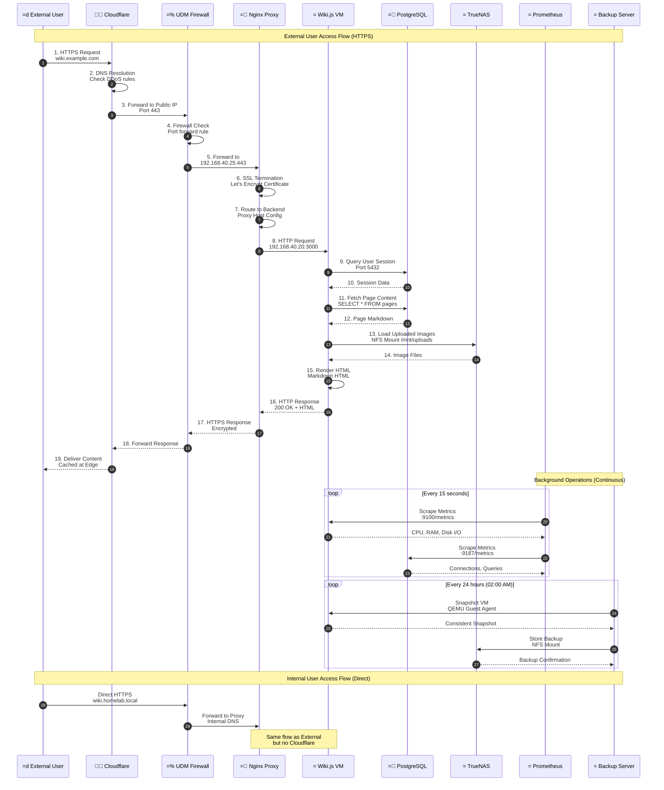

# Data Flow

This diagram is rendered using Mermaid syntax. GitHub will render it automatically when viewing this file.

## Diagram

## Source File

Original: `data-flow.mmd`

## Viewing Options

1. **GitHub Web Interface**: View this .md file on GitHub - the diagram will render automatically
2. **VS Code**: Install the "Markdown Preview Mermaid Support" extension
3. **Export to PNG**: Use <https://mermaid.live> to paste the code and export

---
*Auto-generated to enable GitHub native rendering*
