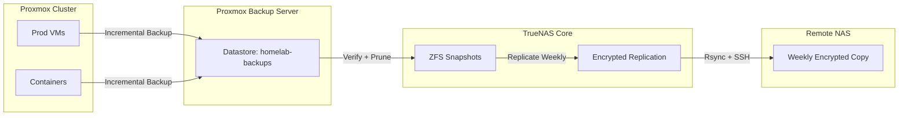

# Backup Strategy & Retention

This document outlines backup policy, retention, and verification for PRJ-HOME-002. All values are sanitized.

## Policy Overview
- **3-2-1 Rule:** Three copies, two media types, one offsite.
- **Scope:** Proxmox VMs, LXC containers, Docker volumes, and TrueNAS datasets critical to core services.
- **Primary Tools:** Proxmox Backup Server (PBS) for VM/CT backups; TrueNAS snapshots + replication for datasets.

## Schedules
- **Daily (02:00):** PBS backups for P0/P1 VMs (FreeIPA, Pi-hole, Nginx, Wiki.js, Home Assistant, Immich, PostgreSQL).
- **Weekly (Sunday 03:00):** Full backup of monitoring/logging containers and supporting services.
- **TrueNAS Snapshots:** Hourly (24), Daily (7), Weekly (4), Monthly (3) per dataset as defined in `../configs/truenas/dataset-structure.md`.
- **Offsite Replication:** Weekly rsync of `tank/backups` to remote NAS with encryption enabled.

## Retention
- **VM/CT Backups (PBS):** 7 daily, 4 weekly, 12 monthly restore points.
- **Logs (Loki):** 90-day retention with index compaction; forward critical alerts to Grafana OnCall.
- **Monitoring (Prometheus):** 30-day retention; long-term metrics pushed to object storage (not included here).

## Verification
- **Nightly:** Run `assets/automation/scripts/backup-verify.sh` to confirm latest PBS job success; results logged to `assets/logs/backup-rotation.log`.
- **Weekly:** Restore test VM to isolated VLAN and validate service start; capture timing in `docs/lessons-learned.md`.
- **Monthly:** Random file restores from TrueNAS snapshots for Immich and Wiki.js uploads.

## Data Flow

## Storage Targets
- **PBS Datastore:** `/mnt/datastore/homelab-backups` (NFS from TrueNAS `backup` pool).
- **TrueNAS Snapshots:** Managed per dataset; see `../configs/truenas/dataset-structure.md` for pool layout.
- **Offsite:** `backup-nas.example.com:/mnt/backup/homelab` via SSH key auth; bandwidth limited to 50 Mbps at night.

## Monitoring & Alerting
- Grafana dashboards track backup duration, dedupe ratio, and success rate.
- Alert if no successful backup in 24 hours or PBS datastore usage > 85%.
- Send PBS job summaries to operations channel; include sanitized job IDs.

## Restoration Notes
- Prefer restoring to new VM IDs to preserve backup chains; reassign static IP after validation.
- For large restores, target local LVM first, then migrate to Ceph for HA.
- Validate application integrity (DB checks, media hashes) before declaring success.

## Compliance & Security
- All configs sanitized (no real IPs/domains); API tokens stored outside repo.
- PBS datastore encrypted at rest; offsite replication uses SSH + restic-style checksums.
- Access to backup hosts restricted to management VLAN; audit via centralized syslog.
