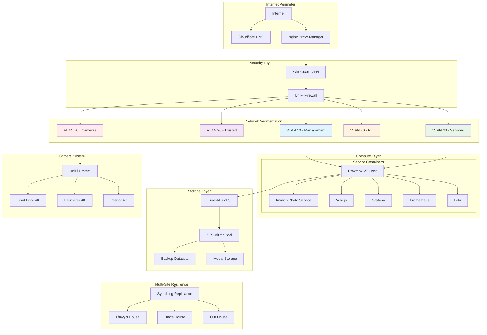
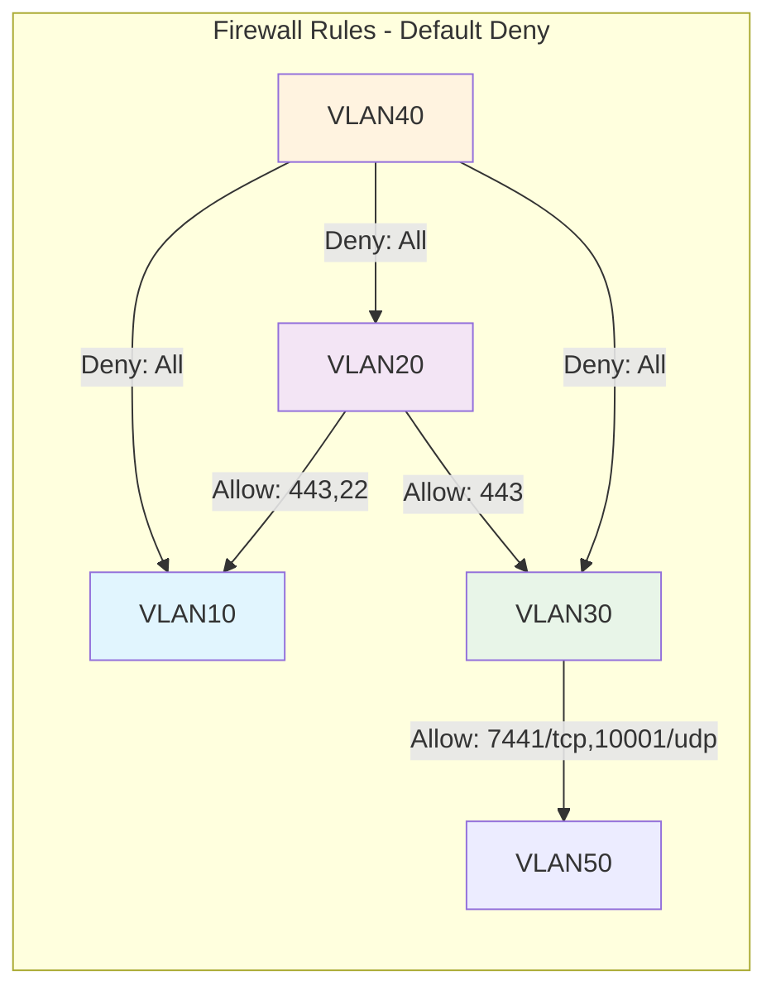
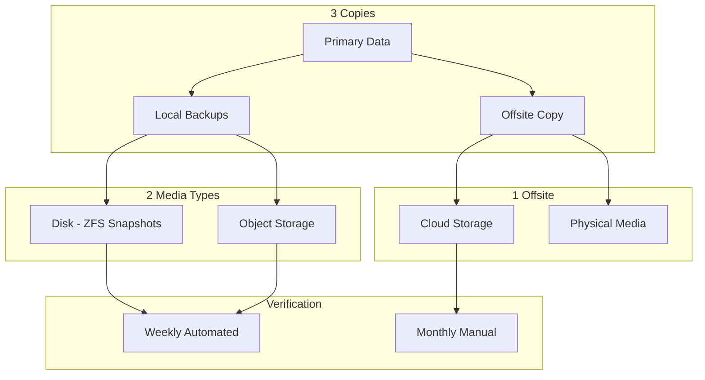
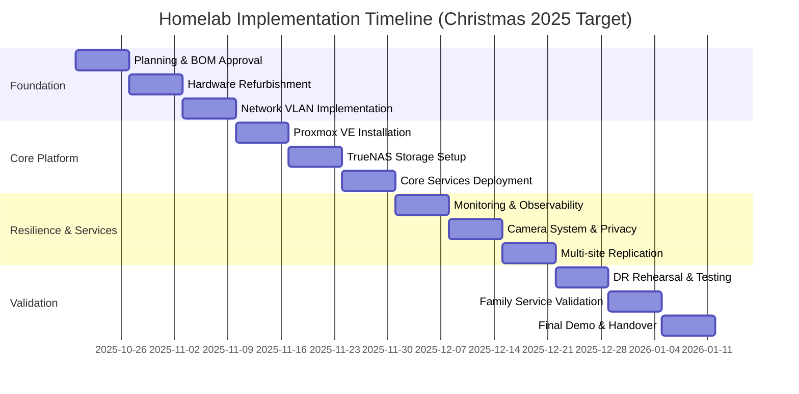
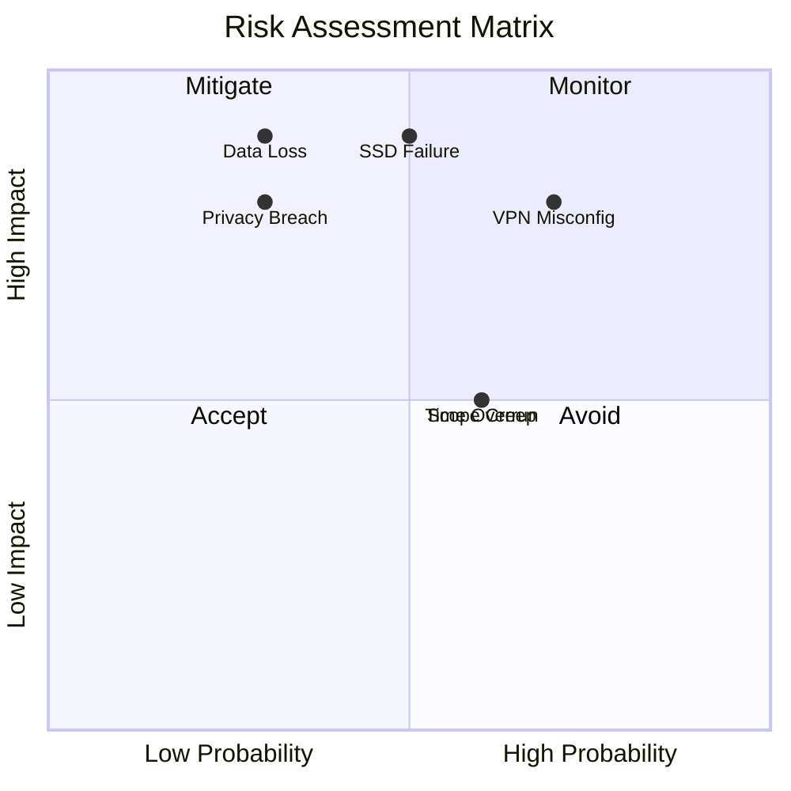
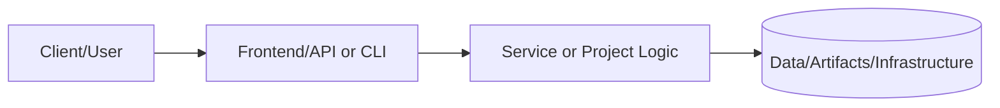
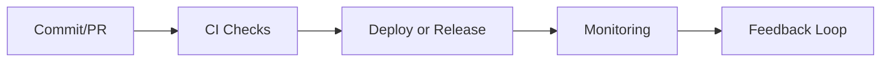

# Homelab Program — Final Proposal & Implementation Plan (v6.0)

## Documentation
For cross-project documentation, standards, and runbooks, see the [Portfolio Documentation Hub](../../../DOCUMENTATION_INDEX.md).


**Status:** 🟠 In Progress
**Category:** Homelab & Enterprise Infrastructure
**Technologies:** Proxmox VE, TrueNAS, UniFi, WireGuard, Nginx Proxy Manager, Prometheus, Grafana, Loki, Immich
**Complexity:** Expert

**Owner:** Samuel Jackson
**Sponsor:** Andrew Vongsady
**Version:** 6.0 (Final Comprehensive)
**Date:** December 16, 2024

---

## Executive Summary

This program transforms decommissioned workstation hardware into a production-style homelab implementing enterprise-grade patterns for security, reliability, and observability. The architecture features segmented UniFi networking, VPN-only administrative access, policy-driven firewalling, Proxmox virtualization, and TrueNAS ZFS storage. Services are securely exposed via a hardened reverse proxy with automatic TLS management, protected by comprehensive monitoring (Prometheus/Grafana/Loki) and verifiable 3-2-1 backups.

This foundation enables Phase 2: developing an elder-friendly, accessibility-first private photo service (Immich) for family use, targeted for Christmas 2025 delivery.

### Primary Outcomes & KPIs

| Category            | Target                                   | Success Criteria                                          |
| ------------------- | ---------------------------------------- | --------------------------------------------------------- |
| **Reliability**     | ≥ 99.9% availability (90-day period)     | Grafana SLO monitoring & uptime exports                   |
| **Security**        | 0 WAN-exposed admin interfaces           | WAN scan verification; VPN+MFA enforcement                |
| **Data Protection** | RPO ≤ 24h, RTO ≤ 4h                      | Weekly automated verification; monthly restore rehearsals |
| **Observability**   | Actionable dashboards + low-noise alerts | Grafana SLO tracking; documented RCAs                     |
| **Family Service**  | Elder-friendly photo sharing             | < 2 support calls/week; 90% task success rate             |

---

## Quick Start Guide

**New to this project?** Start here:

1. **Overview:** Read the [Executive Summary](#executive-summary) above for project goals and KPIs
2. **Architecture:** Review [Solution Architecture](#3-solution-architecture) for system design
3. **Operations:** Check [Daily Operations Runbook](assets/documentation/runbooks/daily-operations.md) for day-to-day tasks
4. **Configuration:** Explore [assets/configs/](assets/configs/) for ready-to-use configuration templates
5. **Network:** See [IP Allocation Table](assets/documentation/network/ip-allocation-table.md) for network layout

**For Operators:**

- [Daily Operations](assets/documentation/runbooks/daily-operations.md) - Your morning routine
- [Incident Response](assets/documentation/runbooks/incident-response.md) - When things go wrong
- [Disaster Recovery](assets/documentation/runbooks/disaster-recovery.md) - Emergency procedures

**For Implementers:**

- [Implementation Timeline](#8-implementation-timeline--milestones) - Project phases and milestones
- [Bill of Materials](#7-bill-of-materials--budget) - Required hardware and budget
- [Configuration Files](assets/configs/) - All service configurations

---

## Table of Contents

- [1. Problem Statement & Business Case](#1-problem-statement--business-case)
- [2. Scope](#2-scope)
- [3. Solution Architecture](#3-solution-architecture)
- [4. Network, Storage & Security Design](#4-network-storage--security-design)
- [5. Backup, Recovery & Operations](#5-backup-recovery--operations)
- [6. Family Photo Service — Elder-Friendly Design](#6-family-photo-service--elder-friendly-design)
- [7. Bill of Materials & Budget](#7-bill-of-materials--budget)
- [8. Implementation Timeline & Milestones](#8-implementation-timeline--milestones)
- [9. Risk Management](#9-risk-management)
- [10. Proof of Concept & Acceptance Criteria](#10-proof-of-concept--acceptance-criteria)
- [11. Demonstrated Competencies](#11-demonstrated-competencies)
- [12. Final Outcomes & Quality Gates](#12-final-outcomes--quality-gates)
- [13. Appendices](#13-appendices)

---

## 1. Problem Statement & Business Case

Traditional homelabs typically operate on flat networks with weak authentication, minimal documentation, and untested backups—presenting both security risks and poor professional demonstration value.

### Business Value

- **Cost Efficiency:** Reuses existing hardware with open-source software stack (~97% TCO savings vs. cloud)
- **Risk Reduction:** Sandboxed environment for testing updates and configurations before production
- **Skills Development:** Hands-on platform for Systems, DevOps, SRE, and QA competencies
- **Family Foundation:** Enables elder-friendly photo service with privacy-first multi-site resilience

### Problems Addressed

1. **Skills Gap:** Certifications ≠ production experience. This program provides real implementation of enterprise SRE/Infrastructure patterns.
2. **Family Privacy & Usability:** Commercial photo platforms are complex for seniors and monetize personal data.
3. **Underused Assets:** Repurpose quality enterprise hardware; avoid cloud lock-in and recurring service costs.

---

## 2. Scope

### In Scope

- **Virtualization:** Proxmox VE on repurposed HP workstation
- **Storage:** TrueNAS CORE with ZFS mirroring and automated snapshots
- **Networking:** UniFi VLAN segmentation with policy-based firewalling
- **Security:** WireGuard VPN, Nginx Proxy Manager, zero-trust access model
- **Observability:** Prometheus/Grafana/Loki full-stack monitoring with alerting
- **Data Protection:** 3-2-1 backup strategy with multi-site replication
- **Family Services:** Immich photo service with elder-friendly accessibility features
- **Documentation:** Wiki.js with architecture diagrams and operational runbooks

### Out of Scope

- Internet-exposed administrative interfaces
- Multi-site high-availability clustering
- Commercial SIEM or paid security monitoring services
- 24/7 on-call support guarantees

---

## 3. Solution Architecture

### 3.1 High-Level Architecture



**Architecture Diagram:** See [assets/diagrams/architecture-overview.mermaid](assets/diagrams/architecture-overview.mermaid)

### 3.2 Technical Stack

| Component     | Technology                  | Rationale                                          |
| ------------- | --------------------------- | -------------------------------------------------- |
| Hypervisor    | Proxmox VE 8.x              | Open-source; enterprise features; LXC support      |
| Storage       | TrueNAS CORE 13.x           | ZFS checksums; compression; snapshots              |
| Networking    | UniFi UDM-Pro + switches    | Integrated AP/PoE/Protect; centralized management  |
| VPN           | WireGuard                   | Modern crypto; high performance; simplicity        |
| Reverse Proxy | Nginx Proxy Manager         | Automatic TLS; SNI routing; web UI                 |
| Monitoring    | Prometheus + Grafana + Loki | Full-stack observability with alerting             |
| Photo Service | Immich                      | Modern interface; mobile-friendly; GPU acceleration |

---

## 4. Network, Storage & Security Design

### 4.1 Network Segmentation

| VLAN ID | Name       | Subnet          | Purpose                    | Trust Level |
| ------- | ---------- | --------------- | -------------------------- | ----------- |
| 10      | Management | 192.168.10.0/24 | Infrastructure controllers | High        |
| 20      | Trusted    | 192.168.20.0/24 | Admin workstations         | Medium      |
| 30      | Services   | 192.168.30.0/24 | Application servers        | Low         |
| 40      | IoT        | 192.168.40.0/24 | Smart devices              | Untrusted   |
| 50      | Cameras    | 192.168.50.0/24 | UniFi Protect cameras      | No Trust    |

### 4.2 Firewall Policy Matrix



**Firewall Rules Diagram:** See [assets/diagrams/firewall-policy.mermaid](assets/diagrams/firewall-policy.mermaid)

#### Explicit Allow Rules

| From       | To            | Ports               | Action   | Purpose                        |
| ---------- | ------------- | ------------------- | -------- | ------------------------------ |
| VLAN 20    | VLAN 10       | TCP 443, 22         | Allow    | Admin to management plane      |
| VLAN 20    | VLAN 30       | TCP 443             | Allow    | Users to apps via proxy        |
| VLAN 30    | VLAN 50       | TCP 7441, UDP 10001 | Allow    | Protect adoption/streams       |
| VLAN 40/50 | VLAN 10/20/30 | Any                 | **Deny** | East/West isolation            |
| WAN        | Admin planes  | Any                 | **Deny** | VPN-only administrative access |

### 4.3 Storage Architecture

#### ZFS Pool Configuration

- **Pool:** `tank` = mirror(ssd1, ssd2)
- **Settings:** `ashift=12`, `compression=zstd`, `atime=off`
- **Datasets:**
  - `tank/backups` — Proxmox VM/CT backups (NFS export)
  - `tank/media` — Immich photo uploads (NFS export)
  - `tank/configs` — Application configurations (NFS/SMB)

#### Snapshot Schedule

| Frequency | Retention | Purpose                          |
| --------- | --------- | -------------------------------- |
| Hourly    | 24        | Recent changes, quick rollback   |
| Daily     | 7         | Day-to-day recovery              |
| Weekly    | 4         | Medium-term history              |
| Monthly   | 3-6       | Long-term archival               |

Optional: Encrypted replication to S3-compatible storage or USB drives for offsite backup.

### 4.4 Security Hardening

#### Access Controls

- **VPN-Only Admin:** Zero WAN-exposed administrative interfaces
- **MFA Enforcement:** All management interfaces require multi-factor authentication
- **SSH Keys Only:** `PasswordAuthentication no` across all systems
- **Least Privilege:** Services run with minimal required permissions

#### System Hardening

- **CIS Benchmark Compliance:** Targeting 92%+ compliance
- **Patch Management:** Weekly security patches; critical vulnerabilities within 72 hours
- **Log Retention:** 14-30 days with PII redaction
- **Security Headers:** Comprehensive HTTP security headers on all proxied services

#### Ingress Security Headers (Nginx)

```nginx
add_header Strict-Transport-Security "max-age=31536000; includeSubDomains" always;
add_header X-Frame-Options "DENY" always;
add_header X-Content-Type-Options "nosniff" always;
add_header Referrer-Policy "strict-origin-when-cross-origin" always;
add_header Permissions-Policy "geolocation=(), microphone=(), camera=()" always;
add_header Content-Security-Policy "default-src 'self'; img-src 'self' data:; frame-ancestors 'none';" always;
```

#### Rate Limiting

```nginx
limit_req_zone $binary_remote_addr zone=api_zone:10m rate=10r/s;
# location /api { limit_req zone=api_zone burst=20 nodelay; }
```

---

## 5. Backup, Recovery & Operations

### 5.1 3-2-1 Backup Strategy



**Backup Strategy Diagram:** See [assets/diagrams/backup-strategy.mermaid](assets/diagrams/backup-strategy.mermaid)

#### Backup Scope

- **VM/Container Backups:** Nightly Proxmox snapshots
- **Database Dumps:** Nightly Postgres dumps with SHA256 checksums
- **Application Data:** Nightly rsync of Immich uploads with verification
- **Configuration Files:** Version-controlled in Git repository
- **Verification:** Weekly automated restore tests; monthly manual validation

#### PostgreSQL Backup & Verification Example

```bash
# Backup with checksum
ts=$(date +%Y%m%d-%H%M)
pg_dump -U wikijs -h 192.168.30.15 -F c wikijs > /backup/wikijs-$ts.dump
sha256sum /backup/wikijs-$ts.dump > /backup/wikijs-$ts.dump.sha256

# Restore to sandbox for verification
pg_restore -U wikijs -h 192.168.30.25 -d wikijs_sandbox /backup/wikijs-$ts.dump

# Verify checksum
sha256sum -c /backup/wikijs-$ts.dump.sha256
```

### 5.2 Disaster Recovery Targets

| Metric       | Target | Measurement                              |
| ------------ | ------ | ---------------------------------------- |
| RPO          | ≤ 24h  | Time since last successful backup        |
| RTO          | ≤ 4h   | Service restoration duration             |
| Verification | Weekly + Monthly | Checksum validation & restore test logs |

### 5.3 Multi-Site Resilience

#### Geographic Distribution

- **Primary Site:** Our House (production environment)
- **Backup Site 1:** Thavy's House (in-state secondary)
- **Backup Site 2:** Dad's House (out-of-state disaster recovery)

#### Replication Technology

- **Method:** Syncthing over Tailscale (encrypted mesh network)
- **Rollout:** Staged deployment with validation at each site
- **Conflict Resolution:** Automated with manual review for critical data

### 5.4 Operational Runbook

#### Daily Operations

- Review Grafana dashboards for system health
- Verify backup job completions in Proxmox Backup Server
- Check alert history for any triggered incidents
- Triage and respond to any active alerts

#### Weekly Maintenance

- **Patch Window:** Apply system updates (critical patches within 72h)
- **Log Review:** Review firewall logs for anomalies
- **Data Integrity:** Perform ZFS scrubs for corruption detection
- **Access Testing:** Test VPN access and peer configurations

#### Monthly Procedures

- **Restore Rehearsal:** Full restore test in sandbox environment
- **Access Audit:** Review user access controls and permissions
- **VPN Rotation:** Rotate VPN peer credentials
- **Capacity Planning:** Review resource utilization and cost trends

---

## 6. Family Photo Service — Elder-Friendly Design

### 6.1 Accessibility Requirements

#### UI/UX Specifications

- **Large Font Sizes:** Minimum 18pt for critical text elements
- **High Contrast:** WCAG 2.1 AA compliant color schemes
- **One-Tap Actions:** Simplified interaction for common tasks
- **Voice Prompts:** Guided workflows with audio assistance
- **Clear Iconography:** Recognizable symbols with text labels

#### User Goals

- **Upload:** Drag-and-drop from desktop; one-tap from mobile
- **View:** Full-screen slideshow mode optimized for TV displays
- **Share:** One-click private link generation with expiration
- **Manage:** Caregiver assistance mode for family support

### 6.2 Success Metrics

| Metric              | Target         | Measurement Method                            |
| ------------------- | -------------- | --------------------------------------------- |
| Task Success Rate   | ≥ 90%          | Moderated usability testing with elderly users |
| Support Calls       | < 2 per week   | Support ticket tracking                       |
| Service Uptime      | ≥ 99.5%        | Grafana SLO monitoring during family hours    |
| Upload Performance  | < 30 seconds   | Mobile app timing tests                       |

---

## 7. Bill of Materials & Budget

### 7.1 CAPEX (One-Time Costs)

| Category        | Item               | Qty | Unit Cost | Subtotal | Notes                    |
| --------------- | ------------------ | --- | --------- | -------- | ------------------------ |
| Compute         | HP Z440 Workstation | 1   | $0        | $0       | Existing (sunk cost)     |
| Storage         | 1TB NVMe SSD       | 2   | $60       | $120     | ZFS mirror pool          |
| Memory          | 32GB DDR4 ECC      | 1   | $80       | $80      | Hypervisor upgrade       |
| Networking      | Cat6a Cabling      | 1   | $25       | $25      | 2.5GbE connections       |
| Cooling         | 120mm Case Fan     | 1   | $15       | $15      | Improved airflow         |
| **Total CAPEX** |                    |     |           | **$240** |                          |

### 7.2 OPEX (Recurring Costs)

| Category            | Monthly  | Annual      | Notes                         |
| ------------------- | -------- | ----------- | ----------------------------- |
| Power Consumption   | $8–$15   | $96–$180    | Two servers + network gear    |
| Offsite Backup      | $1–$5    | $12–$60     | Backblaze B2 object storage   |
| Domain/DNS          | $2       | $24         | andrewvongsady.com            |
| **Total OPEX**      | **$11–$22** | **$132–$264** |                           |

### 7.3 Cost Comparison (3-Year TCO)

| Option                 | 3-Year Total | Notes                              |
| ---------------------- | ------------ | ---------------------------------- |
| AWS Cloud Equivalent   | ~$22,200     | EC2, EBS, ALB, RDS, data transfer  |
| **Homelab (Selected)** | **~$1,020**  | **$240 CAPEX + $780 OPEX (97% savings)** |

---

## 8. Implementation Timeline & Milestones

### 8.1 Gantt Chart



**Implementation Timeline:** See [assets/diagrams/implementation-timeline.mermaid](assets/diagrams/implementation-timeline.mermaid)

### 8.2 Critical Milestones

| Date               | Milestone                        | Deliverables                                |
| ------------------ | -------------------------------- | ------------------------------------------- |
| **October 27, 2025**   | Hardware Ready                   | Network segmented; server refurbished       |
| **November 17, 2025**  | Core Platform Operational        | Proxmox + TrueNAS + VPN working             |
| **December 15, 2025**  | Multi-Site Replication Active    | Syncthing confirmed across all sites        |
| **December 22, 2025**  | Disaster Recovery Tested         | Full restore rehearsal successful           |
| **December 29, 2025**  | Family Photo Service Validated   | Usability testing with family complete      |
| **January 5, 2026**    | Project Completion & Handover    | Documentation finalized; sponsor sign-off   |

### 8.3 Phase Breakdown

#### Phase 1: Foundation (October 20 – November 9, 2025)

- Planning & bill of materials approval
- Hardware refurbishment and thermal testing
- Network VLAN implementation and validation

#### Phase 2: Core Platform (November 10 – December 1, 2025)

- Proxmox VE installation and clustering
- TrueNAS storage configuration with ZFS
- Core services deployment (proxy, VPN, monitoring)

#### Phase 3: Resilience & Services (December 1 – 22, 2025)

- Full monitoring stack with Prometheus/Grafana/Loki
- Camera system integration with privacy controls
- Multi-site replication setup and validation

#### Phase 4: Validation & Handover (December 22, 2025 – January 5, 2026)

- Disaster recovery rehearsal and timing
- Family service validation with usability testing
- Final demo, documentation review, and sponsor sign-off

---

## 9. Risk Management

### 9.1 Risk Register

| Risk             | Probability | Impact | Mitigation Strategy                                  |
| ---------------- | ----------- | ------ | ---------------------------------------------------- |
| SSD Failure      | Medium      | High   | ZFS mirroring; SMART monitoring; hot spare available |
| Data Loss        | Low         | High   | 3-2-1 backup strategy; weekly restore testing        |
| VPN Misconfiguration | Medium | High   | Peer scoping validation; firewall deny logging       |
| Privacy Breach   | Low         | High   | Camera privacy masks; data retention policies        |
| Scope Creep      | Medium      | Medium | Formal change control; sponsor approval required     |
| Time Overrun     | Medium      | Medium | Weekly progress tracking; 15% buffer built in        |

### 9.2 Risk Assessment Matrix



**Risk Assessment Matrix:** See [assets/diagrams/risk-assessment-matrix.mermaid](assets/diagrams/risk-assessment-matrix.mermaid)

### 9.3 Risk Mitigation Details

#### High-Priority Risks

**1. Data Loss (Low Probability, High Impact)**

- **Prevention:** Implement 3-2-1 backup strategy from day one
- **Detection:** Automated backup verification with alerts
- **Response:** Documented restore procedures tested monthly
- **Proof:** Backup logs, checksum validations, restore test results

**2. SSD Failure (Medium Probability, High Impact)**

- **Prevention:** ZFS mirroring ensures no single point of failure
- **Detection:** SMART monitoring with predictive failure alerts
- **Response:** Hot spare available; documented replacement procedure
- **Proof:** SMART reports, mirror status monitoring

**3. VPN Misconfiguration (Medium Probability, High Impact)**

- **Prevention:** Peer-scoped VPN configuration; documented procedures
- **Detection:** Regular external port scans; firewall log review
- **Response:** Automated firewall deny rules; immediate alerts
- **Proof:** Scan reports, firewall logs, access audit trails

---

## 10. Proof of Concept & Acceptance Criteria

### 10.1 Validation Tests

| Test Scenario       | Procedure                                      | Success Criteria                                               |
| ------------------- | ---------------------------------------------- | -------------------------------------------------------------- |
| VPN Access          | Connect via WireGuard from external network    | Successful connection; latency <150ms; dashboard accessible    |
| TLS Termination     | Issue Let's Encrypt certs via proxy            | Valid certificates; HTTP→HTTPS redirect; HSTS headers present  |
| Photo Service       | Upload/view/share photos via web interface     | Upload successful; search works; slideshow mode functional     |
| Backup/Restore      | Restore VM snapshot in sandbox environment     | Restore completes <4h; data integrity verified via checksums   |
| Multi-Site Sync     | Verify data replication across 3 locations     | All sites synchronized; no conflicts; delta transfers working  |
| Firewall Policy     | Test cross-VLAN access restrictions            | Unauthorized access blocked; logs generated; alerts triggered  |

### 10.2 Performance Benchmarks

| Metric                | Target      | Measurement Method                         |
| --------------------- | ----------- | ------------------------------------------ |
| Photo Upload Time     | < 30 seconds | Mobile app timing tests (3MB JPEG)        |
| Search Response       | < 2 seconds  | Immich search functionality (1000+ photos) |
| Backup Completion     | < 4 hours    | Proxmox backup job logs                    |
| Service Restoration   | < 30 minutes | DR rehearsal timing measurements           |
| Dashboard Load Time   | < 3 seconds  | Grafana dashboard rendering                |

### 10.3 Security Validation

| Security Control           | Validation Method                          | Pass Criteria                      |
| -------------------------- | ------------------------------------------ | ---------------------------------- |
| Zero WAN Admin Exposure    | External port scan (nmap, shodan.io)       | Only ports 80, 443 exposed         |
| VPN-Only Access            | Attempt admin access without VPN           | All attempts blocked               |
| Firewall Rules             | Cross-VLAN access testing                  | Only explicit allows succeed       |
| TLS Configuration          | SSL Labs scan                              | A+ rating                          |
| Security Headers           | securityheaders.com scan                   | A grade                            |

---

## 11. Demonstrated Competencies

This program demonstrates enterprise-level competencies across key technology domains, organized by the security lifecycle:

### 11.1 Prevention (Security Engineering)

- **Network Segmentation:** VLAN isolation with default-deny firewall policies
- **Zero-Trust Access:** VPN-only administration with multi-factor authentication
- **System Hardening:** CIS benchmark compliance targeting 92%+ across all systems
- **Security Headers:** Comprehensive HTTP security headers (HSTS, CSP, etc.)
- **Least Privilege:** Role-based access control with principle of least privilege

### 11.2 Detection (DevOps/SRE)

- **Comprehensive Monitoring:** Prometheus metrics collection across all infrastructure
- **Log Aggregation:** Centralized Loki logging with structured query language
- **Performance Analysis:** Grafana dashboards with SLO tracking and burn-rate alerting
- **Anomaly Detection:** Alertmanager with multi-criteria alert routing
- **Health Checks:** Automated service health monitoring with synthetic tests

### 11.3 Response (Operations)

- **Documented Procedures:** Operational runbooks for common failure scenarios
- **Incident Management:** Formal root cause analysis process within 72 hours
- **MTTR Optimization:** Target mean time to recovery < 30 minutes
- **Change Control:** Formal change request process with impact analysis
- **Escalation Paths:** Defined severity levels and escalation procedures

### 11.4 Proof (Systems Development)

- **Data Integrity:** ZFS checksumming with regular scrubs for corruption detection
- **Backup Verification:** Automated weekly and manual monthly restore testing
- **Performance Validation:** SLO monitoring and regular reporting
- **Compliance Evidence:** Comprehensive audit trails and access logs
- **Documentation:** Architecture diagrams, runbooks, and change histories

---

## 12. Final Outcomes & Quality Gates

### 12.1 Key Performance Indicators

| KPI Category               | Target              | Measurement Approach                             |
| -------------------------- | ------------------- | ------------------------------------------------ |
| **Reliability**            | 99.9% uptime        | Grafana SLO monitoring over 90-day rolling period |
| **Security**               | 0 WAN exposures     | Monthly external security scans + firewall audits |
| **Data Protection**        | RPO 24h / RTO 4h    | Monthly disaster recovery rehearsal validation   |
| **Operational Efficiency** | MTTR < 30min        | Incident response timing measurements            |
| **Family Satisfaction**    | < 2 support calls/week | Support ticket tracking and analysis          |

### 12.2 Quality Gates

**Phase Completion Criteria:**

1. ✅ All acceptance tests passed
2. ✅ Documentation updated and reviewed
3. ✅ Security scanning completed with no high/critical findings
4. ✅ Performance benchmarks met or exceeded
5. ✅ Sponsor sign-off obtained

**Go-Live Checklist:**

- [ ] Backup strategy implemented and verified
- [ ] Monitoring and alerting fully configured
- [ ] Disaster recovery procedures tested successfully
- [ ] Security hardening complete (CIS benchmark compliance)
- [ ] User documentation finalized
- [ ] Family training sessions completed
- [ ] Support escalation procedures documented

### 12.3 Success Metrics Dashboard

The following metrics will be tracked in Grafana and reported monthly:

- **System Uptime:** Percentage availability by service
- **Response Times:** P50, P95, P99 latency for all services
- **Error Rates:** 4xx and 5xx HTTP error percentages
- **Backup Success Rate:** Percentage of successful backups
- **Storage Utilization:** ZFS pool capacity and growth trends
- **Alert Noise:** Number of alerts vs. actionable incidents ratio

---

## 13. Appendices

### 13.1 Weekly Status Report Template

| Project          | Week | Health | Completed This Week | Next Steps | Risks/Blockers | Decisions Needed |
| ---------------- | ---- | ------ | ------------------- | ---------- | -------------- | ---------------- |
| Homelab Program  |      |        |                     |            |                |                  |

**Health Legend:** 🟢 On Track | 🟡 At Risk | 🔴 Blocked

### 13.2 Change Request Template

| Field              | Details |
| ------------------ | ------- |
| **Change ID**      |         |
| **Date Submitted** |         |
| **Requested By**   |         |
| **Description**    |         |
| **Impact Analysis** |        |
| **Alternatives Considered** | |
| **Rollback Plan**  |         |
| **Testing Plan**   |         |
| **Decision**       |         |
| **Approver Sign-off** |     |

### 13.3 Implementation Checklist

**Pre-Implementation:**

- [ ] Pre-implementation backups completed and verified
- [ ] Change window coordinated with all stakeholders
- [ ] Rollout procedure validated in test environment
- [ ] Rollback plan documented and ready to execute

**During Implementation:**

- [ ] Change window notification sent to users
- [ ] Implementation steps executed per procedure
- [ ] Real-time monitoring of system health
- [ ] Documentation updated with actual changes

**Post-Implementation:**

- [ ] Post-implementation verification tests passed
- [ ] System performance within expected parameters
- [ ] No new errors or alerts generated
- [ ] Stakeholder communication sent (success/issues)
- [ ] Change request closed with actual vs. planned notes

### 13.4 Disaster Recovery Runbook

**RTO: 4 hours | RPO: 24 hours**

#### Scenario 1: Complete Server Failure

1. **Assessment (15 minutes)**
   - Verify hardware failure
   - Determine if repair or replacement needed
   - Activate DR procedures

2. **Hardware Preparation (1 hour)**
   - Deploy spare hardware or repair existing
   - Install Proxmox VE from USB
   - Configure network interfaces and storage

3. **Data Restoration (2 hours)**
   - Mount Proxmox Backup Server
   - Restore VMs in priority order:
     1. Nginx Proxy Manager
     2. Immich (app + Postgres + Redis)
     3. Monitoring stack
     4. Wiki.js
   - Verify ZFS snapshots integrity

4. **Service Validation (45 minutes)**
   - Test each service endpoint
   - Verify data integrity (checksums)
   - Confirm monitoring is operational
   - Validate VPN connectivity

5. **Communication & Documentation (15 minutes)**
   - Notify family of service restoration
   - Document timeline and root cause
   - Update runbook with lessons learned

### 13.5 Monitoring & Alerting Rules

**Infrastructure Alerts:**

- Node down (severity: critical)
- CPU usage > 90% for 10 minutes (severity: warning)
- Memory usage > 85% for 10 minutes (severity: warning)
- Disk space < 15% (severity: critical)
- Disk space < 25% (severity: warning)
- Temperature > 75°C (severity: critical)

**Network & Proxy Alerts:**

- 5xx error rate > 0.5% over 5 minutes (severity: warning)
- 4xx spike > 3x baseline (severity: info)
- TLS certificate expiring in < 7 days (severity: warning)
- TLS certificate expiring in < 3 days (severity: critical)

**Application Alerts:**

- Immich P95 latency > 3s for 10 minutes (severity: warning)
- Database connection errors (severity: critical)
- Backup job failed (severity: critical)
- Replication lag > 1 hour (severity: warning)

**Security Alerts:**

- VPN brute force attempts detected (severity: warning)
- Firewall deny rule triggered > 100 times in 5 minutes (severity: info)
- Unauthorized admin access attempt (severity: critical)

### 13.6 Configuration Management

All configuration files are version-controlled in Git with the following structure:

```
homelab-configs/
├── proxmox/
│   ├── node-config/
│   ├── vm-definitions/
│   └── backup-schedules/
├── truenas/
│   ├── dataset-definitions/
│   ├── snapshot-policies/
│   └── share-configs/
├── networking/
│   ├── unifi/
│   ├── wireguard/
│   └── firewall-rules/
├── services/
│   ├── nginx-proxy-manager/
│   ├── immich/
│   ├── wiki/
│   └── monitoring/
└── documentation/
    ├── architecture/
    ├── runbooks/
    └── procedures/
```

---

## Project Artifacts

### Configuration Files

Located in [assets/configs/](assets/configs/):

**Proxmox Configuration:**

- [Network interfaces configuration](assets/configs/proxmox/interfaces.conf) - VLAN and bridge setup
- [Backup schedule configuration](assets/configs/proxmox/backup-schedule.conf) - Automated backup jobs

**TrueNAS Configuration:**

- [ZFS dataset creation script](assets/configs/truenas/zfs-datasets.sh) - Storage layout
- [Snapshot and scrub tasks](assets/configs/truenas/snapshot-tasks.json) - Automated maintenance

**Networking Configuration:**

- [WireGuard VPN server configuration](assets/configs/networking/wireguard-server.conf) - Secure remote access
- [UniFi firewall rules](assets/configs/networking/unifi-firewall-rules.json) - Network security policies

**Service Configuration:**

- [Immich Docker Compose](assets/configs/services/docker-compose-immich.yml) - Photo service stack
- [Monitoring Docker Compose](assets/configs/services/docker-compose-monitoring.yml) - Observability stack

**Monitoring Configuration:**

- [Prometheus configuration](assets/configs/monitoring/prometheus.yml) - Metrics collection
- [Alerting rules](assets/configs/monitoring/alerting-rules.yml) - Alert definitions and thresholds

### Documentation

Located in [assets/documentation/](assets/documentation/):

**Operational Runbooks:**

- [Daily Operations](assets/documentation/runbooks/daily-operations.md) - Daily health checks and maintenance
- [Weekly Maintenance](assets/documentation/runbooks/weekly-maintenance.md) - Scheduled system updates and reviews
- [Incident Response](assets/documentation/runbooks/incident-response.md) - Structured incident handling procedures
- [Disaster Recovery](assets/documentation/runbooks/disaster-recovery.md) - Complete DR procedures with RTO/RPO targets

**Security Documentation:**

- [Security Hardening Checklist](assets/documentation/security/security-hardening-checklist.md) - CIS compliance checklist

**Network Documentation:**

- [IP Allocation Table](assets/documentation/network/ip-allocation-table.md) - Complete network inventory

### Evidence

Located in [assets/evidence/](assets/evidence/):

- Performance benchmark results
- Security scan reports
- Backup verification logs
- Disaster recovery test results
- System monitoring screenshots
- Uptime reports

---

## Skills Demonstrated

### Infrastructure & Systems

- Enterprise virtualization with high availability
- Storage management with data integrity (ZFS)
- Network segmentation and security policy design
- VPN configuration and secure remote access
- Reverse proxy with TLS automation

### DevOps & SRE

- Infrastructure as code principles
- Configuration management
- Full-stack observability (metrics, logs, traces)
- SLO/SLI definition and monitoring
- Incident response and root cause analysis

### Security

- Defense-in-depth architecture
- Zero-trust security model
- Principle of least privilege
- Security hardening (CIS benchmarks)
- Vulnerability management

### Operations

- Backup and disaster recovery planning
- Change management processes
- Operational runbook development
- Performance monitoring and optimization
- Capacity planning and resource management

### Documentation

- Technical architecture documentation
- Operational procedure writing
- Network diagramming
- Risk assessment and management
- Business case development

---

## References

- [Proxmox VE Documentation](https://pve.proxmox.com/wiki/)
- [TrueNAS CORE Documentation](https://www.truenas.com/docs/core/)
- [UniFi Network Documentation](https://help.ui.com/)
- [WireGuard Documentation](https://www.wireguard.com/quickstart/)
- [Nginx Proxy Manager](https://nginxproxymanager.com/)
- [Immich Documentation](https://immich.app/docs/)
- [Prometheus Documentation](https://prometheus.io/docs/)
- [Grafana Documentation](https://grafana.com/docs/)
- [Loki Documentation](https://grafana.com/docs/loki/)

---

## Contact

**Project Owner:** Samuel Jackson
**GitHub:** [github.com/sams-jackson](https://github.com/sams-jackson)
**LinkedIn:** [linkedin.com/in/sams-jackson](https://www.linkedin.com/in/sams-jackson)

---

**Document Status:** Final Comprehensive Version 6.0
**Next Review:** Project Completion (January 5, 2026)
**Approval:** Samuel Jackson (Owner), Andrew Vongsady (Sponsor)

---

*This comprehensive proposal demonstrates a professional, enterprise-grade approach to homelab implementation that serves both technical development goals and family service objectives, with clear milestones targeting Christmas 2025 delivery.*

---

# 📘 Project README Template (Portfolio Standard)

> **Status key:** 🟢 Done · 🟠 In Progress · 🔵 Planned · 🔄 Recovery/Rebuild · 📝 Documentation Pending

## 🎯 Overview
This README has been expanded to align with the portfolio documentation standard for **PRJ HOME 004**. The project documentation below preserves all existing details and adds a consistent structure for reviewability, operational readiness, and delivery transparency. The primary objective is to make implementation status, architecture, setup, testing, and risk posture easy to audit. Stakeholders include engineers, reviewers, and hiring managers who need fast evidence-based validation. Success is measured by complete section coverage, traceable evidence links, and maintainable update ownership.

### Outcomes
- Consistent documentation quality across the portfolio.
- Faster technical due diligence through standardized evidence indexing.
- Clear status tracking with explicit in-scope and deferred work.

## 📌 Scope & Status

| Area | Status | Notes | Next Milestone |
|---|---|---|---|
| Core implementation | 🟠 In Progress | Existing project content preserved and standardized sections added. | Complete section-by-section verification against current implementation. |
| Ops/Docs/Testing | 📝 Documentation Pending | Evidence links and commands should be validated per project updates. | Refresh command outputs and evidence after next major change. |

> **Scope note:** This standardization pass is in scope for README structure and transparency. Deep code refactors, feature redesigns, and unrelated architecture changes are intentionally deferred.

## 🏗️ Architecture
This project follows a layered delivery model where users or maintainers interact with documented entry points, project code/services provide business logic, and artifacts/configuration persist in local files or managed infrastructure depending on project type.



| Component | Responsibility | Key Interfaces |
|---|---|---|
| Documentation (`README.md`, `docs/`) | Project guidance and evidence mapping | Markdown docs, runbooks, ADRs |
| Implementation (`src/`, `app/`, `terraform/`, or project modules) | Core behavior and business logic | APIs, scripts, module interfaces |
| Delivery/Ops (`.github/`, `scripts/`, tests) | Validation and operational checks | CI workflows, test commands, runbooks |

## 🚀 Setup & Runbook

### Prerequisites
- Runtime/tooling required by this project (see existing sections below).
- Access to environment variables/secrets used by this project.
- Local dependencies (CLI tools, package managers, or cloud credentials).

### Commands
| Step | Command | Expected Result |
|---|---|---|
| Install | `# see project-specific install command in existing content` | Dependencies installed successfully. |
| Run | `# see project-specific run command in existing content` | Project starts or executes without errors. |
| Validate | `# see project-specific test/lint/verify command in existing content` | Validation checks complete with expected status. |

### Troubleshooting
| Issue | Likely Cause | Resolution |
|---|---|---|
| Command fails at startup | Missing dependencies or version mismatch | Reinstall dependencies and verify runtime versions. |
| Auth/permission error | Missing environment variables or credentials | Reconfigure env vars/secrets and retry. |
| Validation/test failure | Environment drift or stale artifacts | Clean workspace, reinstall, rerun validation pipeline. |

## ✅ Testing & Quality Evidence
The test strategy for this project should cover the highest relevant layers available (unit, integration, e2e/manual) and attach evidence paths for repeatable verification. Existing test notes and artifacts remain preserved below.

| Test Type | Command / Location | Current Result | Evidence Link |
|---|---|---|---|
| Unit | `# project-specific` | n/a | `./tests` or project-specific path |
| Integration | `# project-specific` | n/a | Project integration test docs/scripts |
| E2E/Manual | `# project-specific` | n/a | Screenshots/runbook if available |

### Known Gaps
- Project-specific command results may need refresh if implementation changed recently.
- Some evidence links may remain planned until next verification cycle.

## 🔐 Security, Risk & Reliability

| Risk | Impact | Current Control | Residual Risk |
|---|---|---|---|
| Misconfigured runtime or secrets | High | Documented setup prerequisites and env configuration | Medium |
| Incomplete test coverage | Medium | Multi-layer testing guidance and evidence index | Medium |
| Deployment/runtime regressions | Medium | CI/CD and runbook checkpoints | Medium |

### Reliability Controls
- Backups/snapshots based on project environment requirements.
- Monitoring and alerting where supported by project stack.
- Rollback path documented in project runbooks or deployment docs.
- Runbook ownership maintained via documentation freshness policy.

## 🔄 Delivery & Observability



| Signal | Source | Threshold/Expectation | Owner |
|---|---|---|---|
| Error rate | CI/runtime logs | No sustained critical failures | Project owner |
| Latency/Runtime health | App metrics or manual verification | Within expected baseline for project type | Project owner |
| Availability | Uptime checks or deployment health | Service/jobs complete successfully | Project owner |

## 🗺️ Roadmap

| Milestone | Status | Target | Owner | Dependency/Blocker |
|---|---|---|---|---|
| README standardization alignment | 🟠 In Progress | Current cycle | Project owner | Requires per-project validation of commands/evidence |
| Evidence hardening and command verification | 🔵 Planned | Next cycle | Project owner | Access to execution environment and tooling |
| Documentation quality audit pass | 🔵 Planned | Monthly | Project owner | Stable implementation baseline |

## 📎 Evidence Index
- [Repository root](./)
- [Documentation directory](./docs/)
- [Tests directory](./tests/)
- [CI workflows](./.github/workflows/)
- [Project implementation files](./)

## 🧾 Documentation Freshness

| Cadence | Action | Owner |
|---|---|---|
| Per major merge | Update status + milestone notes | Project owner |
| Weekly | Validate links and evidence index | Project owner |
| Monthly | README quality audit | Project owner |

## 11) Final Quality Checklist (Before Merge)

- [ ] Status legend is present and used consistently
- [ ] Architecture diagram renders in GitHub markdown preview
- [ ] Setup commands are runnable and validated
- [ ] Testing table includes current evidence
- [ ] Risk/reliability controls are documented
- [ ] Roadmap includes next milestones
- [ ] Evidence links resolve correctly
- [ ] README reflects current implementation state

## 📚 Expanded Onboarding Guide (Additive Improvement)

This section intentionally expands guidance for new contributors and operators without removing any existing project content.

### Getting Started Tips
- Start by reading this README top-to-bottom once before executing commands.
- Validate runtime versions early to avoid non-obvious install failures.
- Prefer reproducible commands and copy exact examples where possible.
- Keep local notes for environment-specific deviations.
- Re-run validation commands after each meaningful change.

### Review & Contribution Tips
- Keep pull requests focused and incremental.
- Attach evidence (logs, screenshots, test output) for non-trivial changes.
- Update runbooks and README sections in the same PR as code changes.
- Document assumptions explicitly, especially around infrastructure dependencies.
- Prefer explicit rollback notes over implicit recovery expectations.

### Operational Tips
- Verify credentials and environment variables before deployment steps.
- Track baseline behavior before introducing optimizations.
- Capture incident learnings and feed them into runbooks.
- Keep dependency upgrades isolated and validated with tests.
- Reconfirm monitoring/alert routing after any integration changes.

### Documentation Quality Tips
- Ensure links are relative when possible for portability.
- Keep command examples executable and current.
- Mark planned items clearly instead of omitting sections.
- Add troubleshooting entries whenever a recurring issue appears.
- Refresh roadmap and status tables at consistent intervals.

