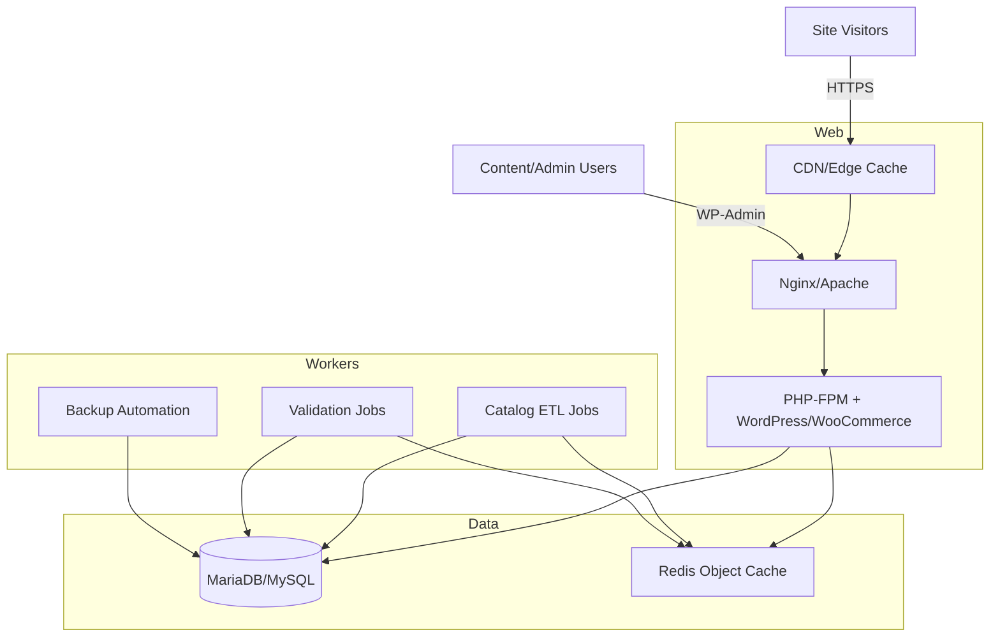

# Architecture & ERD (Sanitized)

### ERD Highlights (Textual)
- `catalog_products` (PK: `product_id`) — base product metadata; joins to `catalog_prices` (FK: `product_id`) and `catalog_inventory` (FK: `product_id`).
- `catalog_prices` — seasonal pricing with `effective_from`/`effective_to`; enforced uniqueness on `(product_id, effective_from)`.
- `catalog_inventory` — stock ledger with `stock_qty` and `reorder_threshold`.
- `catalog_media` — references sanitized filenames and alt text for SEO; FK to `catalog_products`.
- `booking_reservations` — booking headers; joins `booking_units` (inventory) and `booking_rate_rules` (pricing logic); audit trail in `booking_events`.
- `ops_jobs` & `ops_validations` — operational logging for imports, backups, and validation runs.
