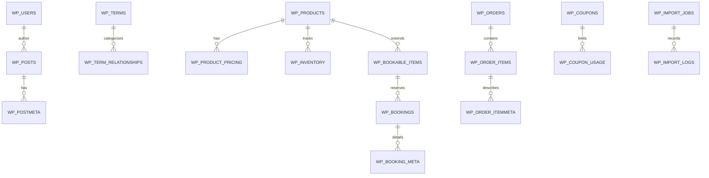

# Schema & ERD — PRJ-WEB-001

Reconstructed schema derived from WordPress/WooCommerce defaults plus custom booking and catalog tables. All identifiers are anonymized.

## Entity-Relationship Diagram

## Table Notes
- **WP_PRODUCTS:** Simplified view of `wp_posts` product rows with essential attributes (SKU, title, status, slug).
- **WP_PRODUCT_PRICING:** Seasonal pricing rows linked by `product_id`, supports start/end dates and channel-specific prices.
- **WP_INVENTORY:** Tracks stock on hand, safety stock, and inbound purchase orders for high-SKU catalogs.
- **WP_BOOKABLE_ITEMS:** Extension table for bookable inventory (rooms/tours) with capacity, blackout dates, and lead time.
- **WP_BOOKINGS / WP_BOOKING_META:** Reservation records tied to bookable items with arrival/departure timestamps and guest counts.
- **WP_IMPORT_JOBS / WP_IMPORT_LOGS:** Audit of catalog imports (source file, checksum, row counts, durations, errors).
- **WP_COUPONS / WP_COUPON_USAGE:** Redacted marketing programs with simple rate/amount structures; PII stripped.

## Data Workflows

### Catalog Update Workflow
1. Stage CSV → validate schema (column count, headers) → checksum recorded in import job.
2. Load into staging tables (`import_products_staging`) via `LOAD DATA INFILE` with strict mode.
3. Run differential upsert to `wp_posts`/`wp_postmeta` using SKU as key; log inserts/updates/deletes.
4. Recompute price bands in `WP_PRODUCT_PRICING` using currency-safe decimals; publish preview report.
5. Promote to production after QA sign-off; trigger cache warm and CDN purge for affected categories.

### Booking Workflow
1. Guest selects dates → availability calculated via `WP_BOOKABLE_ITEMS` and existing `WP_BOOKINGS` overlap check.
2. Quote generated with seasonal pricing and occupancy rules; temporary hold created with expiry timestamp.
3. Payment intent created via gateway (sandbox IDs redacted) → on success, hold converts to confirmed booking.
4. Confirmation email sent with sanitized template; calendar sync updates staff dashboard and ICS feed.
5. Nightly job reconciles abandoned holds and reopens inventory; audit entries written to `WP_BOOKING_META`.

### Price Update Workflow
1. Import sanitized supplier rate sheet; normalize currencies and units of measure.
2. Apply margin rules per channel (web vs. phone) into `WP_PRODUCT_PRICING`; handle min/max guardrails.
3. Run regression queries to detect extreme deltas (>25%) and out-of-stock SKUs.
4. Publish draft catalog; business review; then promote with CDN purge + Redis cache flush.

## Integrity Checks
- Primary/foreign keys on booking and pricing tables enforced during recovery to avoid orphaned records.
- Unique constraints on SKUs and coupon codes; partial index on active products for faster storefront queries.
- Trigger-free design for recoverability; scheduled jobs perform recalculation explicitly.
- All sample data uses randomized IDs and synthetic customer/booking details.
