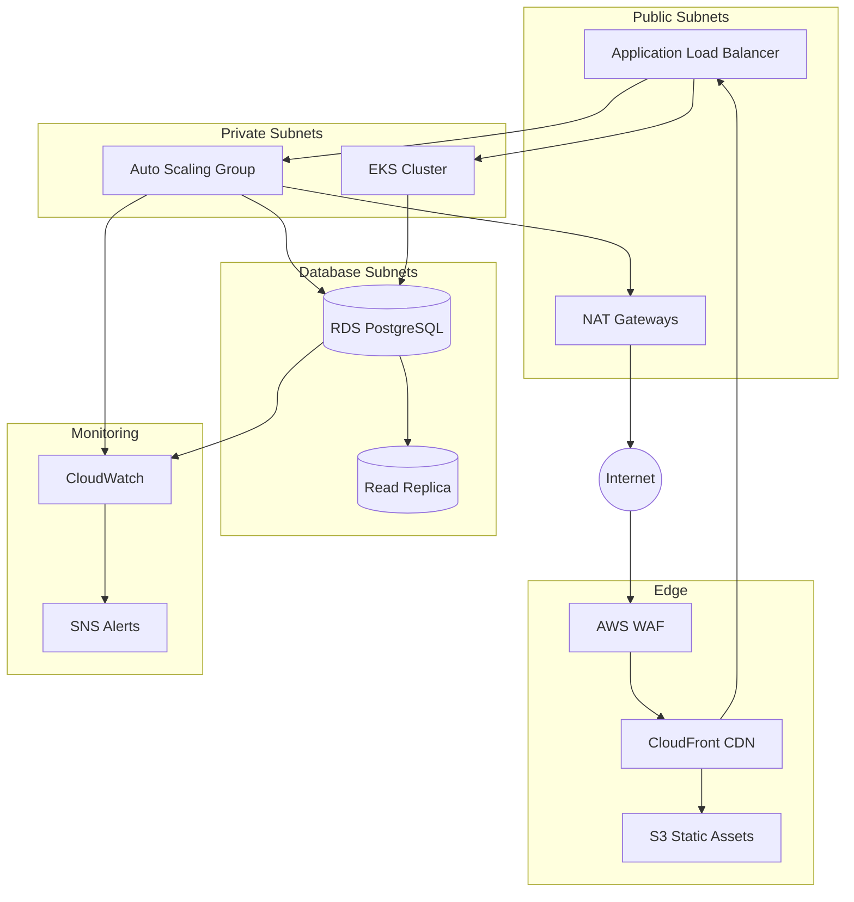

# Project 1: AWS Infrastructure Automation

## Documentation
For cross-project documentation, standards, and runbooks, see the [Portfolio Documentation Hub](../../DOCUMENTATION_INDEX.md).


## 📊 Portfolio Status Board

🟢 Done · 🟠 In Progress · 🔵 Planned

**Current Status:** 🟢 Done (Implemented)


This project provisions a production-ready AWS environment with multiple implementation paths so the portfolio can demonstrate infrastructure-as-code fluency across Terraform, the AWS CDK, and Pulumi.

## Live Deployment
- **Deployment record:** [DEPLOYMENT_STATUS.md](./DEPLOYMENT_STATUS.md)
- **Primary endpoint:** https://aws-infra-automation.example.com
- **Health check:** https://aws-infra-automation.example.com/healthz
- **Static assets (CDN):** https://static.aws-infra-automation.example.com

### Verification steps
```bash
curl -fsSL https://aws-infra-automation.example.com/healthz
curl -I https://static.aws-infra-automation.example.com
```

## Goals
- Launch a multi-AZ network foundation with private, public, and database subnets.
- Provide a managed Kubernetes control plane, managed worker nodes, and autoscaling policies.
- Supply a resilient PostgreSQL database tier with routine backups and monitoring toggles.
- Front application workloads with an Application Load Balancer and auto-scaling group.
- Deliver static assets via S3 with global distribution through CloudFront.
- Offer interchangeable infrastructure definitions so the same outcome can be reached with different toolchains.

## Architecture



## CLI Usage

The project includes a Python CLI (`src/main.py`) for managing infrastructure deployments:

```bash
# Plan infrastructure changes
./src/main.py plan --environment dev
./src/main.py plan --environment staging --target module.networking

# Apply infrastructure
./src/main.py apply --environment production --auto-approve

# Validate Terraform configuration
./src/main.py validate

# Estimate costs with Infracost
./src/main.py cost --environment dev
./src/main.py cost --environment staging --compare  # Compare to baseline

# View deployment status
./src/main.py status --environment production

# Destroy infrastructure (with confirmation)
./src/main.py destroy --environment dev
```

### CLI Commands

| Command | Description | Key Options |
|---------|-------------|-------------|
| `plan` | Generate Terraform execution plan | `--environment`, `--target`, `--out` |
| `apply` | Apply infrastructure changes | `--environment`, `--auto-approve`, `--target` |
| `validate` | Validate Terraform configuration | None |
| `cost` | Estimate infrastructure costs | `--environment`, `--compare`, `--save-baseline` |
| `destroy` | Destroy infrastructure | `--environment`, `--auto-approve` |
| `status` | Show deployment status | `--environment` |

## Contents
- `terraform/` — Primary IaC implementation with modular architecture (VPC, ALB, Auto Scaling Group, EKS, RDS, S3 + CloudFront).
- `terraform/modules/` — Reusable Terraform modules (networking, compute, database, storage, security, monitoring).
- `cloudwatch/` — CloudWatch dashboard JSON definitions and import scripts.
- `cdk/` — Python-based AWS CDK app that mirrors the Terraform footprint.
- `pulumi/` — Pulumi project using Python for multi-cloud-friendly infrastructure.
- `src/` — Python CLI for infrastructure management.
- `tests/` — Integration tests for infrastructure validation.

Each implementation aligns with the runbooks described in the Wiki.js guide so the documentation, automation, and validation steps can be exercised end-to-end.

## Terraform Modules

The project uses a modular Terraform architecture:

| Module | Description | Key Resources |
|--------|-------------|---------------|
| **networking** | VPC with multi-AZ subnets | VPC, Subnets, NAT Gateways, VPC Endpoints, Flow Logs |
| **compute** | Application layer | ALB, Auto Scaling Group, Launch Template |
| **database** | Data tier | RDS PostgreSQL, Read Replicas, CloudWatch Alarms |
| **storage** | Static assets | S3, CloudFront, Origin Access Identity |
| **security** | Security controls | IAM Roles, KMS Keys, WAF, Secrets Manager |
| **monitoring** | Observability | CloudWatch Dashboards, Alarms, SNS Topics |

### Module Usage Example

```hcl
module "networking" {
  source = "./modules/networking"

  environment         = "production"
  vpc_cidr           = "10.0.0.0/16"
  availability_zones = ["us-east-1a", "us-east-1b", "us-east-1c"]
  single_nat_gateway = false
  enable_flow_logs   = true
}

module "database" {
  source = "./modules/database"

  environment          = "production"
  vpc_id              = module.networking.vpc_id
  database_subnet_ids = module.networking.database_subnet_ids
  instance_class      = "db.r6g.large"
  multi_az            = true
  enable_read_replica = true
}
```

## Integration Tests

Run infrastructure validation tests:

```bash
# Run all integration tests
pytest tests/integration/ -v

# Run VPC module tests
pytest tests/integration/test_vpc_module.py -v

# Run RDS module tests
pytest tests/integration/test_rds_module.py -v

# Run with specific markers
pytest tests/integration/ -m "not slow" -v
```

### Test Coverage

- **VPC Module**: Subnet CIDR validation, NAT gateway configuration, route table setup
- **RDS Module**: Multi-AZ deployment, encryption settings, security group rules
- **Security Best Practices**: Flow logs enabled, no public subnets for databases

## Cost Estimation

Estimate infrastructure costs using Infracost:

```bash
# Basic cost estimate
./terraform/scripts/cost-estimate.sh dev

# Compare against baseline
./terraform/scripts/cost-estimate.sh staging --compare

# Save current costs as baseline
./terraform/scripts/cost-estimate.sh production --save-baseline

# Output in different formats
./terraform/scripts/cost-estimate.sh dev --format json
```

Cost estimation is integrated into the CI/CD pipeline and posts cost diffs on pull requests.

## CI/CD Pipeline

The GitHub Actions workflow includes:

1. **Terraform Validation** - Format check and validate
2. **Security Scanning** - Checkov for IaC security analysis
3. **Cost Estimation** - Infracost for cost impact analysis
4. **Plan Generation** - Terraform plan with PR comments
5. **Apply** - Automated apply on main branch (production)

```yaml
# Trigger workflow
git push origin feature/my-change

# View workflow status
gh run list --workflow=terraform.yml
```

## Footprint Highlights
- Internet-facing Application Load Balancer with target group health checks and deregistration protections.
- Auto Scaling Group for web workloads with Amazon Linux 2023 launch template and SSM access.
- Managed EKS control plane and managed node groups for container orchestration.
- RDS PostgreSQL in isolated database subnets with automated backups.
- Static asset delivery via S3, secured by Origin Access Identity and cached globally by CloudFront.


## Code Generation Prompts

This section contains AI-assisted code generation prompts that can help you recreate or extend project components. These prompts are designed to work with AI coding assistants like Claude, GPT-4, or GitHub Copilot.

### Infrastructure as Code

#### 1. Terraform Module
```
Create a Terraform module for deploying a highly available VPC with public/private subnets across 3 availability zones, including NAT gateways and route tables
```

#### 2. CloudFormation Template
```
Generate a CloudFormation template for an Auto Scaling Group with EC2 instances behind an Application Load Balancer, including health checks and scaling policies
```

#### 3. Monitoring Integration
```
Write Terraform code to set up CloudWatch alarms for EC2 CPU utilization, RDS connections, and ALB target health with SNS notifications
```

### How to Use These Prompts

1. **Copy the prompt** from the code block above
2. **Customize placeholders** (replace [bracketed items] with your specific requirements)
3. **Provide context** to your AI assistant about:
   - Your development environment and tech stack
   - Existing code patterns and conventions in this project
   - Any constraints or requirements specific to your use case
4. **Review and adapt** the generated code before using it
5. **Test thoroughly** and adjust as needed for your specific scenario

### Best Practices

- Always review AI-generated code for security vulnerabilities
- Ensure generated code follows your project's coding standards
- Add appropriate error handling and logging
- Write tests for AI-generated components
- Document any assumptions or limitations
- Keep sensitive information (credentials, keys) in environment variables
