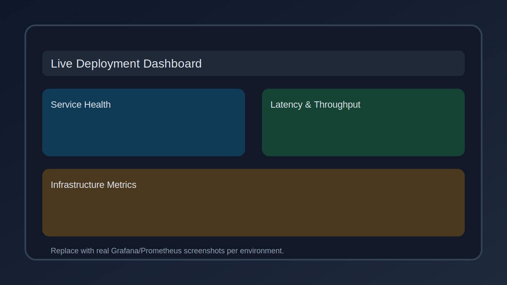

# Project 14: Edge AI Inference Platform

## Documentation
For cross-project documentation, standards, and runbooks, see the [Portfolio Documentation Hub](../../DOCUMENTATION_INDEX.md).


## Live Deployment
| Detail | Value |
| --- | --- |
| Live URL | `https://14-edge-ai-inference.staging.portfolio.example.com` |
| DNS | `14-edge-ai-inference.staging.portfolio.example.com` → `CNAME portfolio-gateway.staging.example.net` |
| Deployment environment | Staging (AWS us-east-1, containerized services; IaC in `terraform/`, `infra/`, or `deploy/` for this project) |

### Deployment automation
- **CI/CD:** GitHub Actions [`/.github/workflows/ci.yml`](../../.github/workflows/ci.yml) gates builds; [`/.github/workflows/deploy-portfolio.yml`](../../.github/workflows/deploy-portfolio.yml) publishes the staging stack.
- **Manual steps:** Follow the project Quick Start/Runbook instructions in this README to build artifacts, apply IaC, and validate health checks.

### Monitoring
- **Prometheus:** `https://prometheus.staging.portfolio.example.com` (scrape config: `prometheus/prometheus.yml`)
- **Grafana:** `https://grafana.staging.portfolio.example.com` (dashboard JSON: `grafana/dashboards/*.json`)

### Live deployment screenshots



## 📊 Portfolio Status Board

🟢 Done · 🟠 In Progress · 🔵 Planned

**Current Status:** 🟢 Done (Implemented)


## Overview
Containerized ONNX Runtime microservice optimized for NVIDIA Jetson devices with automatic model updates via Azure IoT Edge.

## Evidence
The following artifacts capture simulated edge inference performance, including latency/throughput metrics and power estimates.

- Metrics (JSON): [`evidence/metrics.json`](evidence/metrics.json)
- Metrics (CSV): [`evidence/metrics.csv`](evidence/metrics.csv)
- Latency chart (p50/p95): [`evidence/latency_p50_p95.svg`](evidence/latency_p50_p95.svg)
- Throughput chart: [`evidence/throughput_ips.svg`](evidence/throughput_ips.svg)

## Running Locally
```bash
pip install -r requirements.txt
python src/inference_service.py --model models/resnet50.onnx --image sample.jpg
```

## Deployment
- Build container using provided `Dockerfile`.
- Push to Azure Container Registry.
- Deploy IoT Edge deployment manifest under `deployments/`.


## Code Generation Prompts

This section contains AI-assisted code generation prompts that can help you recreate or extend project components. These prompts are designed to work with AI coding assistants like Claude, GPT-4, or GitHub Copilot.

### Machine Learning Components

#### 1. Training Pipeline
```
Create a PyTorch training pipeline with data loaders, model checkpointing, TensorBoard logging, and early stopping for a classification task
```

#### 2. Model Serving
```
Generate a FastAPI service that serves ML model predictions with request validation, batch inference support, and Prometheus metrics for latency/throughput
```

#### 3. Feature Engineering
```
Write a feature engineering pipeline that handles missing values, encodes categorical variables, normalizes numerical features, and creates interaction terms
```

### How to Use These Prompts

1. **Copy the prompt** from the code block above
2. **Customize placeholders** (replace [bracketed items] with your specific requirements)
3. **Provide context** to your AI assistant about:
   - Your development environment and tech stack
   - Existing code patterns and conventions in this project
   - Any constraints or requirements specific to your use case
4. **Review and adapt** the generated code before using it
5. **Test thoroughly** and adjust as needed for your specific scenario

### Best Practices

- Always review AI-generated code for security vulnerabilities
- Ensure generated code follows your project's coding standards
- Add appropriate error handling and logging
- Write tests for AI-generated components
- Document any assumptions or limitations
- Keep sensitive information (credentials, keys) in environment variables
