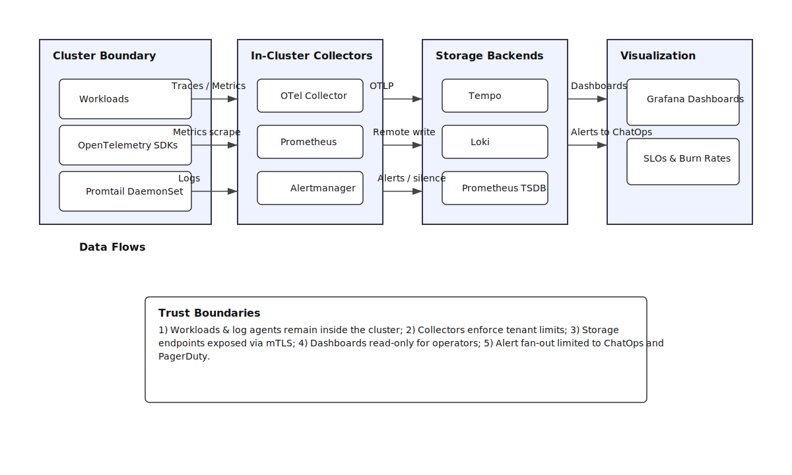

# Project 23: Advanced Monitoring & Observability

## Overview
Unified observability stack with Prometheus, Tempo, Loki, and Grafana dashboards for portfolio workloads.

## Highlights
- `dashboards/portfolio.json` – Grafana dashboard visualizing SLOs, burn rates, and release markers.
- `alerts/portfolio_rules.yml` – Prometheus alerting rules with time-windowed burn rate calculations.
- `manifests/` – Kustomize overlays for staging/production clusters.

## Architecture Diagram

- 
- [Mermaid source](assets/diagrams/architecture.mmd)

**ADR Note:** Observability data stays inside the cluster boundary via OTel Collector and Promtail before flowing into Prometheus, Loki, Tempo, and Grafana; Alertmanager fans out to ChatOps while dashboards stay read-only for operators.
