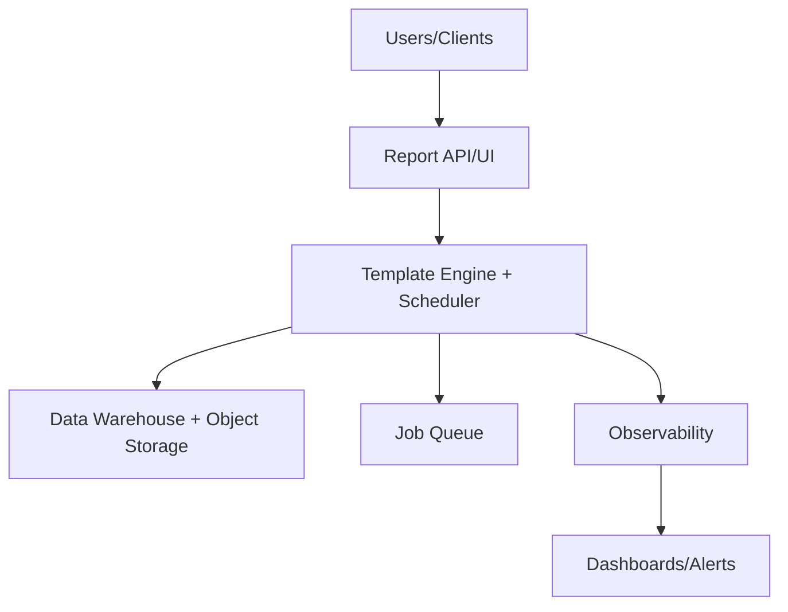

# 24 Report Generator

## Executive Summary
- **Overview:** Report automation service that stitches datasets into governed, distribution-ready narratives and PDFs.
- **Business Impact:** Accelerates delivery with standardized patterns, reduces operational risk, and improves customer trust through reliability and compliance.
- **Technical Value Proposition:** Modular reference implementation with IaC, immutable delivery, and built-in observability and security controls.
- **Success Metrics & KPIs:** Deployment lead time <30 minutes, change failure rate <5%, p95 latency targets per SLO, and availability >=99.9%.

## README / Setup & Deployment
1. **Prerequisites:** Docker, Terraform, language runtime (Python/Node/Go), package manager, and cloud CLI configured with least-privileged credentials.
2. **Bootstrap:** `make install` to fetch deps; `make lint test` locally; copy `.env.example` to `.env` with secrets managed via Vault/KMS.
3. **Run Locally:** `make dev` to start services plus `make seed` where data fixtures exist.
4. **Provision:** `terraform init && terraform apply` in `infra/` to stand up foundational resources.
5. **Deploy:** CI/CD pipeline builds containers, signs artifacts, pushes to registry, applies manifests/Helmfile, and runs smoke + health checks before cutover.

## Architecture Diagram Pack


ASCII topology:
```
[User/Client]
    | HTTPS/API
[Report API/UI]
    | service mesh / authn
[Template Engine + Scheduler] -- telemetry --> [Observability]
    | stateful I/O
[Data Warehouse + Object Storage] <= replication => backups
    | async
[Job Queue] -> workers
[Dashboards/Alerts]
```

## Data Flow & Deployment Topology
- Ingress authenticates, rate-limits, and forwards to core services behind a mesh with mTLS and policy enforcement.
- Core services perform business logic, emit structured logs/traces, and interact with data stores via ORM/DAO layers.
- Async queue offloads heavy tasks; workers scale horizontally; retries and DLQs handle poison messages.
- Multi-env topology: **dev** (ephemeral), **stage** (pre-prod with load testing), **prod** (multi-AZ/region where applicable) with GitOps reconciliation.

## Code Generation Prompts
- **Infrastructure as Code:** "Generate Terraform for Report API/UI + Template Engine + Scheduler + Data Warehouse + Object Storage, with variables, remote state, and workspace-per-env. Include security groups, IAM roles, KMS encryption, backups, and autoscaling policies."
- **Backend Service:** "Scaffold a Template Engine + Scheduler-aligned service with REST/GraphQL endpoints, persistence adapters for Data Warehouse + Object Storage, and OpenTelemetry instrumentation. Include health/readiness probes and structured logging."
- **Frontend/Components:** "Create a UI/workflow surfacing report automation service that stitches datasets into governed, distribution-ready narratives and pdfs. KPIs with role-based views, responsive design, and accessibility AA compliance."
- **Containerization:** "Produce Dockerfile and Helm chart/K8s manifests with non-root user, resource requests/limits, liveness/readiness probes, and secret mounting via CSI." 
- **CI/CD Pipelines:** "Build GitHub Actions/GitLab CI that runs lint+tests, builds SBOM, signs images (cosign), pushes to registry, applies IaC/manifests, and gates on policy checks."
- **Observability Instrumentation:** "Add OTEL SDK, propagate tracecontext, emit RED metrics, and expose `/metrics` for Prometheus plus log correlation IDs."

## Testing Suite
- **Strategy:** Shift-left with unit, contract, integration, e2e, security, and performance gates; use ephemeral preview environments per PR.
- **Test Plan:** Verify CRUD/API correctness, idempotent IaC, failure/retry paths, and data integrity across Data Warehouse + Object Storage.
- **Test Cases & Acceptance:** Define Gherkin scenarios for critical user journeys; acceptance requires zero critical defects, latency within SLO, and successful rollback drills.
- **API Testing:** Collections for authn/authz, pagination, validation errors, and idempotency keys.
- **Security Testing:** SAST, DAST, dependency scanning, container scanning, secrets detection, and IaC policy checks (OPA/Sentinel).
- **Performance:** Load tests simulating peak traffic with autoscaling verification and circuit-breaker behavior.
- **CI Quality Gates:** Coverage >=80%, lint blockers resolved, and no critical vulnerabilities.

## Operational Documents
- **Operational Playbook:** Daily checks on error budgets, capacity, and security posture; weekly chaos drills where applicable.
- **Runbook:** Incident response with triage (severity mapping), containment, mitigation, communication templates, and postmortem timeline capture.
- **SOP:** Access requests, change management approvals, and backup/restore procedures with RPO/RTO targets.
- **On-Call & Escalation:** Primary/secondary rotation, pager rules, and vendor contact list; time-to-ack <5 minutes.
- **Data Migration Runbook:** Pre-migration validation, dual-write toggle, backfill, checksum verification, and cutover with rollback switch.

## Reporting Package
- Status report template (milestones, risks, blockers, scope changes).
- KPI/OKR tracker covering deployment velocity, reliability, cost, and security findings.
- Findings/recommendations report aligned to audits and retrospectives.
- ROI analysis with payback period, efficiency gains, and risk reduction.
- Timeline with milestones, gates, and owner assignments.

## Metrics & Observability
- **SLO/SLI:** Availability >=99.9%, p95 latency targets, error rate <0.1%, throughput targets per project domain.
- **PromQL Examples:**
  - `histogram_quantile(0.95, sum by (le,service) (rate(http_request_duration_seconds_bucket[5m])))`
  - `sum by (service) (rate(http_requests_total{status=~"5.."}[5m])) > 0`
  - `avg_over_time(queue_depth[5m]) > 100` triggers scaling/alerts.
- **Dashboards:** RED + USE views, release markers, capacity heatmaps, and user journey funnels.
- **Logging/Tracing:** JSON logs with trace/span IDs; OTLP exporters to collector; sampling tuned per env.

## Security Package
- **Threat Model (STRIDE):** Spoofing (mTLS/JWT), Tampering (signatures, immutability), Repudiation (audit logs), Information Disclosure (encryption in transit/at rest), Denial of Service (WAF/rate limits/autoscale), Elevation of Privilege (RBAC/least privilege).
- **Access Control & RBAC:** Principle-of-least-privilege roles, break-glass accounts, and just-in-time elevation.
- **Encryption & Keys:** KMS/Key Vault for data at rest; TLS 1.2+/HSTS; key rotation with audit trails.
- **Secrets Management:** Vault/Secrets Manager with short-lived tokens and sealed backups.
- **Compliance Mapping:** Controls for SOC2/ISO 27001 covering logging, backup, change management, and vulnerability management.

## Risk Management
- Risks: supply-chain compromise, misconfiguration, data loss, performance regressions, capacity exhaustion, key leakage, cost overrun, incident fatigue, vendor lock-in, and schema drift.
- Mitigations: signed artifacts, policy-as-code, tested backups, perf tests + autoscaling, secrets hygiene, budget alerts, runbook rotations, and multi-cloud abstractions where feasible.
- Owners: Tech Lead (engineering risks), SRE (reliability), Security (compliance), Product (cost/scope).
- Residual risk assessed monthly with scorecards.

## Architecture Decision Records
- **ADR-001:** Choose IaC (Terraform) for repeatability and policy enforcement.
- **ADR-002:** Adopt GitOps for environment drift detection and auditable changes.
- **ADR-003:** Standardize observability with OTEL and Prometheus-compatible stack.
- **ADR-004:** Enforce trunk-based development with feature flags and progressive delivery.
- **ADR-005:** Prefer managed services for core dependencies to reduce ops toil.

## Business Value Narrative
- **Business Case:** Report automation service that stitches datasets into governed, distribution-ready narratives and PDFs.
- **Recruiter-Ready Angle:** Demonstrates ability to design, secure, and operate production-grade systems with measurable outcomes.
- **Skills Demonstrated:** Cloud architecture, automation, security, observability, testing at scale, and stakeholder communication.
- **Career Relevance:** Highlights end-to-end ownership from design through operations and continuous improvement.
