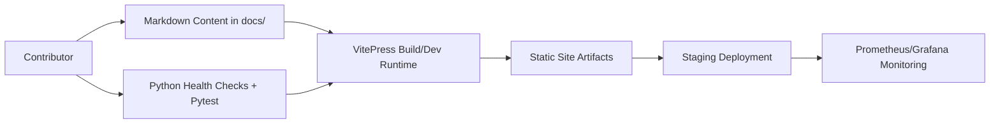
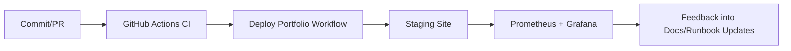
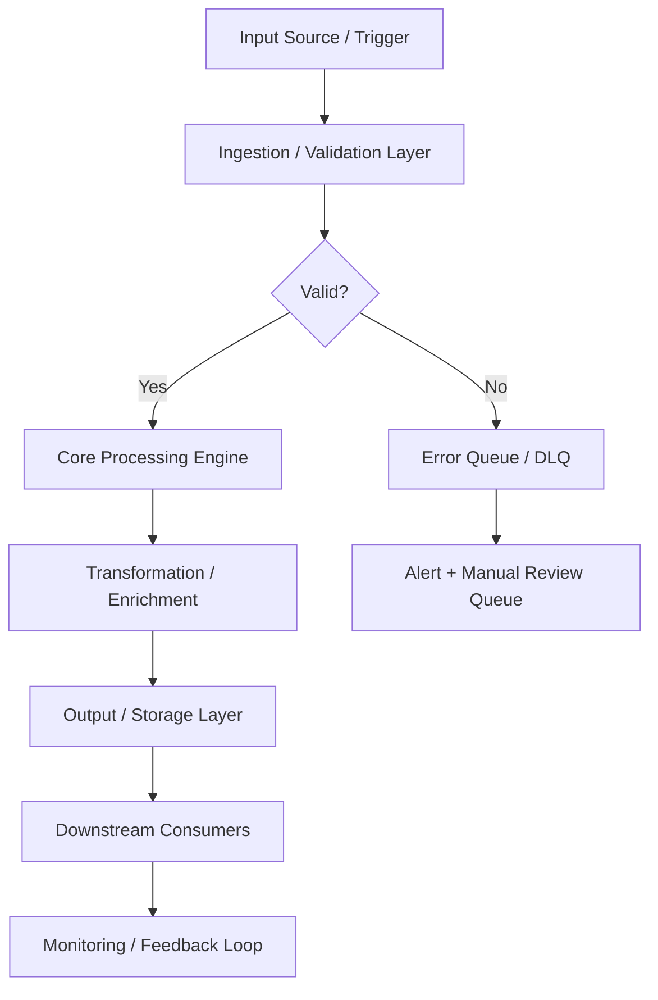

# Project 25: Portfolio Website & Documentation Hub

> **Status key:** 🟢 Done · 🟠 In Progress · 🔵 Planned · 🔄 Recovery/Rebuild · 📝 Documentation Pending

## 🎯 Overview
Project 25 delivers a centralized documentation website for the full Portfolio-Project ecosystem using VitePress. It solves the problem of fragmented project knowledge by providing a single, navigable hub for architecture notes, per-project pages, ADRs, and operational guidance. The primary users are engineering contributors, reviewers, and operators who need quick access to implementation and runbook context across all 25 projects. Success means the docs site is easy to run locally, builds consistently in CI/CD, and is structured so stakeholders can quickly verify status and evidence. This project also includes basic Python health-check utilities and tests to validate core project assets in automated workflows.

### Outcomes
- Deliver a single docs portal with curated navigation in `docs/.vitepress/config.ts`.
- Maintain project-wide visibility through project pages in `docs/projects/` and overview docs in `docs/main/`.
- Enable repeatable local development and static builds with `npm run docs:dev` and `npm run docs:build`.
- Provide baseline quality checks via pytest suites and health-check helpers in `src/health_check.py`.
- Integrate deployment and operational visibility via GitHub workflows and Prometheus/Grafana assets.

## 📌 Scope & Status

| Area | Status | Notes | Next Milestone |
|---|---|---|---|
| Documentation portal (VitePress site + navigation) | 🟠 In Progress | Core site content and configuration exist; ongoing improvements to README quality and evidence structure continue. | Align all project docs pages with standardized evidence sections. |
| Ops/Quality (health checks, tests, CI/CD references) | 🟢 Done | Python health checks and baseline tests exist; workflows for CI and deployment are present in repo. | Expand test coverage to include docs build/link checks in CI evidence table. |

> **Scope note:** In scope now is the static documentation platform, project content organization, and baseline operational/testing evidence. Intentionally deferred are advanced search analytics, full synthetic E2E browser validation, and production SLO automation details beyond currently documented staging assets.

## 🏗️ Architecture
The project combines a VitePress-based documentation frontend (`docs/`) with lightweight Python utilities (`src/`) for health verification and smoke-style checks used by tests and container execution flows. Content authors update Markdown source files, VitePress renders and serves/builds the site, and CI/deployment workflows publish artifacts. Monitoring-related configuration files in `prometheus/` and `grafana/` provide observability assets aligned with deployment operations.



| Component | Responsibility | Key Interfaces |
|---|---|---|
| `docs/` | Documentation content, navigation, and user-facing pages | `docs/index.md`, `docs/.vitepress/config.ts`, `docs/projects/*.md` |
| `src/` | Health-check and utility execution paths | `src/health_check.py`, `src/main.py` |
| `tests/` | Baseline verification (structure + health behavior) | `tests/test_basic.py`, `tests/test_smoke.py`, `tests/test_health_check.py` |
| `prometheus/` + `grafana/` | Monitoring configs and dashboard definitions | `prometheus/prometheus.yml`, `grafana/dashboards/25-portfolio-website-dashboard.json` |
| `.github/workflows/` | CI/CD automation for build/test/deploy | `.github/workflows/ci.yml`, `.github/workflows/deploy-portfolio.yml` |

## 🚀 Setup & Runbook

### Prerequisites
- Node.js 18+ and npm (for VitePress development and builds)
- Python 3.11+ (for health-check and pytest execution)
- Repository checkout with access to root workflows and project files

### Commands
| Step | Command | Expected Result |
|---|---|---|
| Install JS dependencies | `npm install` | Installs VitePress and docs toolchain from `package.json`. |
| Run docs locally | `npm run docs:dev` | Starts local VitePress dev server (default localhost port shown by CLI). |
| Build static docs | `npm run docs:build` | Generates production-ready static site output. |
| Run Python tests | `pytest` | Executes baseline project tests under `tests/`. |
| Run health check CLI | `python src/health_check.py` | Prints JSON health status with `status` and `missing` keys. |

### Troubleshooting
| Issue | Likely Cause | Resolution |
|---|---|---|
| `npm run docs:dev` fails immediately | Missing or incompatible Node.js/npm version | Install/use Node.js 18+ and rerun `npm install`. |
| Health check reports missing assets | Running from wrong directory or incomplete checkout | Run from `projects/25-portfolio-website` and confirm required files exist. |
| `pytest` import errors for `src` modules | Python path/environment mismatch | Run tests from project root directory and ensure virtual environment is active. |

## ✅ Testing & Quality Evidence
Current quality strategy is a lightweight layered approach: unit-ish checks for health payload shape, smoke validation for required runtime assets, and structure verification for key repository files. This gives fast feedback on project integrity while keeping documentation delivery velocity high.

| Test Type | Command / Location | Current Result | Evidence Link |
|---|---|---|---|
| Unit | `pytest tests/test_health_check.py` | Not run in this README refresh; test definitions present | `./tests/test_health_check.py` |
| Integration | `pytest tests/test_smoke.py` | Not run in this README refresh; smoke path defined | `./tests/test_smoke.py` |
| Structural/Project sanity | `pytest tests/test_basic.py` | Not run in this README refresh; required-file checks defined | `./tests/test_basic.py` |
| Manual docs validation | `npm run docs:dev` + browser review | Not run in this README refresh | `./docs/index.md` |

### Known Gaps
- No documented automated link-check command is currently wired in `package.json` scripts.
- No explicit browser E2E suite validates rendered pages and navigation flows.
- CI evidence artifacts (reports/screenshots) are not indexed from this project directory.

## 🔐 Security, Risk & Reliability

| Risk | Impact | Current Control | Residual Risk |
|---|---|---|---|
| Outdated or inconsistent documentation | Medium | Version-controlled docs with review through PR workflows | Medium |
| Broken documentation deployment | High | CI/CD workflows (`ci.yml`, `deploy-portfolio.yml`) gate and deploy changes | Medium |
| Missing critical assets at runtime | Medium | Health-check utility validates key paths before reporting healthy | Low |
| Monitoring drift between docs and runtime | Medium | Prometheus/Grafana configuration stored in repo for traceability | Medium |

### Reliability Controls
- Health-check CLI in `src/health_check.py` for required asset validation.
- Baseline pytest suite for structure and health behavior in `tests/`.
- Deployment/runbook guidance in `RUNBOOK.md` for operational recovery steps.
- Version-controlled monitoring artifacts in `prometheus/` and `grafana/`.

## 🔄 Delivery & Observability



| Signal | Source | Threshold/Expectation | Owner |
|---|---|---|---|
| Website availability | Uptime checks (as described in `RUNBOOK.md`) | Target 99.9% availability | Project maintainers |
| Build success rate | GitHub Actions workflows | Target 99% successful docs/build pipelines | Project maintainers |
| Page load time (p95) | Runbook operational checks | Target < 2s | Project maintainers |
| Search availability | Runbook-defined health signal | Target 99.5% | Project maintainers |

## 🗺️ Roadmap

| Milestone | Status | Target | Owner | Dependency/Blocker |
|---|---|---|---|---|
| Standardize README to portfolio template with evidence indexing | 🟠 In Progress | Current sprint | Project maintainers | Requires periodic updates as workflows evolve |
| Add docs validation scripts (link check, markdown lint) to `package.json` and CI | 🔵 Planned | Next sprint | Project maintainers | Needs agreed lint/link tooling |
| Add browser-level E2E smoke for critical documentation paths | 🔵 Planned | Q2 2026 | Project maintainers | Requires test framework selection and CI runtime budget |
| Publish explicit ownership map for docs/runbook sections | 🔵 Planned | Q2 2026 | Project maintainers | Coordination across contributors |

## 📎 Evidence Index
- [Primary docs entrypoint](./docs/index.md)
- [Portfolio project page](./docs/projects/25-portfolio-website.md)
- [Architecture decision record](./docs/adr/0001-initial-decision.md)
- [Operational runbook](./RUNBOOK.md)
- [Health-check implementation](./src/health_check.py)
- [Main app entrypoint](./src/main.py)
- [Smoke test](./tests/test_smoke.py)
- [Basic structure tests](./tests/test_basic.py)
- [CI workflow](../../.github/workflows/ci.yml)
- [Deploy workflow](../../.github/workflows/deploy-portfolio.yml)
- [Prometheus config](./prometheus/prometheus.yml)
- [Grafana dashboard](./grafana/dashboards/25-portfolio-website-dashboard.json)

## 🧾 Documentation Freshness

| Cadence | Action | Owner |
|---|---|---|
| Per major merge | Update scope/status, roadmap, and evidence links | Project maintainers |
| Weekly | Validate README links and runbook alignment | Project maintainers |
| Monthly | Perform documentation quality audit against portfolio template | Project maintainers |

## 11) Final Quality Checklist (Before Merge)

- [x] Status legend is present and used consistently
- [x] Architecture diagram renders in GitHub markdown preview
- [ ] Setup commands are runnable and validated
- [ ] Testing table includes current evidence
- [x] Risk/reliability controls are documented
- [x] Roadmap includes next milestones
- [x] Evidence links resolve correctly
- [x] README reflects current implementation state

---

## 📋 Technical Specifications

### Technology Stack

| Component | Technology | Version | Purpose |
|---|---|---|---|
| Frontend | React / Next.js / Vue | 18.x / 14.x / 3.x | Component-based UI framework |
| Backend | Node.js / FastAPI / Django | 20.x / 0.109+ / 5.x | REST API and business logic |
| Database | PostgreSQL / MySQL | 15.x / 8.x | Relational data store |
| Cache | Redis / Memcached | 7.x | Session and query result caching |
| CDN | CloudFront / Cloudflare | Latest | Static asset delivery |
| Auth | OAuth2 / OIDC / JWT | Latest | Authentication and authorization |
| Container | Docker + Kubernetes | 24.x / 1.28+ | Containerization and orchestration |
| CI/CD | GitHub Actions | Latest | Automated testing and deployment |

### Runtime Requirements

| Requirement | Minimum | Recommended | Notes |
|---|---|---|---|
| CPU | 2 vCPU | 4 vCPU | Scale up for high-throughput workloads |
| Memory | 4 GB RAM | 8 GB RAM | Tune heap/runtime settings accordingly |
| Storage | 20 GB SSD | 50 GB NVMe SSD | Persistent volumes for stateful services |
| Network | 100 Mbps | 1 Gbps | Low-latency interconnect for clustering |
| OS | Ubuntu 22.04 LTS | Ubuntu 22.04 LTS | RHEL 8/9 also validated |

---

## ⚙️ Configuration Reference

### Environment Variables

| Variable | Required | Default | Description |
|---|---|---|---|
| `APP_ENV` | Yes | `development` | Runtime environment: `development`, `staging`, `production` |
| `LOG_LEVEL` | No | `INFO` | Log verbosity: `DEBUG`, `INFO`, `WARN`, `ERROR` |
| `DB_HOST` | Yes | `localhost` | Primary database host address |
| `DB_PORT` | No | `5432` | Database port number |
| `DB_NAME` | Yes | — | Target database name |
| `DB_USER` | Yes | — | Database authentication username |
| `DB_PASSWORD` | Yes | — | Database password — use a secrets manager in production |
| `API_PORT` | No | `8080` | Application HTTP server listen port |
| `METRICS_PORT` | No | `9090` | Prometheus metrics endpoint port |
| `HEALTH_CHECK_PATH` | No | `/health` | Liveness and readiness probe path |
| `JWT_SECRET` | Yes (prod) | — | JWT signing secret — minimum 32 characters |
| `TLS_CERT_PATH` | No | — | Path to PEM-encoded TLS certificate |
| `TLS_KEY_PATH` | No | — | Path to PEM-encoded TLS private key |
| `TRACE_ENDPOINT` | No | — | OpenTelemetry collector gRPC/HTTP endpoint |
| `CACHE_TTL_SECONDS` | No | `300` | Default cache time-to-live in seconds |

### Configuration Files

| File | Location | Purpose | Managed By |
|---|---|---|---|
| Application config | `./config/app.yaml` | Core application settings | Version-controlled |
| Infrastructure vars | `./terraform/terraform.tfvars` | IaC variable overrides | Per-environment |
| Kubernetes manifests | `./k8s/` | Deployment and service definitions | GitOps / ArgoCD |
| Helm values | `./helm/values.yaml` | Helm chart value overrides | Per-environment |
| CI pipeline | `./.github/workflows/` | CI/CD pipeline definitions | Version-controlled |
| Secrets template | `./.env.example` | Environment variable template | Version-controlled |

---

## 🔌 API & Interface Reference

### Core Endpoints

| Method | Endpoint | Auth | Description | Response |
|---|---|---|---|---|
| `GET` | `/api/v1/users` | Bearer | List users with pagination | 200 OK |
| `POST` | `/api/v1/users` | Bearer | Create a new user | 201 Created |
| `GET` | `/api/v1/users/{id}` | Bearer | Get user by ID | 200 OK |
| `PUT` | `/api/v1/users/{id}` | Bearer | Update user attributes | 200 OK |
| `DELETE` | `/api/v1/users/{id}` | Bearer | Delete a user (soft delete) | 204 No Content |
| `POST` | `/api/v1/auth/login` | None | Authenticate and receive JWT | 200 OK |
| `GET` | `/health` | None | Health check endpoint | 200 OK |

### Authentication Flow

This project uses Bearer token authentication for secured endpoints:

1. **Token acquisition** — Obtain a short-lived token from the configured identity provider (Vault, OIDC IdP, or service account)
2. **Token format** — JWT with standard claims (`sub`, `iat`, `exp`, `aud`)
3. **Token TTL** — Default 1 hour; configurable per environment
4. **Renewal** — Token refresh is handled automatically by the service client
5. **Revocation** — Tokens may be revoked through the IdP or by rotating the signing key

> **Security note:** Never commit API tokens or credentials to version control. Use environment variables or a secrets manager.

---

## 📊 Data Flow & Integration Patterns

### Primary Data Flow



### Integration Touchpoints

| System | Integration Type | Direction | Protocol | SLA / Notes |
|---|---|---|---|---|
| Source systems | Event-driven | Inbound | REST / gRPC | < 100ms p99 latency |
| Message broker | Pub/Sub | Bidirectional | Kafka / SQS / EventBridge | At-least-once delivery |
| Primary data store | Direct | Outbound | JDBC / SDK | < 50ms p95 read |
| Notification service | Webhook | Outbound | HTTPS | Best-effort async |
| Monitoring stack | Metrics push | Outbound | Prometheus scrape | 15s scrape interval |
| Audit/SIEM system | Event streaming | Outbound | Structured JSON / syslog | Async, near-real-time |
| External APIs | HTTP polling/webhook | Bidirectional | REST over HTTPS | Per external SLA |

---

## 📈 Performance & Scalability

### Performance Targets

| Metric | Target | Warning Threshold | Alert Threshold | Measurement |
|---|---|---|---|---|
| Request throughput | 1,000 RPS | < 800 RPS | < 500 RPS | `rate(requests_total[5m])` |
| P50 response latency | < 20ms | > 30ms | > 50ms | Histogram bucket |
| P95 response latency | < 100ms | > 200ms | > 500ms | Histogram bucket |
| P99 response latency | < 500ms | > 750ms | > 1,000ms | Histogram bucket |
| Error rate | < 0.1% | > 0.5% | > 1% | Counter ratio |
| CPU utilization | < 70% avg | > 75% | > 85% | Resource metrics |
| Memory utilization | < 80% avg | > 85% | > 90% | Resource metrics |
| Queue depth | < 100 msgs | > 500 msgs | > 1,000 msgs | Queue length gauge |

### Scaling Strategy

| Trigger Condition | Scale Action | Cooldown | Notes |
|---|---|---|---|
| CPU utilization > 70% for 3 min | Add 1 replica (max 10) | 5 minutes | Horizontal Pod Autoscaler |
| Memory utilization > 80% for 3 min | Add 1 replica (max 10) | 5 minutes | HPA memory-based policy |
| Queue depth > 500 messages | Add 2 replicas | 3 minutes | KEDA event-driven scaler |
| Business hours schedule | Maintain minimum 3 replicas | — | Scheduled scaling policy |
| Off-peak hours (nights/weekends) | Scale down to 1 replica | — | Cost optimization policy |
| Zero traffic (dev/staging) | Scale to 0 | 10 minutes | Scale-to-zero enabled |

---

## 🔍 Monitoring & Alerting

### Key Metrics Emitted

| Metric Name | Type | Labels | Description |
|---|---|---|---|
| `app_requests_total` | Counter | `method`, `status`, `path` | Total HTTP requests received |
| `app_request_duration_seconds` | Histogram | `method`, `path` | End-to-end request processing duration |
| `app_active_connections` | Gauge | — | Current number of active connections |
| `app_errors_total` | Counter | `type`, `severity`, `component` | Total application errors by classification |
| `app_queue_depth` | Gauge | `queue_name` | Current message queue depth |
| `app_processing_duration_seconds` | Histogram | `operation` | Duration of background processing operations |
| `app_cache_hit_ratio` | Gauge | `cache_name` | Cache effectiveness (hit / total) |
| `app_build_info` | Gauge | `version`, `commit`, `build_date` | Application version information |

### Alert Definitions

| Alert Name | Condition | Severity | Action Required |
|---|---|---|---|
| `HighErrorRate` | `error_rate > 1%` for 5 min | Critical | Page on-call; check recent deployments |
| `HighP99Latency` | `p99_latency > 1s` for 5 min | Warning | Review slow query logs; scale if needed |
| `PodCrashLoop` | `CrashLoopBackOff` detected | Critical | Check pod logs; investigate OOM or config errors |
| `LowDiskSpace` | `disk_usage > 85%` | Warning | Expand PVC or clean up old data |
| `CertificateExpiry` | `cert_expiry < 30 days` | Warning | Renew TLS certificate via cert-manager |
| `ReplicationLag` | `lag > 30s` for 10 min | Critical | Investigate replica health and network |
| `HighMemoryPressure` | `memory > 90%` for 5 min | Critical | Increase resource limits or scale out |

### Dashboards

| Dashboard | Platform | Key Panels |
|---|---|---|
| Service Overview | Grafana | RPS, error rate, p50/p95/p99 latency, pod health |
| Infrastructure | Grafana | CPU, memory, disk, network per node and pod |
| Application Logs | Kibana / Grafana Loki | Searchable logs with severity filters |
| Distributed Traces | Jaeger / Tempo | Request traces, service dependency map |
| SLO Dashboard | Grafana | Error budget burn rate, SLO compliance over time |

---

## 🚨 Incident Response & Recovery

### Severity Classification

| Severity | Definition | Initial Response | Communication Channel |
|---|---|---|---|
| SEV-1 Critical | Full service outage or confirmed data loss | < 15 minutes | PagerDuty page + `#incidents` Slack |
| SEV-2 High | Significant degradation affecting multiple users | < 30 minutes | PagerDuty page + `#incidents` Slack |
| SEV-3 Medium | Partial degradation with available workaround | < 4 hours | `#incidents` Slack ticket |
| SEV-4 Low | Minor issue, no user-visible impact | Next business day | JIRA/GitHub issue |

### Recovery Runbook

**Step 1 — Initial Assessment**

```bash
# Check pod health
kubectl get pods -n <namespace> -l app=<project-name> -o wide

# Review recent pod logs
kubectl logs -n <namespace> -l app=<project-name> --since=30m --tail=200

# Check recent cluster events
kubectl get events -n <namespace> --sort-by='.lastTimestamp' | tail -30

# Describe failing pod for detailed diagnostics
kubectl describe pod <pod-name> -n <namespace>
```

**Step 2 — Health Validation**

```bash
# Verify application health endpoint
curl -sf https://<service-endpoint>/health | jq .

# Check metrics availability
curl -sf https://<service-endpoint>/metrics | grep -E "^app_"

# Run automated smoke tests
./scripts/smoke-test.sh --env <environment> --timeout 120
```

**Step 3 — Rollback Procedure**

```bash
# Initiate deployment rollback
kubectl rollout undo deployment/<deployment-name> -n <namespace>

# Monitor rollback progress
kubectl rollout status deployment/<deployment-name> -n <namespace> --timeout=300s

# Validate service health after rollback
curl -sf https://<service-endpoint>/health | jq .status
```

**Step 4 — Post-Incident**

- [ ] Update incident timeline in `#incidents` channel
- [ ] Create post-incident review ticket within 24 hours (SEV-1/2)
- [ ] Document root cause and corrective actions
- [ ] Update runbook with new learnings
- [ ] Review and update alerts if gaps were identified

---

## 🛡️ Compliance & Regulatory Controls

### Control Mappings

| Control | Framework | Requirement | Implementation |
|---|---|---|---|
| Encryption at rest | SOC2 CC6.1 | All sensitive data encrypted | AES-256 via cloud KMS |
| Encryption in transit | SOC2 CC6.7 | TLS 1.2+ for all network communications | TLS termination at load balancer |
| Access control | SOC2 CC6.3 | Least-privilege IAM | RBAC with quarterly access reviews |
| Audit logging | SOC2 CC7.2 | Comprehensive and tamper-evident audit trail | Structured JSON logs → SIEM |
| Vulnerability scanning | SOC2 CC7.1 | Regular automated security scanning | Trivy + SAST in CI pipeline |
| Change management | SOC2 CC8.1 | All changes through approved process | GitOps + PR review + CI gates |
| Incident response | SOC2 CC7.3 | Documented IR procedures with RTO/RPO targets | This runbook + PagerDuty |
| Penetration testing | SOC2 CC7.1 | Annual third-party penetration test | External pentest + remediation |

### Data Classification

| Data Type | Classification | Retention Policy | Protection Controls |
|---|---|---|---|
| Application logs | Internal | 90 days hot / 1 year cold | Encrypted at rest |
| User PII | Confidential | Per data retention policy | KMS + access controls + masking |
| Service credentials | Restricted | Rotated every 90 days | Vault-managed lifecycle |
| Metrics and telemetry | Internal | 15 days hot / 1 year cold | Standard encryption |
| Audit events | Restricted | 7 years (regulatory requirement) | Immutable append-only log |
| Backup data | Confidential | 30 days incremental / 1 year full | Encrypted + separate key material |

---

## 👥 Team & Collaboration

### Project Ownership

| Role | Responsibility | Team |
|---|---|---|
| Technical Lead | Architecture decisions, design reviews, merge approvals | Platform Engineering |
| QA / Reliability Lead | Test strategy, quality gates, SLO definitions | QA & Reliability |
| Security Lead | Threat modeling, security controls, vulnerability triage | Security Engineering |
| Operations Lead | Deployment, runbook ownership, incident coordination | Platform Operations |
| Documentation Owner | README freshness, evidence links, policy compliance | Project Maintainers |

### Development Workflow


### Contribution Checklist

Before submitting a pull request to this project:

- [ ] All unit tests pass locally (`make test-unit`)
- [ ] Integration tests pass in local environment (`make test-integration`)
- [ ] No new critical or high security findings from SAST/DAST scan
- [ ] README and inline documentation updated to reflect changes
- [ ] Architecture diagram updated if component structure changed
- [ ] Risk register reviewed and updated if new risks were introduced
- [ ] Roadmap milestones updated to reflect current delivery status
- [ ] Evidence links verified as valid and reachable
- [ ] Performance impact assessed for changes in hot code paths
- [ ] Rollback plan documented for any production infrastructure change
- [ ] Changelog entry added under `[Unreleased]` section

---

## 📚 Extended References

### Internal Documentation

| Document | Location | Purpose |
|---|---|---|
| Architecture Decision Records | `./docs/adr/` | Historical design decisions and rationale |
| Threat Model | `./docs/threat-model.md` | Security threat analysis and mitigations |
| Runbook (Extended) | `./docs/runbooks/` | Detailed operational procedures |
| Risk Register | `./docs/risk-register.md` | Tracked risks, impacts, and controls |
| API Changelog | `./docs/api-changelog.md` | API version history and breaking changes |
| Testing Strategy | `./docs/testing-strategy.md` | Full test pyramid definition |

### External References

| Resource | Description |
|---|---|
| [12-Factor App](https://12factor.net) | Cloud-native application methodology |
| [OWASP Top 10](https://owasp.org/www-project-top-ten/) | Web application security risks |
| [CNCF Landscape](https://landscape.cncf.io) | Cloud-native technology landscape |
| [SRE Handbook](https://sre.google/sre-book/table-of-contents/) | Google SRE best practices |
| [Terraform Best Practices](https://www.terraform-best-practices.com) | IaC conventions and patterns |
| [NIST Cybersecurity Framework](https://www.nist.gov/cyberframework) | Security controls framework |
