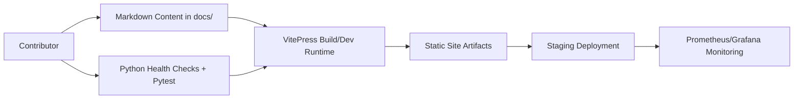
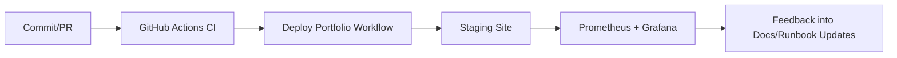

# Project 25: Portfolio Website & Documentation Hub

> **Status key:** 🟢 Done · 🟠 In Progress · 🔵 Planned · 🔄 Recovery/Rebuild · 📝 Documentation Pending

## 🎯 Overview
Project 25 delivers a centralized documentation website for the full Portfolio-Project ecosystem using VitePress. It solves the problem of fragmented project knowledge by providing a single, navigable hub for architecture notes, per-project pages, ADRs, and operational guidance. The primary users are engineering contributors, reviewers, and operators who need quick access to implementation and runbook context across all 25 projects. Success means the docs site is easy to run locally, builds consistently in CI/CD, and is structured so stakeholders can quickly verify status and evidence. This project also includes basic Python health-check utilities and tests to validate core project assets in automated workflows.

### Outcomes
- Deliver a single docs portal with curated navigation in `docs/.vitepress/config.ts`.
- Maintain project-wide visibility through project pages in `docs/projects/` and overview docs in `docs/main/`.
- Enable repeatable local development and static builds with `npm run docs:dev` and `npm run docs:build`.
- Provide baseline quality checks via pytest suites and health-check helpers in `src/health_check.py`.
- Integrate deployment and operational visibility via GitHub workflows and Prometheus/Grafana assets.

## 📌 Scope & Status

| Area | Status | Notes | Next Milestone |
|---|---|---|---|
| Documentation portal (VitePress site + navigation) | 🟠 In Progress | Core site content and configuration exist; ongoing improvements to README quality and evidence structure continue. | Align all project docs pages with standardized evidence sections. |
| Ops/Quality (health checks, tests, CI/CD references) | 🟢 Done | Python health checks and baseline tests exist; workflows for CI and deployment are present in repo. | Expand test coverage to include docs build/link checks in CI evidence table. |

> **Scope note:** In scope now is the static documentation platform, project content organization, and baseline operational/testing evidence. Intentionally deferred are advanced search analytics, full synthetic E2E browser validation, and production SLO automation details beyond currently documented staging assets.

## 🏗️ Architecture
The project combines a VitePress-based documentation frontend (`docs/`) with lightweight Python utilities (`src/`) for health verification and smoke-style checks used by tests and container execution flows. Content authors update Markdown source files, VitePress renders and serves/builds the site, and CI/deployment workflows publish artifacts. Monitoring-related configuration files in `prometheus/` and `grafana/` provide observability assets aligned with deployment operations.

| Component | Responsibility | Key Interfaces |
|---|---|---|
| `docs/` | Documentation content, navigation, and user-facing pages | `docs/index.md`, `docs/.vitepress/config.ts`, `docs/projects/*.md` |
| `src/` | Health-check and utility execution paths | `src/health_check.py`, `src/main.py` |
| `tests/` | Baseline verification (structure + health behavior) | `tests/test_basic.py`, `tests/test_smoke.py`, `tests/test_health_check.py` |
| `prometheus/` + `grafana/` | Monitoring configs and dashboard definitions | `prometheus/prometheus.yml`, `grafana/dashboards/25-portfolio-website-dashboard.json` |
| `.github/workflows/` | CI/CD automation for build/test/deploy | `.github/workflows/ci.yml`, `.github/workflows/deploy-portfolio.yml` |

## 🚀 Setup & Runbook

### Prerequisites
- Node.js 18+ and npm (for VitePress development and builds)
- Python 3.11+ (for health-check and pytest execution)
- Repository checkout with access to root workflows and project files

### Commands
| Step | Command | Expected Result |
|---|---|---|
| Install JS dependencies | `npm install` | Installs VitePress and docs toolchain from `package.json`. |
| Run docs locally | `npm run docs:dev` | Starts local VitePress dev server (default localhost port shown by CLI). |
| Build static docs | `npm run docs:build` | Generates production-ready static site output. |
| Run Python tests | `pytest` | Executes baseline project tests under `tests/`. |
| Run health check CLI | `python src/health_check.py` | Prints JSON health status with `status` and `missing` keys. |

### Troubleshooting
| Issue | Likely Cause | Resolution |
|---|---|---|
| `npm run docs:dev` fails immediately | Missing or incompatible Node.js/npm version | Install/use Node.js 18+ and rerun `npm install`. |
| Health check reports missing assets | Running from wrong directory or incomplete checkout | Run from `projects/25-portfolio-website` and confirm required files exist. |
| `pytest` import errors for `src` modules | Python path/environment mismatch | Run tests from project root directory and ensure virtual environment is active. |

## ✅ Testing & Quality Evidence
Current quality strategy is a lightweight layered approach: unit-ish checks for health payload shape, smoke validation for required runtime assets, and structure verification for key repository files. This gives fast feedback on project integrity while keeping documentation delivery velocity high.

| Test Type | Command / Location | Current Result | Evidence Link |
|---|---|---|---|
| Unit | `pytest tests/test_health_check.py` | Not run in this README refresh; test definitions present | `./tests/test_health_check.py` |
| Integration | `pytest tests/test_smoke.py` | Not run in this README refresh; smoke path defined | `./tests/test_smoke.py` |
| Structural/Project sanity | `pytest tests/test_basic.py` | Not run in this README refresh; required-file checks defined | `./tests/test_basic.py` |
| Manual docs validation | `npm run docs:dev` + browser review | Not run in this README refresh | `./docs/index.md` |

### Known Gaps
- No documented automated link-check command is currently wired in `package.json` scripts.
- No explicit browser E2E suite validates rendered pages and navigation flows.
- CI evidence artifacts (reports/screenshots) are not indexed from this project directory.

## 🔐 Security, Risk & Reliability

| Risk | Impact | Current Control | Residual Risk |
|---|---|---|---|
| Outdated or inconsistent documentation | Medium | Version-controlled docs with review through PR workflows | Medium |
| Broken documentation deployment | High | CI/CD workflows (`ci.yml`, `deploy-portfolio.yml`) gate and deploy changes | Medium |
| Missing critical assets at runtime | Medium | Health-check utility validates key paths before reporting healthy | Low |
| Monitoring drift between docs and runtime | Medium | Prometheus/Grafana configuration stored in repo for traceability | Medium |

### Reliability Controls
- Health-check CLI in `src/health_check.py` for required asset validation.
- Baseline pytest suite for structure and health behavior in `tests/`.
- Deployment/runbook guidance in `RUNBOOK.md` for operational recovery steps.
- Version-controlled monitoring artifacts in `prometheus/` and `grafana/`.

## 🔄 Delivery & Observability

| Signal | Source | Threshold/Expectation | Owner |
|---|---|---|---|
| Website availability | Uptime checks (as described in `RUNBOOK.md`) | Target 99.9% availability | Project maintainers |
| Build success rate | GitHub Actions workflows | Target 99% successful docs/build pipelines | Project maintainers |
| Page load time (p95) | Runbook operational checks | Target < 2s | Project maintainers |
| Search availability | Runbook-defined health signal | Target 99.5% | Project maintainers |

## 🗺️ Roadmap

| Milestone | Status | Target | Owner | Dependency/Blocker |
|---|---|---|---|---|
| Standardize README to portfolio template with evidence indexing | 🟠 In Progress | Current sprint | Project maintainers | Requires periodic updates as workflows evolve |
| Add docs validation scripts (link check, markdown lint) to `package.json` and CI | 🔵 Planned | Next sprint | Project maintainers | Needs agreed lint/link tooling |
| Add browser-level E2E smoke for critical documentation paths | 🔵 Planned | Q2 2026 | Project maintainers | Requires test framework selection and CI runtime budget |
| Publish explicit ownership map for docs/runbook sections | 🔵 Planned | Q2 2026 | Project maintainers | Coordination across contributors |

## 📎 Evidence Index
- [Primary docs entrypoint](./docs/index.md)
- [Portfolio project page](./docs/projects/25-portfolio-website.md)
- [Architecture decision record](./docs/adr/0001-initial-decision.md)
- [Operational runbook](./RUNBOOK.md)
- [Health-check implementation](./src/health_check.py)
- [Main app entrypoint](./src/main.py)
- [Smoke test](./tests/test_smoke.py)
- [Basic structure tests](./tests/test_basic.py)
- [CI workflow](../../.github/workflows/ci.yml)
- [Deploy workflow](../../.github/workflows/deploy-portfolio.yml)
- [Prometheus config](./prometheus/prometheus.yml)
- [Grafana dashboard](./grafana/dashboards/25-portfolio-website-dashboard.json)

## 🧾 Documentation Freshness

| Cadence | Action | Owner |
|---|---|---|
| Per major merge | Update scope/status, roadmap, and evidence links | Project maintainers |
| Weekly | Validate README links and runbook alignment | Project maintainers |
| Monthly | Perform documentation quality audit against portfolio template | Project maintainers |

## 11) Final Quality Checklist (Before Merge)

- [x] Status legend is present and used consistently
- [x] Architecture diagram renders in GitHub markdown preview
- [ ] Setup commands are runnable and validated
- [ ] Testing table includes current evidence
- [x] Risk/reliability controls are documented
- [x] Roadmap includes next milestones
- [x] Evidence links resolve correctly
- [x] README reflects current implementation state
