# Complete Portfolio Overview

This page contains the full portfolio README with all diagrams rendered properly.

## GitHub Status Snapshot (Local Repository)

**Repository Pulse (local Git snapshot)**
- **Active branch:** `work`
- **Last update:** 2026-01-05
- **Commits:** 777 total revisions
- **Tracked files:** 3,062 assets
- **Projects:** 25 portfolio showcases
- **READMEs:** 46 published guides

**Documentation & Infra Inventory**
- **Markdown files:** 407 references · **Total words:** 506,150
- **Docker compose files:** 25 · **Terraform files:** 81 · **Config packs:** 54

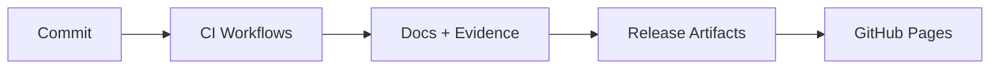

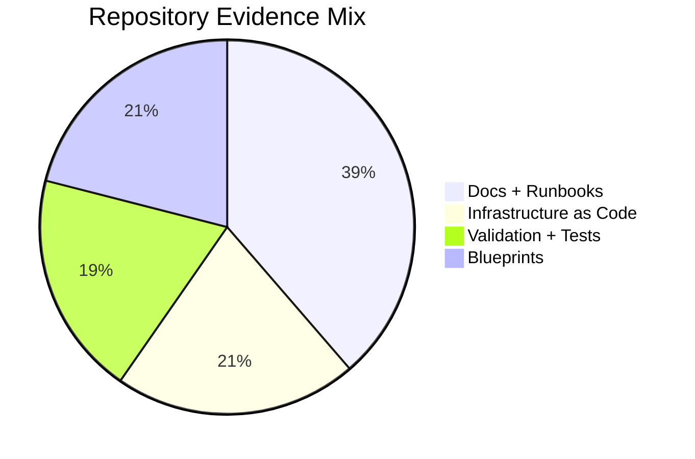

## Project Visuals (Charts + Diagrams)

### Project 1: AWS Infrastructure Automation
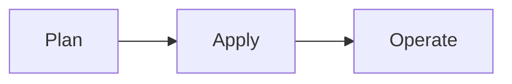
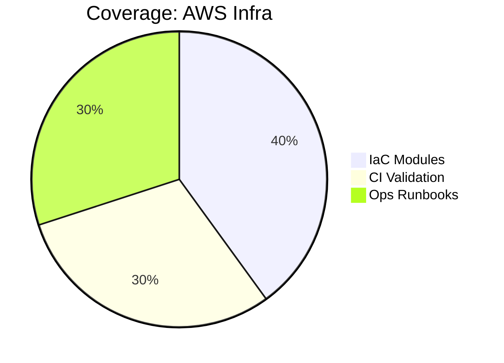

### Project 2: Database Migration Platform
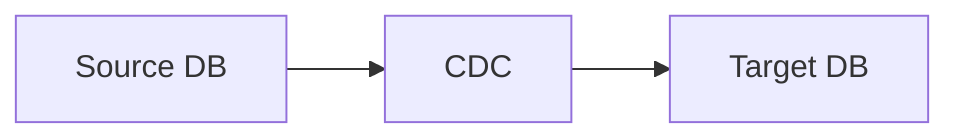
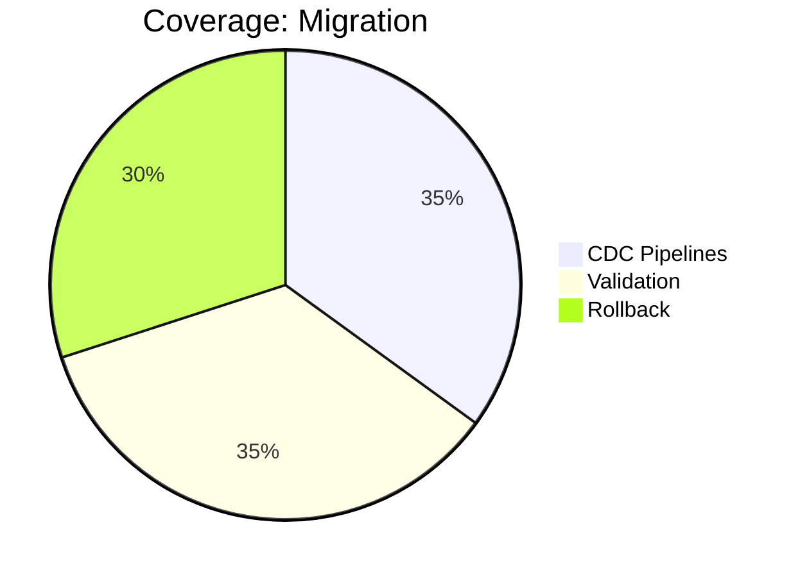

### Project 3: Kubernetes CI/CD Pipeline
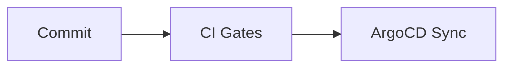
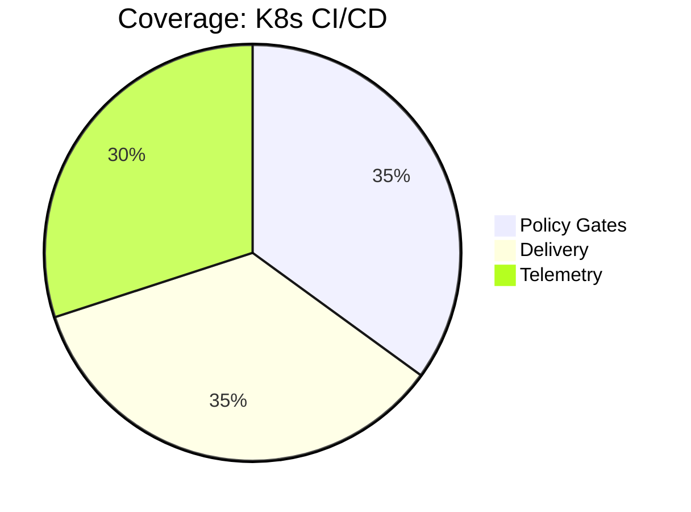

### Project 4: DevSecOps Pipeline
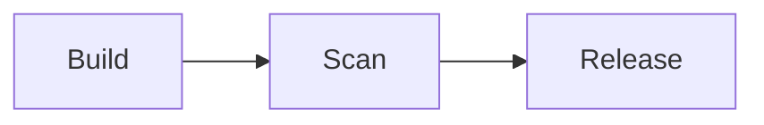
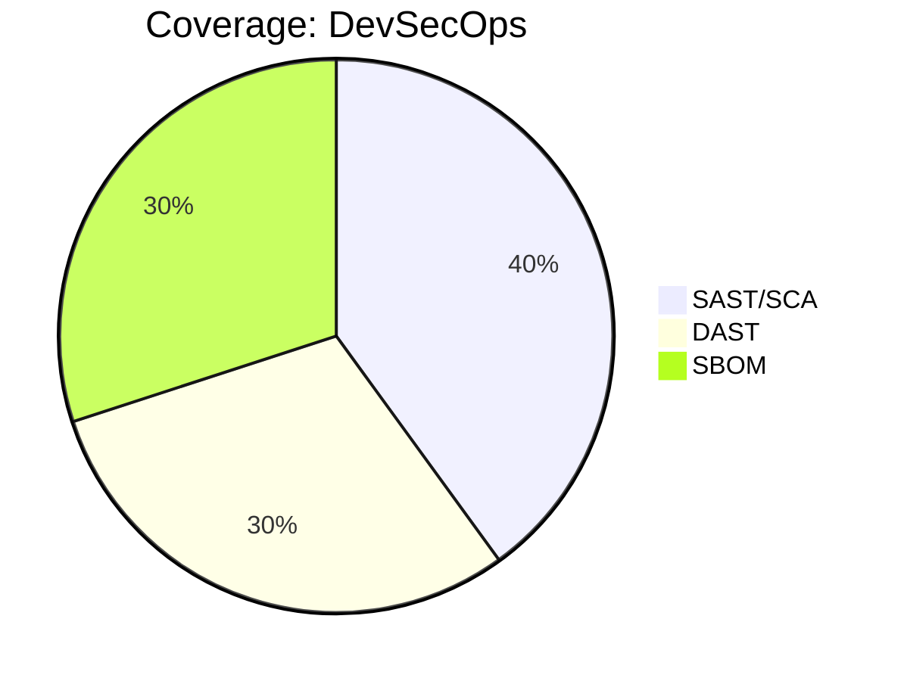

### Project 5: Real-time Data Streaming
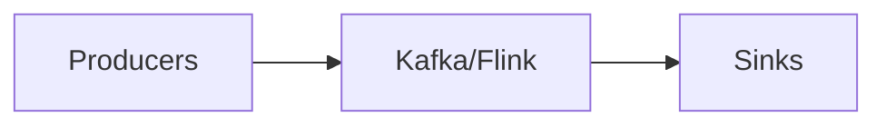
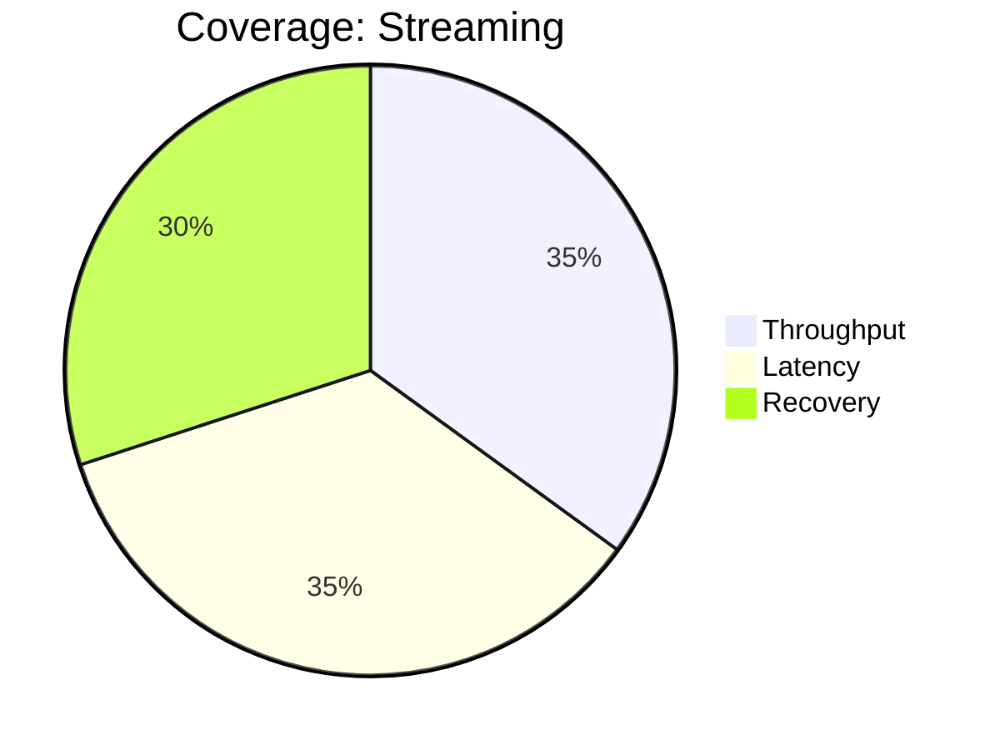

::: tip Success!
If you can see the diagrams above rendered as flowcharts and pie charts, Mermaid is working correctly!
:::

## All 25 Projects Overview

For the complete list of all projects with their diagrams, continue scrolling below or navigate using the sidebar.

[View Individual Projects](/projects/01-aws-infrastructure)
