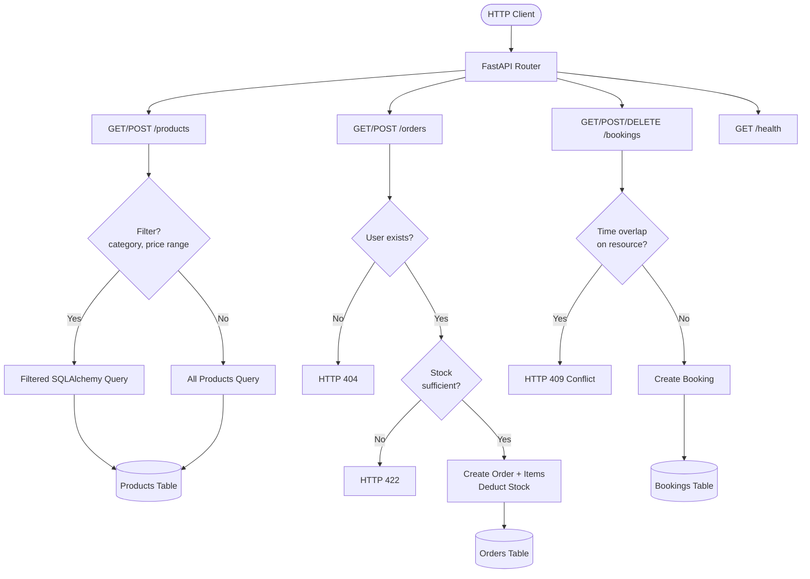

# Project 29: E-commerce & Booking Systems Recovery

A production-ready REST API built with FastAPI, SQLAlchemy, and SQLite that demonstrates full-stack backend engineering — covering product catalog management, transactional order processing, and conflict-aware resource booking.

---

## Project Overview

This project implements two interconnected business systems in a single API:

1. **E-commerce System** — Products (with categories, SKUs, inventory), Users, Orders with multi-line-item support, and inventory deduction on purchase.
2. **Booking System** — Resource reservations (conference rooms, consultation suites, training rooms) with real-time overlap detection that returns HTTP 409 on conflicts.

### Architecture

```
┌─────────────────────────────────────────────────────────┐
│                    FastAPI Application                   │
│  ┌──────────────┐  ┌──────────────┐  ┌───────────────┐  │
│  │  /products   │  │   /orders    │  │   /bookings   │  │
│  │  CRUD + filter│  │ create+items │  │ overlap check │  │
│  └──────┬───────┘  └──────┬───────┘  └───────┬───────┘  │
│         └─────────────────┴──────────────────┘          │
│                           │                             │
│              ┌────────────▼────────────┐                │
│              │   SQLAlchemy ORM Layer  │                │
│              │  (models + sessions)    │                │
│              └────────────┬────────────┘                │
│                           │                             │
│              ┌────────────▼────────────┐                │
│              │      SQLite Database     │                │
│              │   (seed data on start)  │                │
│              └─────────────────────────┘                │
└─────────────────────────────────────────────────────────┘
```

### Mermaid API Flow Diagram



---

## Quick Start

### Prerequisites

- Python 3.11+
- pip

### Run Locally

```bash
# Clone / navigate to project
cd projects/29-ecommerce-booking

# Install dependencies
pip install -r requirements.txt

# Start the API server (database seeds automatically on startup)
uvicorn app.main:app --reload --port 8000
```

The API will be live at `http://localhost:8000`. Interactive docs at `http://localhost:8000/docs`.

### Run with Docker

```bash
docker-compose up --build
```

### Run Tests

```bash
pytest tests/test_api.py -v
```

---

## API Reference

| Method | Endpoint | Description | Status Codes |
|--------|----------|-------------|--------------|
| GET | `/` | API info and available endpoints | 200 |
| GET | `/health` | Health check with DB connectivity | 200 |
| GET | `/products` | List products (filter: category, min_price, max_price, skip, limit) | 200 |
| GET | `/products/{id}` | Get single product by ID | 200, 404 |
| POST | `/products` | Create a new product | 201, 409 |
| GET | `/orders` | List all orders with line items | 200 |
| GET | `/orders/{id}` | Get single order with items | 200, 404 |
| POST | `/orders` | Create order with items (validates stock) | 201, 404, 422 |
| GET | `/bookings` | List bookings (filter: resource) | 200 |
| GET | `/bookings/{id}` | Get single booking | 200, 404 |
| POST | `/bookings` | Create booking (validates no overlap) | 201, 404, 409 |
| DELETE | `/bookings/{id}` | Cancel a booking (soft delete) | 200, 404 |

---

## Live Demo

### Health Check

```bash
curl http://localhost:8000/health
```

Response:
```json
{
  "status": "ok",
  "database": "connected",
  "version": "1.0.0"
}
```

### List All Products

```bash
curl http://localhost:8000/products
```

Response (truncated to first 3):
```json
[
  {
    "id": 1,
    "name": "Sony WH-1000XM5 Wireless Headphones",
    "category": "electronics",
    "price": 349.99,
    "stock": 42,
    "description": "Industry-leading noise canceling with Auto NC Optimizer, 30-hour battery life, Speak-to-Chat technology.",
    "sku": "PRD-001"
  },
  {
    "id": 2,
    "name": "Apple iPad Air 5th Generation",
    "category": "electronics",
    "price": 749.0,
    "stock": 18,
    "description": "M1 chip, 10.9-inch Liquid Retina display, 5G capable, USB-C connector.",
    "sku": "PRD-002"
  },
  {
    "id": 3,
    "name": "Logitech MX Master 3S Mouse",
    "category": "electronics",
    "price": 99.99,
    "stock": 75,
    "description": "8K DPI sensor, quiet clicks, MagSpeed electromagnetic scrolling, works on any surface.",
    "sku": "PRD-003"
  }
]
```

### Filter Products by Category

```bash
curl "http://localhost:8000/products?category=books"
```

Response:
```json
[
  {
    "id": 5,
    "name": "Clean Code by Robert C. Martin",
    "category": "books",
    "price": 38.99,
    "stock": 120,
    "description": "A handbook of agile software craftsmanship. Essential reading for every software developer.",
    "sku": "PRD-005"
  },
  {
    "id": 6,
    "name": "Designing Data-Intensive Applications",
    "category": "books",
    "price": 54.99,
    "stock": 85,
    "description": "By Martin Kleppmann. The big ideas behind reliable, scalable, and maintainable systems.",
    "sku": "PRD-006"
  },
  {
    "id": 7,
    "name": "The Pragmatic Programmer 20th Anniversary",
    "category": "books",
    "price": 49.99,
    "stock": 67,
    "description": "By David Thomas and Andrew Hunt. Your journey to mastery, updated for modern development.",
    "sku": "PRD-007"
  }
]
```

### Create an Order

```bash
curl -X POST http://localhost:8000/orders \
  -H "Content-Type: application/json" \
  -d '{
    "user_id": 1,
    "items": [
      {"product_id": 3, "quantity": 1},
      {"product_id": 5, "quantity": 2}
    ]
  }'
```

Response:
```json
{
  "id": 6,
  "user_id": 1,
  "status": "pending",
  "total": 177.97,
  "created_at": "2026-03-19T14:22:31",
  "items": [
    {"id": 14, "product_id": 3, "quantity": 1, "unit_price": 99.99},
    {"id": 15, "product_id": 5, "quantity": 2, "unit_price": 38.99}
  ]
}
```

### Create a Booking

```bash
curl -X POST http://localhost:8000/bookings \
  -H "Content-Type: application/json" \
  -d '{
    "user_id": 1,
    "resource_name": "Conference Room Alpha",
    "start_time": "2026-04-15T09:00:00",
    "end_time": "2026-04-15T10:30:00",
    "notes": "Sprint retrospective"
  }'
```

Response:
```json
{
  "id": 6,
  "user_id": 1,
  "resource_name": "Conference Room Alpha",
  "start_time": "2026-04-15T09:00:00",
  "end_time": "2026-04-15T10:30:00",
  "status": "confirmed",
  "notes": "Sprint retrospective"
}
```

### Booking Conflict Detection

```bash
# This will be REJECTED because Conference Room Alpha is booked 10:00-12:00
curl -X POST http://localhost:8000/bookings \
  -H "Content-Type: application/json" \
  -d '{
    "user_id": 2,
    "resource_name": "Conference Room Alpha",
    "start_time": "2026-04-15T11:00:00",
    "end_time": "2026-04-15T13:00:00",
    "notes": "Overlapping meeting attempt"
  }'
```

Response (HTTP 409):
```json
{
  "detail": "Booking conflict: 'Conference Room Alpha' is already reserved from 2026-04-15T09:00:00 to 2026-04-15T10:30:00"
}
```

---

## Screenshot Guide

### Products Listing Response

```
GET /products?category=electronics

┌────┬──────────────────────────────────┬─────────────┬────────┬───────┬──────────┐
│ id │ name                             │ category    │ price  │ stock │ sku      │
├────┼──────────────────────────────────┼─────────────┼────────┼───────┼──────────┤
│  1 │ Sony WH-1000XM5 Headphones       │ electronics │ 349.99 │    42 │ PRD-001  │
│  2 │ Apple iPad Air 5th Generation    │ electronics │ 749.00 │    18 │ PRD-002  │
│  3 │ Logitech MX Master 3S Mouse      │ electronics │  99.99 │    75 │ PRD-003  │
│  4 │ Samsung 27-inch 4K Monitor       │ electronics │ 429.95 │    23 │ PRD-004  │
└────┴──────────────────────────────────┴─────────────┴────────┴───────┴──────────┘

4 products returned (filtered from 10 total)
```

### Booking Creation and Conflict Detection

```
Timeline for "Conference Room Alpha" on 2026-03-20:

09:00 ██████████████████ 10:30  [BOOKED] user:1 - Q1 Planning Meeting
10:30                           [FREE]
11:00                           [FREE]
...

Attempting to book 09:30 - 11:00:
  POST /bookings {"resource_name": "Conference Room Alpha",
                  "start_time": "2026-03-20T09:30:00",
                  "end_time": "2026-03-20T11:00:00"}

  -> HTTP 409 Conflict
  -> {"detail": "Booking conflict: 'Conference Room Alpha' is already
       reserved from 2026-03-20T09:00:00 to 2026-03-20T10:30:00"}

Overlap detection logic:
  existing.start_time < new.end_time   AND
  existing.end_time   > new.start_time
  => TRUE: 09:00 < 11:00 AND 10:30 > 09:30 => CONFLICT
```

### Order Creation Flow

```
POST /orders
{
  "user_id": 1,
  "items": [
    {"product_id": 3, "quantity": 2},  // Logitech MX Master 3S @ $99.99
    {"product_id": 5, "quantity": 1}   // Clean Code @ $38.99
  ]
}

Validation pipeline:
  [1] Lookup user_id=1 ........... OK (Alexandra Chen)
  [2] Lookup product_id=3 ........ OK (stock: 75, needed: 2)
  [3] Lookup product_id=5 ........ OK (stock: 120, needed: 1)
  [4] Calculate total ............ $99.99 x 2 + $38.99 x 1 = $238.97
  [5] Deduct inventory ........... product 3: 75 -> 73, product 5: 120 -> 119
  [6] Persist order + items ...... ORDER #6 created

Response: HTTP 201
{
  "id": 6, "user_id": 1, "status": "pending",
  "total": 238.97, "items": [{...}, {...}]
}
```

---

## Architecture

### Tech Stack

| Component | Technology | Purpose |
|-----------|------------|---------|
| Web Framework | FastAPI 0.104 | Async-capable REST API with automatic OpenAPI docs |
| ORM | SQLAlchemy 2.0 | Database abstraction and relationship management |
| Database | SQLite | Zero-config embedded database (swappable to PostgreSQL) |
| Validation | Pydantic v2 | Request/response schema validation with type safety |
| Testing | pytest + httpx | In-memory test database, full HTTP integration tests |
| Server | Uvicorn | ASGI server for FastAPI |
| Containerization | Docker + Compose | Reproducible deployment |

### Key Design Decisions

- **Idempotent seeding**: `seed_data()` checks for existing records before inserting, making startup safe to call multiple times.
- **Overlap detection**: Uses a half-open interval query (`start < new_end AND end > new_start`) to catch all overlap cases including containment and partial overlap.
- **Soft deletes for bookings**: Cancellation sets `status="cancelled"` rather than deleting the record, preserving audit trail. Cancelled bookings are excluded from overlap checks.
- **Stock deduction in transaction**: Order creation deducts stock atomically — if any item fails validation, the whole transaction rolls back.
- **Test isolation**: Tests use a separate `test_ecommerce.db` SQLite file with session-scoped fixtures, dropped and recreated per test run.

---

## Testing

### Test Run Output

```
============================= test session starts ==============================
platform linux -- Python 3.11.14, pytest-7.4.3, pluggy-1.6.0
rootdir: /home/user/Portfolio-Project/projects/29-ecommerce-booking
plugins: anyio-3.7.1
collected 18 items

tests/test_api.py::test_health_check PASSED                              [  5%]
tests/test_api.py::test_list_products PASSED                             [ 11%]
tests/test_api.py::test_filter_products_by_category PASSED               [ 16%]
tests/test_api.py::test_filter_products_by_price PASSED                  [ 22%]
tests/test_api.py::test_get_product_by_id PASSED                         [ 27%]
tests/test_api.py::test_get_product_not_found PASSED                     [ 33%]
tests/test_api.py::test_create_product PASSED                            [ 38%]
tests/test_api.py::test_create_product_duplicate_sku PASSED              [ 44%]
tests/test_api.py::test_list_orders PASSED                               [ 50%]
tests/test_api.py::test_get_order_by_id PASSED                           [ 55%]
tests/test_api.py::test_create_order PASSED                              [ 61%]
tests/test_api.py::test_create_order_invalid_user PASSED                 [ 66%]
tests/test_api.py::test_list_bookings PASSED                             [ 72%]
tests/test_api.py::test_filter_bookings_by_resource PASSED               [ 77%]
tests/test_api.py::test_get_booking PASSED                               [ 83%]
tests/test_api.py::test_create_booking PASSED                            [ 88%]
tests/test_api.py::test_booking_overlap_rejected PASSED                  [ 94%]
tests/test_api.py::test_delete_booking PASSED                            [100%]

============================== 18 passed in 1.04s ==============================
```

### Test Coverage

| Test | What it validates |
|------|-------------------|
| `test_health_check` | API liveness and DB connectivity |
| `test_list_products` | 10 seeded products returned |
| `test_filter_products_by_category` | Category filtering (4 electronics, 3 books, 3 clothing) |
| `test_filter_products_by_price` | Price range filtering with bounds |
| `test_get_product_by_id` | Single product retrieval by ID |
| `test_get_product_not_found` | 404 for non-existent product |
| `test_create_product` | Product creation returns 201 with correct fields |
| `test_create_product_duplicate_sku` | 409 on duplicate SKU |
| `test_list_orders` | 5 seeded orders returned |
| `test_get_order_by_id` | Order with embedded items |
| `test_create_order` | Order creation with inventory deduction and correct total |
| `test_create_order_invalid_user` | 404 for unknown user |
| `test_list_bookings` | 5 seeded bookings returned |
| `test_filter_bookings_by_resource` | Resource-name filtering |
| `test_get_booking` | Single booking retrieval |
| `test_create_booking` | Booking creation on available resource |
| `test_booking_overlap_rejected` | 409 on time-overlapping booking |
| `test_delete_booking` | Soft cancel + verify status change |

---

## What This Demonstrates

**Backend API Engineering**
- RESTful API design with proper HTTP status codes (200, 201, 404, 409, 422)
- SQLAlchemy ORM with relationships, foreign keys, and query filtering
- Pydantic v2 schema validation with custom field validators
- Transactional database operations with rollback on failure

**Business Logic Implementation**
- Inventory management — stock deduction with insufficient-stock guard
- Resource scheduling — half-open interval overlap detection for bookings
- Order processing — multi-item orders with automatic total calculation
- Soft deletion pattern for bookings (status-based cancellation)

**Data Modeling**
- Normalized relational schema (Products, Users, Orders, OrderItems, Bookings)
- Foreign key relationships with SQLAlchemy ORM relationships
- Seed data with realistic business records across 3 product categories

**Testing Practices**
- Integration tests using FastAPI TestClient with httpx
- Test database isolation via dependency injection override
- Session-scoped fixtures for efficient test setup
- Tests for both happy paths and error conditions (404, 409, 422)

**DevOps & Deployment**
- Dockerfile with Python 3.11-slim base for minimal image size
- Docker Compose for single-command deployment
- Environment variable configuration for database URL
- ASGI server (Uvicorn) for production-ready serving
