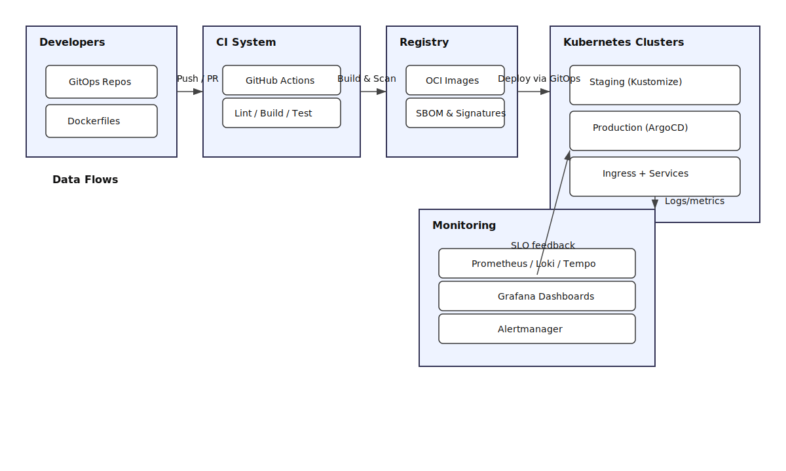

# Project 3: Kubernetes CI/CD Pipeline

Declarative delivery pipeline with GitHub Actions, ArgoCD, and progressive delivery strategies.

## Contents
- `pipelines/github-actions.yaml` — build/test/deploy workflow.
- `pipelines/argocd-app.yaml` — GitOps application manifest.

## Architecture Diagram

- 
- [Mermaid source](assets/diagrams/architecture.mmd)

**ADR Note:** GitHub Actions builds and scans images before ArgoCD syncs manifests from the registry into dev → staging → production clusters using progressive delivery policies, preserving clear trust boundaries between CI, registry, and runtime.
