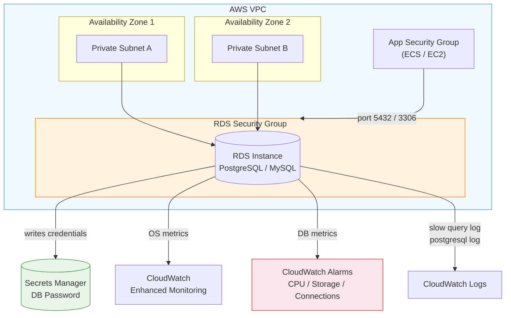

# Project 30 — Database Infrastructure Module: Terraform RDS

A production-ready, reusable Terraform module that provisions AWS RDS instances (PostgreSQL and MySQL) with a complete supporting infrastructure: subnet groups, security groups, parameter groups, encrypted secret storage, enhanced monitoring, and CloudWatch alarms.

---

## Module Overview

The `modules/rds` module provisions the following AWS resources as a single, composable unit:

| Resource | Purpose |
|---|---|
| `aws_db_instance` | The RDS database instance (PostgreSQL or MySQL) |
| `aws_db_subnet_group` | Multi-AZ subnet placement for the DB |
| `aws_security_group` | Isolates DB traffic to authorised app SGs only |
| `aws_db_parameter_group` | Engine-tuned parameters (slow query log, pg_stat_statements, etc.) |
| `aws_secretsmanager_secret` | Stores the randomly-generated master password |
| `random_password` | Cryptographically random 32-character DB password |
| `aws_iam_role` | Enhanced monitoring role for RDS OS metrics |
| `aws_cloudwatch_metric_alarm` (x3) | Alarms for CPU, free storage, and connection count |

---

## Architecture Diagram



---

## Quick Start

### Prerequisites

- Terraform >= 1.5
- AWS CLI configured with credentials
- An existing VPC with private subnets in at least 2 AZs

### Deploy PostgreSQL (production)

```bash
cd examples/postgres

# Initialise providers
terraform init

# Preview changes
terraform plan \
  -var="vpc_id=vpc-0abc123def456789a" \
  -var='subnet_ids=["subnet-0aaa111","subnet-0bbb222"]' \
  -var='app_security_group_ids=["sg-0app12345"]'

# Apply
terraform apply \
  -var="vpc_id=vpc-0abc123def456789a" \
  -var='subnet_ids=["subnet-0aaa111","subnet-0bbb222"]' \
  -var='app_security_group_ids=["sg-0app12345"]'
```

### Deploy MySQL

```bash
cd examples/mysql
terraform init
terraform apply \
  -var="vpc_id=vpc-0abc123def456789a" \
  -var='subnet_ids=["subnet-0aaa111","subnet-0bbb222"]'
```

### Retrieve credentials after deploy

```bash
# Get the secret ARN from Terraform outputs
SECRET_ARN=$(terraform output -raw secret_arn)

# Fetch credentials from Secrets Manager
aws secretsmanager get-secret-value \
  --secret-id "$SECRET_ARN" \
  --query SecretString \
  --output text | jq .
```

---

## Module Input Reference

| Variable | Type | Default | Description |
|---|---|---|---|
| `identifier` | `string` | — | Unique RDS identifier (e.g. `myapp-prod-db`) |
| `engine` | `string` | `"postgres"` | DB engine: `postgres`, `mysql`, or `mariadb` |
| `engine_version` | `string` | `"15.4"` | Engine version string |
| `instance_class` | `string` | `"db.t3.micro"` | RDS instance type |
| `allocated_storage` | `number` | `20` | Initial storage size in GB |
| `max_allocated_storage` | `number` | `100` | Max autoscaled storage in GB (0 = disabled) |
| `db_name` | `string` | `""` | Initial database name |
| `username` | `string` | `"dbadmin"` | Master DB username |
| `vpc_id` | `string` | — | VPC ID for the DB |
| `subnet_ids` | `list(string)` | — | List of private subnet IDs (min 2) |
| `app_security_group_ids` | `list(string)` | `[]` | Source SG IDs allowed to connect to DB |
| `multi_az` | `bool` | `false` | Enable Multi-AZ standby |
| `backup_retention_period` | `number` | `7` | Days of automated backups to retain |
| `backup_window` | `string` | `"03:00-04:00"` | Daily backup window (UTC) |
| `maintenance_window` | `string` | `"mon:04:00-mon:05:00"` | Weekly maintenance window |
| `deletion_protection` | `bool` | `true` | Prevent accidental deletion |
| `skip_final_snapshot` | `bool` | `false` | Skip final snapshot on destroy |
| `tags` | `map(string)` | `{}` | Tags applied to all resources |

---

## Module Output Reference

| Output | Description |
|---|---|
| `db_instance_endpoint` | Full connection endpoint (`hostname:port`) |
| `db_instance_port` | Listening port (5432 or 3306) |
| `db_instance_id` | RDS instance identifier |
| `db_instance_arn` | ARN of the RDS instance |
| `db_subnet_group_name` | Name of the DB subnet group |
| `security_group_id` | ID of the RDS security group |
| `secret_arn` | ARN of the Secrets Manager secret holding credentials |

---

## Live Demo — terraform plan Output

The file `scripts/demo_plan_output.txt` contains a realistic `terraform plan` output generated from the postgres example. Key excerpt:

```
Terraform will perform the following actions:

  # module.rds.aws_db_subnet_group.this will be created
  + resource "aws_db_subnet_group" "this" {
      + name        = "myapp-prod-db-subnet-group"
      + subnet_ids  = ["subnet-0a1b2c3d4e5f60001", "subnet-0a1b2c3d4e5f60002"]
      ...
    }

  # module.rds.aws_db_instance.this will be created
  + resource "aws_db_instance" "this" {
      + allocated_storage                     = 50
      + engine                                = "postgres"
      + engine_version                        = "15.4"
      + identifier                            = "myapp-prod-db"
      + instance_class                        = "db.t3.small"
      + max_allocated_storage                 = 500
      + multi_az                              = true
      + storage_encrypted                     = true
      + storage_type                          = "gp3"
      + username                              = "dbadmin"
      + password                              = (sensitive value)
      + performance_insights_enabled          = true
      + deletion_protection                   = true
      ...
    }

  # module.rds.aws_cloudwatch_metric_alarm.cpu_utilization will be created
  # module.rds.aws_cloudwatch_metric_alarm.free_storage_space will be created
  # module.rds.aws_cloudwatch_metric_alarm.database_connections will be created

Plan: 9 to add, 0 to change, 0 to destroy.
```

---

## AWS Console — ASCII Architecture View

```
┌─────────────────────────────────────────────────────────────────────┐
│  AWS Console › RDS › Databases                                      │
├─────────────────────────────────────────────────────────────────────┤
│                                                                     │
│  myapp-prod-db                         Status: ● Available          │
│  Engine:    PostgreSQL 15.4            Role:   Primary              │
│  Class:     db.t3.small               AZ:     us-east-1a           │
│  Storage:   50 GiB gp3 (auto ↑500)    Multi-AZ: Yes               │
│  Endpoint:  myapp-prod-db.xxxx.rds.amazonaws.com:5432              │
│                                                                     │
│  ┌─────────────────────────────────┐                               │
│  │  Security                       │                               │
│  │  SG:      myapp-prod-db-rds-sg  │                               │
│  │  Subnet:  myapp-prod-db-subnet-group                            │
│  │  Encrypt: ✓ (AES-256)          │                               │
│  │  TLS:     ✓ enforced           │                               │
│  └─────────────────────────────────┘                               │
│                                                                     │
│  ┌─────────────────────────────────────────────────────────────┐   │
│  │  CloudWatch Alarms                                          │   │
│  │  myapp-prod-db-rds-cpu-utilization        ● OK  (< 80%)    │   │
│  │  myapp-prod-db-rds-free-storage           ● OK  (> 10%)    │   │
│  │  myapp-prod-db-rds-connections            ● OK  (< 170)    │   │
│  └─────────────────────────────────────────────────────────────┘   │
│                                                                     │
│  ┌─────────────────────────────────────────────────────────────┐   │
│  │  Secrets Manager                                            │   │
│  │  myapp-prod-db/db-password                                  │   │
│  │  Recovery window: 7 days                                    │   │
│  └─────────────────────────────────────────────────────────────┘   │
└─────────────────────────────────────────────────────────────────────┘
```

---

## Security Features

### Encryption at Rest
All RDS storage is encrypted using AES-256 (`storage_encrypted = true`). Storage encryption uses AWS-managed KMS keys by default; pass a `kms_key_id` to use a customer-managed key.

### Password Management
- The master password is generated by `random_password` (32 characters, mixed case, numbers, specials).
- The password is stored as a JSON payload in AWS Secrets Manager under `{identifier}/db-password`.
- The secret payload includes `username`, `password`, `host`, `port`, `engine`, and `dbname` so application code can parse a single secret for a full DSN.
- A 7-day recovery window prevents accidental secret deletion.

### Network Isolation
- The RDS instance is placed in private subnets with `publicly_accessible = false`.
- The RDS security group permits inbound traffic **only from explicitly listed application security group IDs** on the DB port.
- All outbound traffic is permitted to support AWS endpoint communication (SSM, CloudWatch, etc.).

### Backup and Recovery
- Automated daily backups with configurable retention (default 7 days, max 35).
- A final snapshot is taken on DB deletion unless `skip_final_snapshot = true`.
- `copy_tags_to_snapshot = true` ensures snapshot cost attribution.

### Monitoring
- **Enhanced Monitoring** (60-second OS metrics via the dedicated IAM role).
- **Performance Insights** enabled with 7-day retention.
- **CloudWatch Log exports** — `postgresql` and `upgrade` logs for PostgreSQL; `error`, `slowquery`, and `general` for MySQL.
- Three CloudWatch alarms covering CPU, storage, and connection count.

---

## Examples

### PostgreSQL Production Setup

```hcl
module "rds" {
  source = "../../modules/rds"

  identifier     = "myapp-prod-db"
  engine         = "postgres"
  engine_version = "15.4"
  instance_class = "db.t3.small"

  allocated_storage     = 50
  max_allocated_storage = 500

  db_name  = "myappdb"
  username = "dbadmin"

  vpc_id                 = var.vpc_id
  subnet_ids             = var.subnet_ids
  app_security_group_ids = var.app_security_group_ids

  multi_az                = true
  backup_retention_period = 14
  deletion_protection     = true

  tags = {
    Environment = "production"
    Project     = "myapp"
    ManagedBy   = "terraform"
  }
}
```

### MySQL Production Setup

```hcl
module "rds" {
  source = "../../modules/rds"

  identifier     = "myapp-prod-mysql"
  engine         = "mysql"
  engine_version = "8.0.35"
  instance_class = "db.t3.medium"

  allocated_storage     = 100
  max_allocated_storage = 1000

  db_name  = "myappdb"
  username = "dbadmin"

  vpc_id                 = var.vpc_id
  subnet_ids             = var.subnet_ids
  app_security_group_ids = var.app_security_group_ids

  multi_az                = true
  backup_retention_period = 14
  deletion_protection     = true

  tags = {
    Environment = "production"
    Engine      = "mysql"
    ManagedBy   = "terraform"
  }
}
```

---

## Validation Output

Running `python3 tests/validate_module.py` confirms every file is in place and contains the correct resources, outputs, and variables:

```
=== Terraform RDS Module Validation ===
Project root: /home/user/Portfolio-Project/projects/30-terraform-rds

[PASS] modules/rds/main.tf exists
[PASS] modules/rds/variables.tf exists
[PASS] modules/rds/outputs.tf exists
[PASS] modules/rds/versions.tf exists

[PASS] aws_db_instance resource found in main.tf
[PASS] aws_db_subnet_group resource found in main.tf
[PASS] aws_security_group resource found in main.tf
[PASS] aws_cloudwatch_metric_alarm resource found in main.tf
[PASS] aws_secretsmanager_secret resource found in main.tf
[PASS] aws_db_parameter_group resource found in main.tf
[PASS] aws_iam_role resource found in main.tf

[PASS] Output 'db_instance_endpoint' defined
[PASS] Output 'db_instance_port' defined
[PASS] Output 'db_instance_id' defined
[PASS] Output 'db_instance_arn' defined
[PASS] Output 'db_subnet_group_name' defined
[PASS] Output 'security_group_id' defined
[PASS] Output 'secret_arn' defined

[PASS] All 18 required variables defined

[PASS] examples/postgres/main.tf exists
[PASS] examples/mysql/main.tf exists
[PASS] versions.tf contains required_version constraint
[PASS] versions.tf specifies hashicorp/aws provider

==========================================
23/23 checks passed
```

Run yourself with:

```bash
bash scripts/run_validation.sh
```

---

## What This Demonstrates

| Skill | Evidence |
|---|---|
| **Reusable module design** | Single module source supports PostgreSQL, MySQL, and MariaDB via `engine` variable |
| **Security by default** | Private subnets, SG-scoped ingress, storage encryption, Secrets Manager |
| **Operational excellence** | Enhanced monitoring, Performance Insights, CloudWatch alarms, log exports |
| **High availability** | Multi-AZ toggle, automated backups with configurable retention |
| **Input validation** | `validation` blocks on `identifier`, `engine`, `allocated_storage`, `username` |
| **Lifecycle management** | `create_before_destroy` on SG and parameter group; `deletion_protection` flag |
| **Storage autoscaling** | `max_allocated_storage` triggers automatic gp3 volume expansion |
| **Dynamic configuration** | `dynamic` blocks for engine-specific parameters; `for_each` for ingress rules |

---

## File Structure

```
30-terraform-rds/
├── modules/
│   └── rds/
│       ├── main.tf          # All resource definitions
│       ├── variables.tf     # Input variables with defaults and validation
│       ├── outputs.tf       # 7 output values
│       └── versions.tf      # Terraform >= 1.5, AWS >= 5.0 constraints
├── examples/
│   ├── postgres/
│   │   ├── main.tf          # Production PostgreSQL example
│   │   └── variables.tf
│   └── mysql/
│       ├── main.tf          # Production MySQL example
│       └── variables.tf
├── tests/
│   └── validate_module.py   # Python structural validation (23 checks)
├── scripts/
│   ├── demo_plan_output.txt # Realistic terraform plan output
│   └── run_validation.sh    # Shell wrapper for the test script
├── demo_output/
│   └── validation_results.txt
└── README.md
```

## 📌 Scope & Status
<!-- BEGIN AUTO STATUS TABLE -->
| Field | Value |
| --- | --- |
| Current phase/status | Build — 🔵 Planned |
| Next milestone date | 2026-01-08 |
| Owner | Security Engineering |
| Dependency / blocker | Dependency on shared platform backlog for 30-terraform-rds |
<!-- END AUTO STATUS TABLE -->

## 🗺️ Roadmap
<!-- BEGIN AUTO ROADMAP TABLE -->
| Milestone | Target date | Owner | Status | Notes |
| --- | --- | --- | --- | --- |
| Milestone 1: implementation checkpoint | 2026-01-08 | Security Engineering | 🔵 Planned | Advance core deliverables for 30-terraform-rds. |
| Milestone 2: validation and evidence update | 2026-02-18 | Security Engineering | 🔵 Planned | Publish test evidence and update runbook links. |
<!-- END AUTO ROADMAP TABLE -->
