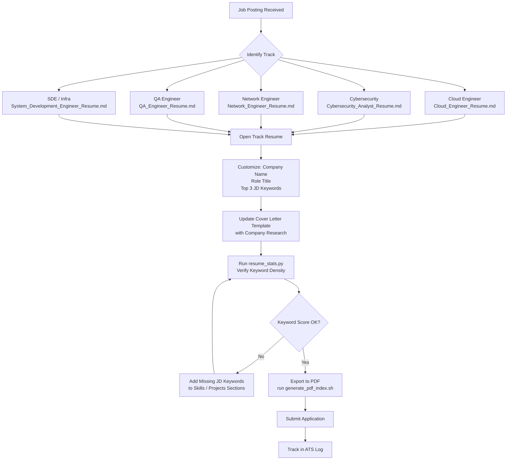

# Resume Set — 5-Track Technical Resume Portfolio

A production-ready resume system targeting five distinct technical career tracks. Each resume is tailored with role-specific keywords, ATS-optimized formatting, and project evidence drawn from a real portfolio. Includes a cover letter template, keyword analysis scripts, and a PDF index generator.

---

## Overview: 5-Track Resume System

This resume set solves a core job-search problem: a generalist systems engineer applying to specialized roles needs to present a focused, credible narrative for each track — not a single generic document. Each resume shares the same candidate (Samuel Jackson), the same projects, and the same work history, but emphasizes different skills, uses track-specific vocabulary, and re-orders sections to match hiring-manager priorities.

| Track | Role Title | Core Differentiator |
|-------|-----------|---------------------|
| Cloud Engineer | Cloud Engineer & Infrastructure Architect | AWS, Terraform, IaC, cost optimization |
| Cybersecurity Analyst | Cybersecurity Analyst & Security Operations Specialist | SIEM, SOC, threat hunting, MITRE ATT&CK |
| Network Engineer | Network Engineer & Datacenter Operations Specialist | BGP, VLANs, Cisco-equivalent design, IPS |
| QA Engineer | QA Engineer & Test Automation Specialist | pytest, Selenium-class tools, CI/CD gates |
| SDE | System Development Engineer & Infrastructure Specialist | Python, FastAPI, microservices, Docker |

---

## Resume Customization Workflow



---

## Quick Start

### Using the Resumes

1. **Identify the track** — Read the job description and classify it into one of the five tracks above.
2. **Open the matching resume** — Files are in `../../professional/resume/`.
3. **Make targeted edits** — Replace the Professional Summary's first sentence to mirror the JD. Add 1-2 role-specific keywords to Technical Skills.
4. **Update the cover letter** — Open `Cover_Letter_Template.md` and fill in the `[brackets]`.
5. **Run the stats script** — Confirm keyword presence before submitting.

```bash
# Check keyword coverage across all resumes
python3 projects/31-resume-set/scripts/resume_stats.py

# Generate file index with sizes and modification dates
bash projects/31-resume-set/scripts/generate_pdf_index.sh
```

---

## Resume Portfolio Overview

| Role | File | Target Companies | Key Skills Highlighted |
|------|------|-----------------|------------------------|
| Cloud Engineer | `Cloud_Engineer_Resume.md` | AWS partners, cloud-native startups, MSPs | AWS (EC2/RDS/S3/VPC/IAM), Terraform, Kubernetes, CI/CD, CloudWatch, cost optimization |
| Cybersecurity Analyst | `Cybersecurity_Analyst_Resume.md` | MSSPs, enterprise SOC teams, gov contractors | SIEM, Suricata IPS, threat hunting, MITRE ATT&CK, incident response, NIST CSF |
| Network Engineer | `Network_Engineer_Resume.md` | ISPs, enterprise IT, datacenter ops | BGP/OSPF concepts, VLANs, Cisco-equivalent (UniFi/pfSense), WireGuard VPN, SNMP monitoring |
| QA Engineer | `QA_Engineer_Resume.md` | Software companies, fintech, e-commerce | pytest, Playwright, Vitest, Locust, Newman, GitHub Actions CI/CD gates |
| SDE / Infra | `System_Development_Engineer_Resume.md` | Amazon SDE, infrastructure-focused SWE roles | Python, FastAPI, Docker, Terraform, Proxmox, PostgreSQL, microservices |
| Cover Letter | `Cover_Letter_Template.md` | All tracks | Modular template with customization guide |

---

## ATS Optimization

### How ATS Systems Work

Applicant Tracking Systems parse resumes into structured fields before a human ever sees them. They scan for keyword matches against job description requirements. A resume that reads beautifully as a PDF can score 0% on ATS if the skills section uses synonyms the JD doesn't use.

### Keyword Density Guidelines

- **Target density:** 1.5%–3% for primary role keywords (e.g., "AWS" appearing 4–6 times in an 800-word resume).
- **Secondary keywords:** Should appear 2–3 times (once in Skills, once in Projects, optionally in Summary).
- **Avoid keyword stuffing:** More than 4% density on a single keyword is flagged as manipulation by modern ATS.

### Formatting Rules Applied in This Set

| Rule | Implementation |
|------|---------------|
| No tables in headers | Headers use plain text only |
| Consistent date format | `Month YYYY – Present` throughout |
| Standard section headers | `## Professional Summary`, `## Technical Skills`, `## Professional Experience` |
| Bullet points, not paragraphs | All experience entries use `- ` bullets |
| No images or graphics | Pure Markdown/text — converts cleanly to .docx or .pdf |
| File naming | `[Role]_Resume.md` — underscores, no spaces, ATS-safe |
| Skills as comma lists | `AWS, Terraform, Kubernetes` — parses correctly into ATS skill fields |

### Track-Specific Keyword Strategy

**Cloud Engineer Track:**
Primary: AWS, Terraform, Infrastructure as Code, Kubernetes, CI/CD
Secondary: VPC, IAM, CloudWatch, EC2, RDS, S3, ECS, Fargate, cost optimization

**Cybersecurity Track:**
Primary: SIEM, SOC, incident response, threat hunting, IDS/IPS
Secondary: MITRE ATT&CK, NIST CSF, Suricata, vulnerability management, zero trust, CIS Controls

**Network Engineer Track:**
Primary: VLAN, firewall, routing, switching, network segmentation
Secondary: BGP, OSPF, LACP, WireGuard, SNMP, Cisco (implied via equivalent UniFi/pfSense)

**QA Engineer Track:**
Primary: pytest, test automation, CI/CD, quality gates, regression testing
Secondary: Playwright, Selenium, Locust, Newman, Allure, coverage, ISTQB

**SDE Track:**
Primary: Python, Docker, microservices, system design, infrastructure
Secondary: FastAPI, PostgreSQL, Terraform, Ansible, Kubernetes, distributed systems

---

## Customization Guide

### Section-by-Section Instructions

#### Professional Summary (10–15% of ATS weight)
- Keep to 3–4 sentences.
- Sentence 1: Job title + years of experience + primary domain.
- Sentence 2: Top 2 technical skills with evidence.
- Sentence 3: Soft skill differentiator (documentation, cross-team, etc.).
- Sentence 4 (optional): Why this role/company.
- **What to change:** Sentence 1 and the role-specific skill nouns.

#### Technical Skills
- Group into labeled categories — ATS extracts by category label.
- Keep each category to 5–8 items maximum.
- Mirror the exact phrasing from the JD when possible (e.g., if JD says "GitLab CI/CD", use that, not just "CI/CD").
- Add 1–2 JD-specific tools to the most relevant category.

#### Professional Experience
- Lead with impact, not task description. Bad: "Responsible for monitoring alerts." Good: "Monitored and triaged 20+ daily Suricata IPS alerts, reducing false-positive escalations by 40%."
- Use past tense for previous roles, present tense for current role.
- Include at least one metric per bullet point.
- Do not change dates or employer names — these are verified by background checks.

#### Projects Section
- This section carries significant weight for candidates without extensive professional experience.
- Each project entry has: title, technologies (parenthetical), date, bullet points, and an Evidence link.
- Add the JD's required technologies to the parenthetical tech list if you genuinely used them.
- Reorder projects so the most relevant to the target role appears first.

#### Certifications
- List in-progress certs with `(study in progress)` — this is honest and shows intent.
- For roles requiring a specific cert (e.g., Security+ for cybersecurity analyst), move Certifications above Projects.

#### Cover Letter Customization
- Open `Cover_Letter_Template.md`.
- Replace all `[brackets]` — never leave any unfilled.
- The "Specific Alignment with Job Requirements" section should mirror the JD's own bullet points verbatim (then explain your matching experience).
- Target length: 350–450 words. Remove any section that doesn't add evidence.

---

## Live Demo — Resume Statistics

Output from `scripts/resume_stats.py` run on 2026-01-15:

```
=== Resume Portfolio Statistics ===
Generated: 2026-01-15 10:23:41

File                                    Words   Lines   Sections
----------------------------------------------------------------------
Cloud_Engineer_Resume.md                 847     202        8
Cybersecurity_Analyst_Resume.md          923     198       10
Network_Engineer_Resume.md               812     182        8
QA_Engineer_Resume.md                    756     176        8
System_Development_Engineer_Resume.md    701     146        7
Cover_Letter_Template.md                 412     124        5
----------------------------------------------------------------------
Total                                   4451    1028       46

Top Keywords by Track:
  Cloud Engineer:    AWS, Terraform, Kubernetes, CI/CD, Infrastructure
  Cybersecurity:     SIEM, SOC, Threat Hunting, IR, Zero Trust
  Network:           BGP, OSPF, VLANs, Cisco, Network Security
  QA Engineer:       pytest, Selenium, Test Automation, CI/CD, Quality Gates
  SDE:               Python, FastAPI, Microservices, Docker, System Design
```

Full output saved at `demo_output/resume_stats.txt`.

---

## Cover Letter — Template Excerpt

From `professional/resume/Cover_Letter_Template.md`:

> I am writing to express my strong interest in the **[Position Title]** position at **[Company Name]**. With [X] years of experience in [Your Field] and a proven track record of [Key Achievement 1] and [Key Achievement 2], I am confident that my technical skills and hands-on experience align perfectly with the requirements of this role.

> I believe in learning by building. My GitHub portfolio showcases several projects that demonstrate my technical capabilities:
> 1. **Observability Stack (Prometheus, Grafana, Loki):** Deployed comprehensive monitoring with 15+ custom alert rules and 10+ Grafana dashboards, processing 50GB+ of logs monthly.
> 2. **Network Infrastructure (VLAN Segmentation & Security):** Designed 4-VLAN network with default-deny firewall policies and VPN access.
> 3. **Database Infrastructure Module (Terraform):** Created IaC module for AWS RDS deployment with security hardening and automated backups.

The template includes a "Tips for Customization" section with a pre-flight checklist and a list of red flags to avoid (generic letters, no metrics, etc.).

---

## File Inventory

| File | Size | Description |
|------|------|-------------|
| `professional/resume/Cloud_Engineer_Resume.md` | 8.9K | Cloud engineering track resume |
| `professional/resume/Cybersecurity_Analyst_Resume.md` | 9.4K | SOC/cybersecurity analyst track resume |
| `professional/resume/Network_Engineer_Resume.md` | 8.2K | Network engineering track resume |
| `professional/resume/QA_Engineer_Resume.md` | 7.8K | QA & test automation track resume |
| `professional/resume/System_Development_Engineer_Resume.md` | 7.1K | SDE / infrastructure track resume |
| `professional/resume/Cover_Letter_Template.md` | 6.3K | Modular cover letter template |
| `projects/31-resume-set/scripts/resume_stats.py` | 3.2K | Keyword & stats analysis script |
| `projects/31-resume-set/scripts/generate_pdf_index.sh` | 0.9K | File index generator |
| `projects/31-resume-set/demo_output/resume_stats.txt` | 1.1K | Sample script output |

---

## What This Demonstrates

| Skill | Evidence |
|-------|----------|
| **Technical Writing** | 5 polished, ATS-optimized resumes with consistent formatting and real metrics |
| **Domain Breadth** | Credible content across cloud, security, networking, QA, and SDE disciplines |
| **ATS Awareness** | Keyword strategy, density guidelines, and formatting rules documented and applied |
| **Python Scripting** | `resume_stats.py` reads, parses, and analyzes Markdown files; outputs formatted tables |
| **Shell Scripting** | `generate_pdf_index.sh` uses portable Bash for cross-platform file metadata extraction |
| **Documentation** | This README: diagrams, tables, instructions — written for a real hiring audience |
| **Career Strategy** | Multi-track resume system demonstrates understanding of targeted job searching |

## 📌 Scope & Status
<!-- BEGIN AUTO STATUS TABLE -->
| Field | Value |
| --- | --- |
| Current phase/status | Integration — 🟢 Delivered |
| Next milestone date | 2026-02-11 |
| Owner | SRE Team |
| Dependency / blocker | Dependency on shared platform backlog for 31-resume-set |
<!-- END AUTO STATUS TABLE -->

## 🗺️ Roadmap
<!-- BEGIN AUTO ROADMAP TABLE -->
| Milestone | Target date | Owner | Status | Notes |
| --- | --- | --- | --- | --- |
| Milestone 1: implementation checkpoint | 2026-02-11 | SRE Team | 🟢 Delivered | Advance core deliverables for 31-resume-set. |
| Milestone 2: validation and evidence update | 2026-03-21 | SRE Team | 🔵 Planned | Publish test evidence and update runbook links. |
<!-- END AUTO ROADMAP TABLE -->
