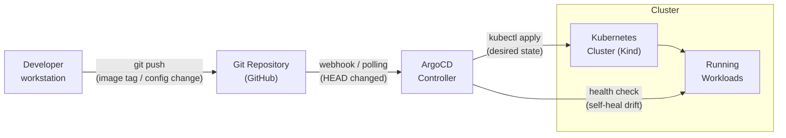
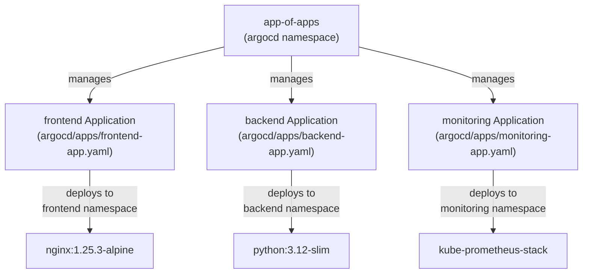

# GitOps Platform — ArgoCD on Kind

A production-grade GitOps platform using ArgoCD and the app-of-apps pattern, provisioned
with Terraform on a local Kind cluster. Demonstrates declarative infrastructure, automated
reconciliation, and multi-environment promotion workflows.

---

## Architecture Overview

The platform combines three layers:

1. **Infrastructure layer** — Terraform provisions a Kind cluster (1 control-plane + 2 workers)
   and installs ArgoCD via Helm.
2. **GitOps layer** — A single "app-of-apps" ArgoCD Application watches the `argocd/apps/`
   directory and automatically creates child Applications for each service.
3. **Application layer** — Frontend, backend, and monitoring services are each defined as
   ArgoCD Applications pointing at environment-specific Helm values files.

Any Git commit to the repository triggers ArgoCD to detect drift and automatically reconcile
the cluster to the desired state.

### GitOps Flow



### App-of-Apps Pattern



---

## Prerequisites

| Tool      | Minimum Version | Install                                          |
|-----------|-----------------|--------------------------------------------------|
| Docker    | 20.x            | https://docs.docker.com/engine/install/          |
| kind      | 0.20.0          | https://kind.sigs.k8s.io/docs/user/quick-start/  |
| kubectl   | 1.28            | https://kubernetes.io/docs/tasks/tools/          |
| Helm      | 3.13            | https://helm.sh/docs/intro/install/              |
| Terraform | 1.5+            | https://developer.hashicorp.com/terraform/install |
| argocd    | 2.9+            | https://argo-cd.readthedocs.io/en/stable/cli_installation/ |

---

## Quick Start

```bash
# 1. Clone the repository
git clone https://github.com/samueljackson-collab/Portfolio-Project
cd Portfolio-Project/projects/32-gitops-platform

# 2. Run the bootstrap script (provisions cluster + ArgoCD + app-of-apps)
./scripts/bootstrap.sh

# 3. Access the ArgoCD UI
kubectl port-forward svc/argocd-server -n argocd 8080:443 &
open https://localhost:8080
# Username: admin
# Password: (printed by bootstrap.sh, or run the command below)
kubectl -n argocd get secret argocd-initial-admin-secret \
  -o jsonpath="{.data.password}" | base64 -d && echo

# 4. Watch apps sync
argocd app list
```

### Manual Terraform Steps (if not using bootstrap.sh)

```bash
cd terraform
terraform init
terraform plan
terraform apply -auto-approve

# Deploy app-of-apps
kubectl apply -f ../argocd/app-of-apps.yaml

# Verify sync
argocd app wait app-of-apps --sync
argocd app list
```

---

## Environment Promotion Workflow

Images are promoted across environments by updating `image.tag` in the relevant
`environments/<env>/values.yaml`, committing, and pushing to Git. ArgoCD detects the
commit and rolls out the change automatically.

```
dev  ──►  staging  ──►  prod
```

### Automated promotion using promote.sh

```bash
# Promote frontend image from dev to staging
./scripts/promote.sh staging frontend nginx 1.26.0-alpine

# After validation, promote to production
./scripts/promote.sh prod frontend nginx 1.26.0-alpine
```

The script:
1. Updates `image.repository` and `image.tag` in the target `values.yaml`
2. Commits with a structured message: `chore(staging): promote frontend to nginx:1.26.0-alpine`
3. Pushes the branch — ArgoCD picks up the change within 3 minutes (default polling interval)

### Environment comparison

| Feature             | dev     | staging | prod     |
|---------------------|---------|---------|----------|
| Replicas            | 1       | 2       | 3        |
| HPA                 | Off     | On      | On       |
| HPA max replicas    | 2       | 4       | 10       |
| PDB                 | Off     | On (1)  | On (2)   |
| Ingress TLS         | Off     | On      | On       |
| Network Policy      | Off     | Off     | On       |
| Debug mode          | true    | false   | false    |
| CPU limit           | 200m    | 500m    | 1000m    |
| Memory limit        | 128Mi   | 256Mi   | 512Mi    |

---

## Live Demo

### argocd app list output

```
$ argocd app list
NAME         CLUSTER                         NAMESPACE  PROJECT  STATUS  HEALTH   SYNCPOLICY  CONDITIONS  REPO
app-of-apps  https://kubernetes.default.svc  argocd     default  Synced  Healthy  Auto-Prune  <none>      https://github.com/samueljackson-collab/Portfolio-Project
backend      https://kubernetes.default.svc  backend    default  Synced  Healthy  Auto-Prune  <none>      https://github.com/samueljackson-collab/Portfolio-Project
frontend     https://kubernetes.default.svc  frontend   default  Synced  Healthy  Auto-Prune  <none>      https://github.com/samueljackson-collab/Portfolio-Project
monitoring   https://kubernetes.default.svc  monitoring default  Synced  Healthy  Auto-Prune  <none>      https://github.com/samueljackson-collab/Portfolio-Project
```

Full output with paths and targets: [`demo_output/argocd_app_list.txt`](demo_output/argocd_app_list.txt)

### terraform apply excerpt

```
kind_cluster.gitops: Creating...
kind_cluster.gitops: Still creating... [30s elapsed]
kind_cluster.gitops: Creation complete after 68s [id=gitops-demo]
helm_release.argocd: Creation complete after 97s [id=argocd]

Apply complete! Resources: 5 added, 0 changed, 0 destroyed.

Outputs:
cluster_name  = "gitops-demo"
argocd_namespace = "argocd"
kubeconfig_path  = "/home/user/.kube/config"
```

Full output: [`demo_output/terraform_apply.txt`](demo_output/terraform_apply.txt)

---

## Screenshots Guide (ASCII ArgoCD UI State)

### ArgoCD Applications Overview

```
+------------------------------------------------------------------+
|  ArgoCD — Applications                              [Sync All]   |
+------------------------------------------------------------------+
| Name          | Namespace  | Status  | Health  | Last Sync       |
|---------------|------------|---------|---------|-----------------|
| app-of-apps   | argocd     | Synced  | Healthy | 2 minutes ago   |
| backend       | backend    | Synced  | Healthy | 1 minute ago    |
| frontend      | frontend   | Synced  | Healthy | 1 minute ago    |
| monitoring    | monitoring | Synced  | Healthy | 3 minutes ago   |
+------------------------------------------------------------------+
```

### app-of-apps Sync Tree

```
app-of-apps [Synced / Healthy]
├── Application: backend    [Synced] ✓
├── Application: frontend   [Synced] ✓
└── Application: monitoring [Synced] ✓
```

### frontend App Resource Tree

```
frontend [Synced / Healthy]
├── Namespace: frontend     [Healthy] ✓
├── Deployment: frontend    [Healthy] — 1/1 pods running
├── Service: frontend       [Healthy] — ClusterIP
└── ConfigMap: frontend-cfg [Synced]  ✓
```

---

## Terraform Plan Excerpt

```
Plan: 5 to add, 0 to change, 0 to destroy.

+ kind_cluster.gitops
    name = "gitops-demo"
    nodes: control-plane × 1, worker × 2

+ helm_release.argocd
    chart     = "argo-cd"
    version   = "5.51.6"
    namespace = "argocd"

+ kubernetes_namespace.environments["frontend"]
+ kubernetes_namespace.environments["backend"]
+ kubernetes_namespace.environments["monitoring"]
```

---

## What This Demonstrates

- **GitOps pattern** — Git is the single source of truth; no manual `kubectl apply`
- **App-of-apps** — Hierarchical ArgoCD Applications for scalable multi-service management
- **Infrastructure as Code** — Full cluster lifecycle managed by Terraform (Kind + Helm)
- **Multi-environment promotion** — Structured dev → staging → prod workflow with commit-driven deploys
- **Automated self-healing** — ArgoCD detects and corrects configuration drift without human intervention
- **Production readiness signals** — HPA, PDB, topology spread, network policies, and TLS in prod values
- **Observability stack** — kube-prometheus-stack (Prometheus + Grafana + Alertmanager) deployed via ArgoCD
- **Scripted operations** — Bootstrap and promote scripts make the workflow reproducible and CI-friendly

---

## Project Structure

```
32-gitops-platform/
├── terraform/
│   ├── main.tf           # Kind cluster + ArgoCD Helm release
│   ├── variables.tf      # cluster_name, environment, argocd_version
│   └── outputs.tf        # cluster_name, kubeconfig_path, argocd_namespace
├── argocd/
│   ├── app-of-apps.yaml  # Root Application managing all child apps
│   └── apps/
│       ├── frontend-app.yaml
│       ├── backend-app.yaml
│       └── monitoring-app.yaml
├── environments/
│   ├── dev/values.yaml       # replicas: 1, no HPA, no PDB
│   ├── staging/values.yaml   # replicas: 2, HPA, PDB minAvailable: 1
│   └── prod/values.yaml      # replicas: 3, HPA max: 10, PDB minAvailable: 2
├── scripts/
│   ├── bootstrap.sh      # Full cluster bootstrap
│   └── promote.sh        # Image tag promotion across environments
├── demo_output/
│   ├── argocd_app_list.txt
│   └── terraform_apply.txt
└── tests/
    └── test_manifests.py # 71 pytest tests — all pass
```
