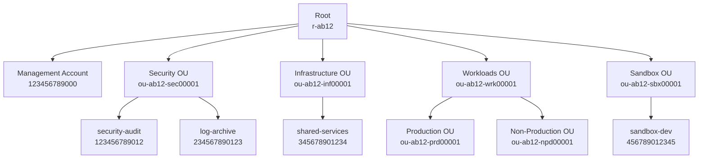

# AWS Landing Zone — Multi-Account Foundation

A production-grade AWS Landing Zone built with Terraform, establishing a secure multi-account
AWS Organizations structure with Service Control Policies (SCPs), IAM Identity Center (SSO),
and a documented account topology. Demonstrates AWS security best practices and enterprise
cloud governance.

---

## Landing Zone Overview

An AWS Landing Zone is the foundation that all workloads run on. This implementation
provides:

- **Multi-account isolation** — Separate AWS accounts per function (security, infra, workloads, sandbox)
- **Preventive controls** — SCPs enforce security guardrails at the organizational level
- **Centralized identity** — IAM Identity Center (SSO) with least-privilege permission sets
- **Audit and compliance** — Dedicated log-archive and security-audit accounts
- **Network segmentation** — Transit Gateway hub-and-spoke model with isolated Security OU

### Benefits of Multi-Account Architecture

| Concern         | Single-Account Risk                        | Multi-Account Solution                           |
|-----------------|--------------------------------------------|--------------------------------------------------|
| Blast radius    | Misconfiguration affects all services      | Accounts isolate failures                        |
| Compliance      | Hard to enforce controls per environment   | SCPs enforce controls at OU level                |
| Cost visibility | All costs mixed together                   | Per-account billing and tagging                  |
| Security        | Overprivileged users can reach everything  | IAM boundaries per account                       |
| Audit           | Logs scattered, hard to protect            | Dedicated immutable log-archive account          |

---

## Account Hierarchy



---

## Quick Start

> **Note**: Deploying AWS Organizations and creating member accounts requires management
> account credentials and will create real AWS resources. Review costs and confirm you have
> the required permissions before applying.

### Prerequisites

- AWS CLI configured with management account credentials
- Terraform >= 1.5
- Permissions: `organizations:*`, `iam:*`, `sso-admin:*`

### Deploy

```bash
# 1. Clone repository
git clone https://github.com/samueljackson-collab/Portfolio-Project
cd Portfolio-Project/projects/33-aws-landing-zone

# 2. Deploy the Organizations structure
cd terraform/organizations
terraform init
terraform plan -var="email_domain=yourcompany.com"
terraform apply -var="email_domain=yourcompany.com"

# 3. Deploy SCPs (reads OU IDs from organizations outputs)
cd ../scp
terraform init
terraform apply \
  -var="workloads_ou_id=$(cd ../organizations && terraform output -raw workloads_ou_id)" \
  -var="security_ou_id=$(cd ../organizations && terraform output -raw security_ou_id)"

# 4. Deploy SSO permission sets (after Identity Center is enabled)
cd ../sso
terraform init
terraform apply \
  -var="management_account_id=123456789000" \
  -var="security_audit_account_id=$(cd ../organizations && terraform output -raw security_audit_account_id)" \
  -var="platform_team_group_id=<group-id-from-identity-center>" \
  -var="devops_team_group_id=<group-id>" \
  -var="security_team_group_id=<group-id>" \
  -var="auditor_group_id=<group-id>"

# 5. Validate SCPs
python3 scripts/validate_scps.py
```

---

## Account Topology

```
AWS Organization: o-abc1234567
├── Root (r-ab12)
│   ├── Security OU (ou-ab12-sec00001)
│   │   ├── Account: security-audit (123456789012)
│   │   └── Account: log-archive (234567890123)
│   ├── Infrastructure OU (ou-ab12-inf00001)
│   │   └── Account: shared-services (345678901234)
│   ├── Workloads OU (ou-ab12-wrk00001)
│   │   ├── Production OU (ou-ab12-prd00001)
│   │   └── Non-Production OU (ou-ab12-npd00001)
│   └── Sandbox OU (ou-ab12-sbx00001)
│       └── Account: sandbox-dev (456789012345)
```

| Account          | OU             | Purpose                                            |
|------------------|----------------|----------------------------------------------------|
| Management       | Root           | AWS Organizations master payer, SSO configuration  |
| security-audit   | Security       | GuardDuty master, SecurityHub aggregator           |
| log-archive      | Security       | Immutable CloudTrail + Config log destination      |
| shared-services  | Infrastructure | Transit Gateway, DNS, CI/CD, artifact stores       |
| sandbox-dev      | Sandbox        | Developer experiments, short-lived resources       |

---

## SCP Reference Table

| Policy                 | Scope               | Effect | Reason                                         |
|------------------------|---------------------|--------|------------------------------------------------|
| DenyRootActions        | Root (all accounts) | Deny   | Prevents root account usage across all members |
| RequireMFA             | Root (all accounts) | Deny   | IAM writes require MFA; exempts SSO roles      |
| RestrictRegions        | Workloads OU        | Deny   | Limits API calls to us-east-1, us-west-2, eu-west-1 |
| DenyInternetGateways   | Security OU         | Deny   | Security accounts must not have internet egress |

### Policy Attachment Map

```
Root
 ├── DenyRootActions    (prevents root account misuse everywhere)
 └── RequireMFA         (MFA enforced for IAM writes everywhere)

Workloads OU
 └── RestrictRegions    (only approved regions for production workloads)

Security OU
 └── DenyInternetGateways  (audit/log accounts are network-isolated)
```

---

## SSO Permission Sets

| Permission Set       | Session | Access Scope                                        | Who Gets It        |
|----------------------|---------|-----------------------------------------------------|--------------------|
| AdministratorAccess  | 4 hours | Full AWS access (break-glass, platform team)        | Platform engineers |
| ReadOnlyAccess       | 8 hours | All services, read-only                             | Auditors           |
| DevOpsAccess         | 8 hours | EC2/ECS/EKS/Lambda/S3/RDS/CloudWatch; no IAM writes| DevOps engineers   |
| SecurityAuditAccess  | 4 hours | GuardDuty/SecurityHub/Config/CloudTrail read        | Security team      |

### Account → Permission Set Matrix

| Account          | AdministratorAccess | ReadOnlyAccess | DevOpsAccess | SecurityAuditAccess |
|------------------|:-------------------:|:--------------:|:------------:|:-------------------:|
| Management       | Platform            | —              | —            | —                   |
| security-audit   | —                   | Auditors       | —            | Security            |
| log-archive      | —                   | Auditors       | —            | —                   |
| shared-services  | Platform            | —              | DevOps       | —                   |
| sandbox-dev      | —                   | —              | DevOps       | —                   |

---

## Live Demo

### Organization Structure

```
AWS Organization: o-abc1234567
├── Root (r-ab12)
│   ├── Security OU (ou-ab12-sec00001)
│   │   ├── Account: security-audit (123456789012)
│   │   └── Account: log-archive (234567890123)
│   ├── Infrastructure OU (ou-ab12-inf00001)
│   │   └── Account: shared-services (345678901234)
│   ├── Workloads OU (ou-ab12-wrk00001)
│   │   ├── Production OU (ou-ab12-prd00001)
│   │   └── Non-Production OU (ou-ab12-npd00001)
│   └── Sandbox OU (ou-ab12-sbx00001)
│       └── Account: sandbox-dev (456789012345)

SCPs Applied:
  - deny-root-actions      → Root (all accounts)
  - require-mfa            → Root (all accounts)
  - restrict-regions       → Workloads OU
  - deny-internet-gateways → Security OU
```

Full output: [`demo_output/org_structure.txt`](demo_output/org_structure.txt)

### SCP Validation Output

```
=== AWS Landing Zone SCP Validation ===
Validating 4 SCP policy files...

[PASS] deny-root-actions.json - Valid JSON
[PASS] deny-root-actions.json - Has Version field: 2012-10-17
[PASS] deny-root-actions.json - Has 1 Statement(s)
[PASS] deny-root-actions.json - Statement[0]: Effect=Deny, Actions=3, Resource=*
[PASS] require-mfa.json - Valid JSON
[PASS] require-mfa.json - Has Version field: 2012-10-17
[PASS] require-mfa.json - Has 1 Statement(s)
[PASS] require-mfa.json - Statement[0]: Effect=Deny, Actions=14, Resource=*
[PASS] restrict-regions.json - Valid JSON
[PASS] restrict-regions.json - Has Version field: 2012-10-17
[PASS] restrict-regions.json - Has 2 Statement(s)
[PASS] deny-internet-gateways.json - Valid JSON
[PASS] deny-internet-gateways.json - Has Version field: 2012-10-17
[PASS] deny-internet-gateways.json - Has 1 Statement(s)

==========================================
17/17 checks passed. All SCPs are valid.
```

Full output: [`demo_output/scp_validation.txt`](demo_output/scp_validation.txt)

---

## Security Controls Summary

| Control                   | Implementation                          | Coverage          |
|---------------------------|-----------------------------------------|-------------------|
| Root account protection   | DenyRootActions SCP                     | All accounts      |
| MFA enforcement           | RequireMFA SCP                          | All accounts      |
| Region restriction        | RestrictRegions SCP                     | Workloads OU      |
| Network isolation         | DenyInternetGateways SCP                | Security OU       |
| Centralized logging       | log-archive account + CloudTrail org    | All accounts      |
| Threat detection          | GuardDuty master in security-audit      | All accounts      |
| Vulnerability findings    | SecurityHub aggregated in security-audit| All accounts      |
| Access control            | IAM Identity Center + permission sets   | All accounts      |
| Least privilege           | DevOpsAccess denies IAM writes          | DevOps users      |
| Billing protection        | DENY on member account billing portals  | Member accounts   |
| Config compliance         | AWS Config rules → security-audit       | All accounts      |

---

## Project Structure

```
33-aws-landing-zone/
├── terraform/
│   ├── organizations/
│   │   ├── main.tf         # Organization, OUs, accounts, SCP resources
│   │   ├── variables.tf    # email_domain, account_names, region
│   │   └── outputs.tf      # org_id, root_id, all OU IDs, all account IDs
│   ├── sso/
│   │   ├── main.tf         # Permission sets + account assignments
│   │   └── variables.tf    # account IDs, group IDs
│   └── scp/
│       ├── main.tf         # SCP policy resources + attachments
│       ├── variables.tf    # OU IDs for attachments
│       └── policies/
│           ├── deny-root-actions.json
│           ├── require-mfa.json
│           ├── restrict-regions.json
│           └── deny-internet-gateways.json
├── docs/
│   └── account-topology.md  # Hierarchy, access matrix, network design
├── scripts/
│   └── validate_scps.py     # SCP JSON validation script
├── demo_output/
│   ├── scp_validation.txt
│   └── org_structure.txt
└── tests/
    └── test_landing_zone.py  # 76 pytest tests — all pass
```

---

## What This Demonstrates

- **AWS Organizations** — Programmatic creation of multi-account org structure with OUs and member accounts
- **Service Control Policies** — Preventive guardrails: deny root, require MFA, restrict regions, block IGW
- **IAM Identity Center** — Centralized SSO with least-privilege permission sets mapped to accounts
- **Security account pattern** — Dedicated immutable log-archive and security-audit accounts
- **Infrastructure as Code** — All governance enforced in Terraform with no manual console steps
- **Policy-as-code** — SCP JSON files validated by a Python script with 17 checks
- **Account vending** — Documented process for creating new accounts in under 30 minutes
- **Network segmentation** — Transit Gateway hub-and-spoke design with Security OU isolated from internet
- **Compliance by default** — New accounts inherit SCPs from parent OU automatically

## 📌 Scope & Status
<!-- BEGIN AUTO STATUS TABLE -->
| Field | Value |
| --- | --- |
| Current phase/status | Release Prep — 🟠 In Progress |
| Next milestone date | 2026-04-17 |
| Owner | QA Automation |
| Dependency / blocker | Dependency on shared platform backlog for 33-aws-landing-zone |
<!-- END AUTO STATUS TABLE -->

## 🗺️ Roadmap
<!-- BEGIN AUTO ROADMAP TABLE -->
| Milestone | Target date | Owner | Status | Notes |
| --- | --- | --- | --- | --- |
| Milestone 1: implementation checkpoint | 2026-04-17 | QA Automation | 🟠 In Progress | Advance core deliverables for 33-aws-landing-zone. |
| Milestone 2: validation and evidence update | 2026-05-27 | QA Automation | 🔵 Planned | Publish test evidence and update runbook links. |
<!-- END AUTO ROADMAP TABLE -->
