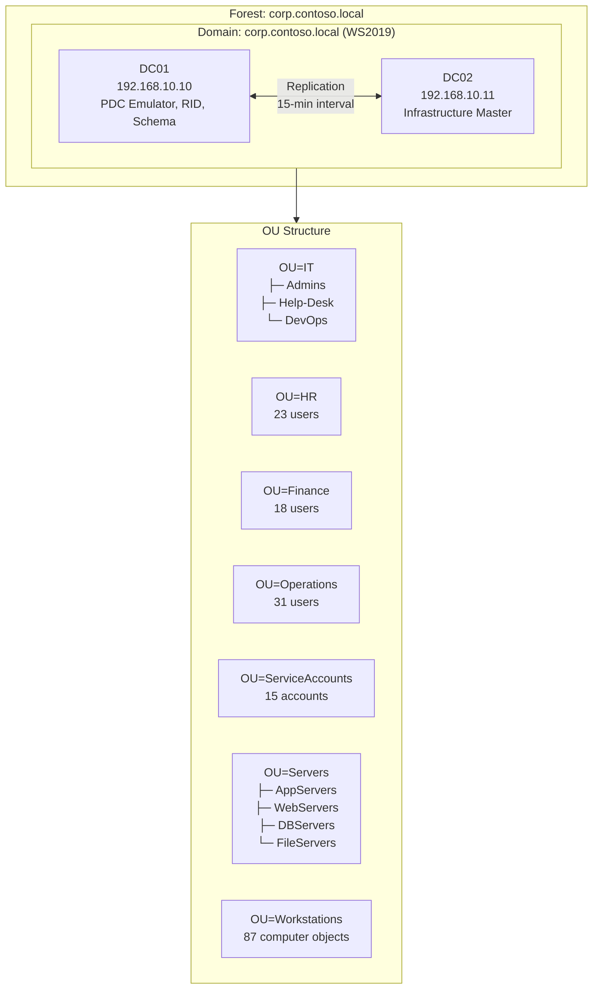

# Active Directory Design & Automation

Infrastructure-as-code for a production-grade Active Directory environment using PowerShell DSC and Ansible. Covers domain deployment, OU design, user/group provisioning, GPO management, Linux domain join, and security hardening.

---

## Domain Architecture Overview

Single-forest, single-domain design for `corp.contoso.local` following Microsoft's Enterprise Access Model (Tier 0 / 1 / 2 privilege separation).



---

## Quick Start

### Prerequisites

- Windows Server 2022 VM (for DSC)
- Vagrant + VirtualBox (optional, for local lab)
- Ansible 2.14+ with `ansible.windows` collection
- Python 3.10+

### 1. Deploy Domain Controller (DSC)

```powershell
# On target Windows Server
Install-Module -Name ActiveDirectoryDsc, NetworkingDsc, ComputerManagementDsc -Force

$cred = Get-Credential -UserName "Administrator" -Message "Domain admin password"
. .\dsc\DomainSetup.ps1
DomainController -DomainAdminCredential $cred -ConfigurationData $ConfigData -OutputPath C:\DSC\Domain
Start-DscConfiguration -Path C:\DSC\Domain -Wait -Verbose -Force
```

### 2. Provision Users and Groups

```powershell
$domainCred = Get-Credential -UserName "CONTOSO\Administrator"
$userPass   = Get-Credential -UserName "NewUser" -Message "Default user password"
. .\dsc\UsersAndGroups.ps1
UsersAndGroups -DomainAdminCredential $domainCred -DefaultUserPassword $userPass `
    -ConfigurationData $ConfigData -OutputPath C:\DSC\UsersGroups
Start-DscConfiguration -Path C:\DSC\UsersGroups -Wait -Verbose -Force
```

### 3. Apply GPO Policies

```powershell
. .\dsc\GPOPolicies.ps1
GPOPolicies -DomainAdminCredential $domainCred `
    -ConfigurationData $ConfigData -OutputPath C:\DSC\GPO
Start-DscConfiguration -Path C:\DSC\GPO -Wait -Verbose -Force
```

### 4. Join Linux Servers to Domain

```bash
# Encrypt secrets
ansible-vault encrypt_string 'svc-deploy' --name 'vault_ad_user'
ansible-vault encrypt_string 'P@ssw0rd123!' --name 'vault_ad_password'

# Run domain join playbook
ansible-playbook -i ansible/inventory/lab.ini \
    ansible/playbooks/ad-join.yml \
    --ask-vault-pass \
    --limit linux_servers
```

### 5. Apply Security Hardening

```bash
ansible-playbook -i ansible/inventory/lab.ini \
    ansible/playbooks/ad-hardening.yml \
    --ask-vault-pass
```

### 6. Run AD Report

```bash
python3 scripts/generate_ad_report.py
# Or save to file:
python3 scripts/generate_ad_report.py --output demo_output/ad_report.txt
```

---

## OU Structure

| OU | Contents | GPO Applied |
|----|---------|-------------|
| `OU=IT/Admins` | 4 IT admin accounts (Tier 1) | IT-Admin-Rights |
| `OU=IT/Help-Desk` | 8 support technicians | Help-Desk-Rights |
| `OU=IT/DevOps` | 4 DevOps/automation engineers | DevOps-Access |
| `OU=HR` | 23 HR staff accounts | Workstation-Standard |
| `OU=Finance` | 18 finance accounts | Finance-AppLocker |
| `OU=Operations` | 31 operations accounts | Workstation-Standard |
| `OU=ServiceAccounts` | 15 service/managed accounts | Service-Account-Policy |
| `OU=Servers` | 22 server computer objects | Server-Hardening |
| `OU=Workstations` | 87 workstation objects | Workstation-Standard |
| `OU=Security` | Resource groups (AGDLP DL layer) | None |

---

## Automation Capabilities

| Capability | Tool | File |
|-----------|------|------|
| Domain controller deployment | PowerShell DSC | `dsc/DomainSetup.ps1` |
| User and group provisioning | PowerShell DSC | `dsc/UsersAndGroups.ps1` |
| GPO management | PowerShell DSC | `dsc/GPOPolicies.ps1` |
| Linux domain join | Ansible | `ansible/playbooks/ad-join.yml` |
| AD security hardening | Ansible | `ansible/playbooks/ad-hardening.yml` |
| DC role deployment | Ansible Role | `ansible/roles/ad-domain/tasks/main.yml` |
| AD infrastructure reporting | Python | `scripts/generate_ad_report.py` |

---

## Live Demo — AD Report Output

```
================================================================================
=== Active Directory Infrastructure Report ===
================================================================================
Domain                : corp.contoso.local
Forest                : corp.contoso.local
Generated             : 2026-01-15 09:15:22
Forest Functional Level: Windows Server 2019
Domain Functional Level: Windows Server 2019

──────────────────────────────────────────────────────────────────────────────
=== FSMO Role Holders ===
──────────────────────────────────────────────────────────────────────────────
  Schema Master        : DC01.corp.contoso.local
  PDC Emulator         : DC01.corp.contoso.local
  Infrastructure Master: DC02.corp.contoso.local

──────────────────────────────────────────────────────────────────────────────
=== OU Structure ===
──────────────────────────────────────────────────────────────────────────────
DC=corp,DC=contoso,DC=local
├── OU=IT (12 users, 3 groups)
│   ├── OU=Admins (4 users)
│   ├── OU=Help-Desk (8 users)
│   └── OU=DevOps (4 users)
├── OU=HR (23 users, 1 group)
├── OU=Finance (18 users, 2 groups)
├── OU=Operations (31 users, 4 groups)
├── OU=ServiceAccounts (15 users)
├── OU=Servers (22 computer objects)
│   ├── OU=AppServers (6 computer objects)
│   ├── OU=WebServers (4 computer objects)
│   ├── OU=DBServers (3 computer objects)
│   └── OU=FileServers (2 computer objects)
├── OU=Workstations (87 computer objects)
└── OU=Security (6 groups)

  Total Enabled Users  : 24
  Total Computers      : 109
  Total Groups         : 10
...
```

Full output in [demo_output/ad_report.txt](demo_output/ad_report.txt)

---

## Security Hardening Checklist

- [x] Forest/Domain functional level: Windows Server 2019
- [x] AD Recycle Bin enabled
- [x] SMBv1 disabled on all DCs
- [x] NTLMv1 disabled (LmCompatibilityLevel = 5)
- [x] LM hash storage disabled (NoLMHash = 1)
- [x] LDAP signing required (LDAPServerIntegrity = 2)
- [x] LDAP channel binding enforced
- [x] Kerberos AES-only encryption for krbtgt
- [x] Fine-grained password policies (IT-Admins, ServiceAccounts)
- [x] Protected Users group for Tier 0/1 accounts
- [x] Advanced audit policy (all security-relevant categories)
- [x] Windows Event Log expanded (Security: 256 MB, System: 64 MB)
- [x] SMB signing required
- [x] Screensaver timeout GPO (15 min, password-protected)
- [x] Anonymous LDAP enumeration disabled
- [ ] LAPS deployed to all workstations (planned)
- [ ] Privileged Access Workstations (PAW) for Tier 0 (planned)
- [ ] Microsoft Defender for Identity (MDI) sensor on DCs (planned)

---

## What This Demonstrates

- **PowerShell DSC** for declarative, idempotent infrastructure configuration
- **Ansible** for cross-platform (Windows + Linux) automation
- **AD design** following Microsoft's tiered access model
- **Security hardening**: legacy protocol removal, LDAP hardening, audit policy
- **Group Policy architecture** with inheritance, enforcement, and delegation
- **Fine-grained password policies** scoped to privileged accounts
- **Linux-AD integration** using realmd + SSSD
- **Python reporting** for operational visibility
- **pytest** for infrastructure validation

---

## Project Structure

```
34-active-directory-automation/
├── dsc/
│   ├── DomainSetup.ps1        # DC deployment DSC config
│   ├── UsersAndGroups.ps1     # User/group provisioning DSC
│   └── GPOPolicies.ps1        # GPO management DSC
├── ansible/
│   ├── playbooks/
│   │   ├── ad-join.yml        # Linux domain join
│   │   └── ad-hardening.yml   # AD security hardening
│   ├── inventory/
│   │   └── lab.ini            # Lab environment inventory
│   └── roles/
│       └── ad-domain/
│           └── tasks/main.yml # DC setup role
├── scripts/
│   └── generate_ad_report.py  # AD infrastructure report generator
├── demo_output/
│   └── ad_report.txt          # Sample report output
├── docs/
│   └── domain-design.md       # Full domain design document
├── tests/
│   └── test_configs.py        # pytest validation suite
└── README.md
```
