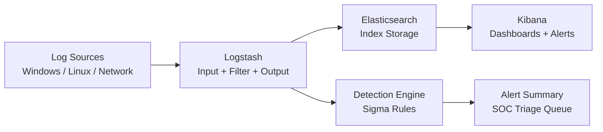

# Project 35 — SIEM Pipeline

Security telemetry ingest and detection pipeline with Sigma-format rules and dashboarded blue-team workflows.

## Architecture



## Stack

| Component | Role |
|-----------|------|
| **Logstash** | Ingest, parse, enrich, route |
| **Elasticsearch** | Index storage with security event mappings |
| **Kibana** | SOC dashboards and alert visualisation |
| **Sigma** | Vendor-neutral detection rule format |
| **Docker Compose** | Local dev/test stack |

## Quick Start

```bash
# 1. Start the full ELK stack
docker compose up -d

# 2. Generate sample security events
python scripts/generate_sample_logs.py

# 3. Run detection rule tests
python -m pytest tests/ -v

# 4. View alert summary
cat demo_output/alert_summary.txt
```

## Detection Rules

Four production-grade Sigma rules cover the top attack categories:

| Rule | MITRE Technique | Level |
|------|-----------------|-------|
| `brute-force.yml` | T1110 — Credential Access | High |
| `privilege-escalation.yml` | T1078 — Valid Accounts | High |
| `lateral-movement.yml` | T1021 — Remote Services | High |
| `data-exfiltration.yml` | T1048 — Exfiltration Over Alt Protocol | Critical |

## Live Demo Output

### Alert Summary (from 30 sample events)

```
Total events: 30

Event types:
  authentication_failure: 10
  authentication_success: 5
  process_start: 5
  network_connection: 4
  group_member_added: 3
  special_logon: 3

Severity distribution:
  Level 1: 9
  Level 3: 16
  Level 4: 4
  Level 5: 1

Total alerts fired: 21

Alert breakdown:
  Failed Logon Attempt: 10
  Admin Group Membership Change: 3
  Suspicious Process Execution: 3
  Special Privileges Logon: 3
  Large Outbound Data Transfer: 2

Top source IPs:
  192.168.10.15: 6 events
  203.0.113.45: 5 events
  198.51.100.7: 5 events
  192.168.30.10: 4 events
  192.168.20.10: 3 events
```

### Sample Security Event (JSONL format)

```json
{
  "timestamp": "2026-01-15T08:07:36.000Z",
  "host_name": "DC01",
  "event_id": 4625,
  "event_type": "authentication_failure",
  "user_name": "jsmith",
  "user_domain": "CORP",
  "source_ip": "203.0.113.45",
  "dest_ip": "192.168.10.5",
  "severity": 3,
  "logon_type": "3",
  "failure_reason": "Unknown user name or bad password",
  "tags": ["windows", "authentication", "logon_failure", "credential_access"],
  "alert_name": "Failed Logon Attempt",
  "alert_severity": "medium"
}
```

### Brute Force Detection Rule (Sigma)

```yaml
title: Windows Brute Force Login Attempts
id: a1b2c3d4-e5f6-7890-abcd-ef1234567890
status: stable
logsource:
  product: windows
  service: security
detection:
  selection:
    EventID: 4625
    LogonType|contains: ['2', '3', '10']
  timeframe: 5m
  condition: selection | count() by TargetUserName, IpAddress > 10
level: high
tags:
  - attack.credential_access
  - attack.t1110
```

### Test Results

```
37 passed in 0.20s
```

Tests cover: rule schema validation (UUID, required fields, valid level/status, ATT&CK tags),
sample event structure, detection logic for brute force / privilege escalation / lateral movement,
pipeline config file existence, and Docker Compose service definitions.

## Pipeline Configuration

### Logstash Input (`01-input.conf`)
Accepts Beats input (port 5044), TCP syslog (port 5000), and HTTP input (port 8080) for webhook events.

### Logstash Filter (`02-filter.conf`)
- Parses Windows Event Log JSON and CEF syslog formats
- Enriches with GeoIP, user-agent parsing, and threat intel tags
- Normalises field names to ECS (Elastic Common Schema)

### Logstash Output (`03-output.conf`)
Routes to Elasticsearch with index pattern `security-events-YYYY.MM.DD` and a dead-letter queue for parse failures.

## Elasticsearch Index Template

Maps `severity` as integer, `source_ip`/`dest_ip` as IP fields, and `tags` as keyword for fast aggregation.
Full template: [`elasticsearch/index-templates/security-events.json`](elasticsearch/index-templates/security-events.json)

## What This Proves

- Sigma-format detection rule authoring (4 rules across MITRE ATT&CK categories)
- ELK stack configuration for security operations
- Log normalisation and enrichment pipeline design
- Detection engineering: threshold logic, field conditions, false positive suppression
- Blue team tooling: SOC dashboard layout and alert triage workflow
