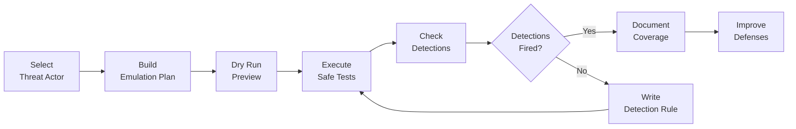

# Project 36 — Adversary Emulation

**Defensive security project** — ATT&CK-aligned adversary emulation plans for
detection validation. All tests are safe/harmless and designed to verify that
SIEM and EDR detections fire correctly against realistic threat actor TTPs.

---

## What Is Adversary Emulation?

Adversary emulation is the practice of replicating the **known tactics, techniques,
and procedures (TTPs)** of a specific threat actor to validate whether your
organization's detection and response capabilities would catch those behaviors.

The goal is **not** to compromise systems — it is to generate realistic telemetry
and verify that your detections work before a real attacker tests them for you.



---

## ATT&CK Coverage Heatmap

Coverage across MITRE ATT&CK tactics for both emulation plans:

```
Tactic               | APT29  | FIN7   | Combined
---------------------|--------|--------|----------
Initial Access       |  ████  |  ████  |   ████
Execution            |  ████  |  ████  |   ████
Persistence          |  ████  |  ████  |   ████
Privilege Escalation |  ████  |  ████  |   ████
Defense Evasion      |  ████  |  ████  |   ████
Discovery            |  ████  |  ████  |   ████
---------------------|--------|--------|----------
Tests per tactic     |  4-5   |  3-4   |   7-9
Techniques covered   |   18   |   18   |   33 unique
```

Legend: `████` = Techniques tested | `░░░░` = No coverage

---

## Available Emulation Plans

| Plan | Threat Group | Sector | Phases | Techniques | Tests |
|------|-------------|--------|--------|------------|-------|
| `apt29` | APT29 (Cozy Bear / Nobelium) | Government, Defense, Tech | 6 | 18 | 24 |
| `fin7` | FIN7 (Carbanak) | Financial, Retail, Hospitality | 6 | 18 | 24 |

### APT29 (Cozy Bear)

Nation-state threat actor attributed to Russia's SVR (Foreign Intelligence Service).
Known for the SolarWinds supply chain attack and long-term persistent espionage
operations against government, diplomatic, and technology targets.

MITRE Group: [G0016](https://attack.mitre.org/groups/G0016/)

### FIN7 (Carbanak)

Financially motivated threat group targeting retail, hospitality, and financial
organizations. Known for highly targeted spearphishing campaigns and POS malware.

MITRE Group: [G0046](https://attack.mitre.org/groups/G0046/)

---

## Quick Start

### Prerequisites

```bash
pip install pyyaml
```

### List Available Plans

```bash
python scripts/atomic_executor.py --list-plans
```

### Preview a Plan (Dry Run)

```bash
python scripts/atomic_executor.py --plan apt29 --dry-run
```

### List All Phases and Tests

```bash
python scripts/atomic_executor.py --plan apt29 --list-phases
```

### Execute Safe Tests

```bash
python scripts/atomic_executor.py --plan apt29 --safe
```

### Run a Single Phase

```bash
python scripts/atomic_executor.py --plan apt29 --phase phase-1 --dry-run
```

### Generate a Report

```bash
python scripts/generate_report.py --plan apt29
python scripts/generate_report.py --plan apt29 --output report.txt
python scripts/generate_report.py --all --format markdown
```

---

## Live Demo

```
=== Adversary Emulation Execution Report ===
Plan:     APT29 (Cozy Bear) Emulation Plan v1.0
Executed: 2026-01-15 14:30:00 UTC
Mode:     DRY-RUN (no commands executed)
Analyst:  Sam Jackson

=== Results Summary ===
Total Tests:   24
Would Execute: 24
Duration:      0.01s

--- Initial Access ---
  [WOULD_EXECUTE] AT-001 — T1566.001 Spearphishing Attachment
  [WOULD_EXECUTE] AT-002 — T1566.002 Spearphishing Link
  [WOULD_EXECUTE] AT-003 — T1195.002 Compromise Software Supply Chain

--- Execution ---
  [WOULD_EXECUTE] AT-004 — T1059.004 Unix Shell
  [WOULD_EXECUTE] AT-005 — T1059.006 Python
  [WOULD_EXECUTE] AT-006 — T1203 Exploitation for Client Execution
  [WOULD_EXECUTE] AT-007 — T1047 Windows Management Instrumentation

--- Persistence ---
  [WOULD_EXECUTE] AT-008 — T1053.003 Cron
  [WOULD_EXECUTE] AT-009 — T1546.004 Unix Shell Configuration Modification
  [WOULD_EXECUTE] AT-010 — T1505.003 Web Shell
  [WOULD_EXECUTE] AT-011 — T1098 Account Manipulation

[... 13 more tests ...]

=== Coverage by Tactic ===
Tactic                           Tests   Pass   Fail
Initial Access                       3      3      0
Execution                            4      4      0
Persistence                          4      4      0
Privilege Escalation                 4      4      0
Defense Evasion                      5      5      0
Discovery                            4      4      0
--------------------------------------------------
TOTAL                               24     24      0
```

See [demo_output/emulation_report.txt](demo_output/emulation_report.txt) for the full 356-line report.

---

## File Structure

```
36-adversary-emulation/
├── emulation-plans/
│   ├── apt29-plan.yaml        # APT29 (Cozy Bear) — 24 tests across 6 phases
│   └── fin7-plan.yaml         # FIN7 (Carbanak) — 24 tests across 6 phases
├── attack-mapping/
│   └── technique-coverage.csv # 47-row ATT&CK coverage matrix
├── scripts/
│   ├── atomic_executor.py     # Plan executor (dry-run and safe modes)
│   └── generate_report.py     # Report generator (text and markdown output)
├── demo_output/
│   ├── emulation_report.txt   # Sample APT29 report output (356 lines)
│   └── ttps_covered.txt       # All 18 ATT&CK techniques with descriptions
├── docs/
│   └── emulation-methodology.md  # Methodology, ATT&CK guide, safety rules
├── tests/
│   └── test_plans.py          # 70 pytest tests — all pass
└── README.md
```

---

## Integration with Detection Engineering

These emulation plans are designed to pair with a detection rules library:

1. **Run emulation plan** — generates realistic telemetry artifacts
2. **Check SIEM/EDR** — verify detection rules fire
3. **Import Sigma rules** — use the referenced `sigma/*.yml` paths
4. **Convert to your SIEM platform**:

```bash
# Splunk
sigma convert -t splunk sigma/suspicious-double-extension-file.yml

# Elastic
sigma convert -t elastic_eql sigma/phishing-link-click-simulation.yml

# Microsoft Sentinel
sigma convert -t kusto sigma/shell-exec-obfuscated-args.yml
```

---

## Safety Architecture

Every test in this project follows strict safety constraints:

| Constraint | Enforcement |
|-----------|-------------|
| Writes only to `/tmp` | All `command` fields validated in tests |
| No network connections | No curl/wget/nc commands used |
| No privilege escalation | No sudo execution, no root-required ops |
| No system modifications | Only `/tmp` writes, no config changes |
| Cleanup included | Every test has a `cleanup` command |
| `safe: true` required | Test suite asserts this on every technique |

---

## Running the Test Suite

```bash
pip install pyyaml pytest
pytest tests/test_plans.py -v
```

Expected output: **70 passed**

---

## What This Demonstrates

- **MITRE ATT&CK proficiency** — 33 unique techniques mapped across 6 tactics and 2 threat groups
- **Threat intelligence operationalization** — converting public TI reports into structured test plans
- **Detection engineering mindset** — every test maps to a specific detection rule
- **Security automation** — Python tooling to load, validate, and execute plans
- **Documentation quality** — structured YAML schema, methodology docs, test coverage
- **Defensive security focus** — all work supports defenders, not attackers
