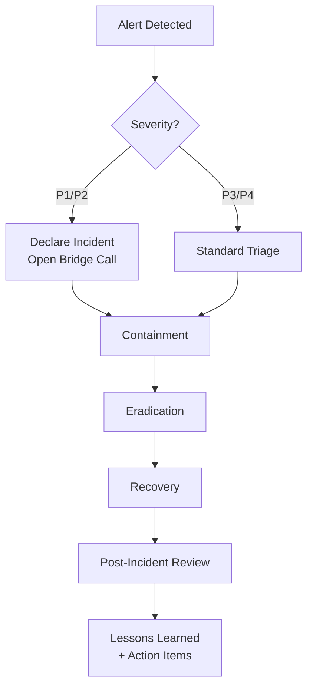

# Project 37 — Incident Response Playbook

Structured ransomware-focused IR runbook and escalation framework covering the full
PICERL lifecycle with communication templates, PIR examples, and an automated timeline generator.

## Architecture



## Playbooks

| Playbook | Type | Phases Covered |
|---------|------|----------------|
| `ransomware-ir.md` | Ransomware | Preparation → Lessons Learned (PICERL) |
| `phishing-ir.md` | Phishing / AiTM | Identification → Recovery |
| `data-breach-ir.md` | Data Breach | Identification → Regulatory Notification |

## Quick Start

```bash
# Run the IR timeline generator with demo incident data
python scripts/ir_timeline_generator.py --demo

# Generate timeline from your own incident JSON
python scripts/ir_timeline_generator.py --incident-file incident.json --output timeline.txt

# Run all tests
python -m pytest tests/ -v
```

## Live Demo Output

### Incident Timeline (demo — INC-2026-0042, Ransomware)

```
========================================================================
  INCIDENT TIMELINE — INC-2026-0042
  Type: Ransomware — LockBit 3.0 | Severity: P1
========================================================================

  2026-01-15 07:52 UTC  [Initial Access      ]  [Attacker  ]
    → User jsmith opens malicious Word attachment (CVE-2024-21413)

  2026-01-15 08:07 UTC  [Impact              ]  [Attacker  ]
    → First .lockbit encrypted files detected — EDR escalates to HIGH

  2026-01-15 08:14 UTC  [Detection           ]  [SOC       ]
    → SOC Analyst acknowledges alert; IC declared; bridge call opened

  2026-01-15 08:29 UTC  [Containment         ]  [SOC       ]
    → All 3 affected hosts isolated via CrowdStrike console

  2026-01-15 15:06 UTC  [Recovery            ]  [IT        ]
    → jsmith workstation rebuilt from golden image — user access restored

------------------------------------------------------------------------
  METRICS
------------------------------------------------------------------------
  MTTD (Mean Time to Detect):   22 min
  MTTC (Mean Time to Contain):  15 min
  MTTR (Mean Time to Recover):  6h 37m
  Total incident duration:       7h 14m
========================================================================
```

### Test Results

```
35 passed in 0.20s
```

Tests cover: all three playbooks present with required PICERL phases, escalation matrix severity levels,
SLA table, communication templates, incident ticket and PIR templates, timeline generator correctness (MTTD/MTTC/MTTR values).

## Escalation Matrix Summary

| Severity | IC Notified | CISO | CEO/Board |
|----------|-------------|------|-----------|
| P1 — Critical | 5 min | 15 min | 1 hour |
| P2 — High | 15 min | 1 hour | If data breach |
| P3 — Medium | 1 hour | Next business day | No |
| P4 — Low | Next shift | Weekly summary | No |

## What This Proves

- PICERL incident response lifecycle knowledge (Preparation through Lessons Learned)
- Ransomware-specific containment and recovery decision matrices
- GDPR/HIPAA/PCI regulatory notification timelines and templates
- Incident metrics tracking: MTTD, MTTC, MTTR
- Communication frameworks for executives, legal, and customers
- Python automation for incident timeline analysis
- Tabletop exercise and PIR documentation
