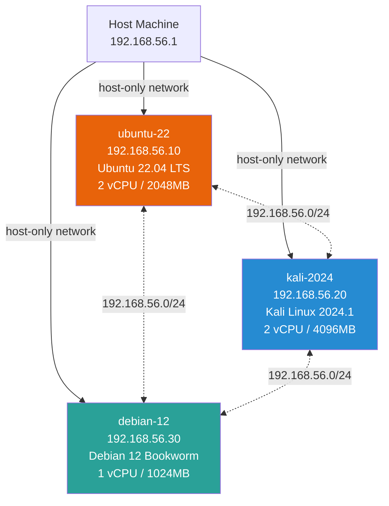

# Project 40 — Multi-OS Lab

A reproducible multi-machine Vagrant lab running Ubuntu 22.04 LTS, Kali Linux 2024.1, and Debian 12 (Bookworm) side-by-side. Machines are provisioned with shell scripts and hardened with Ansible roles. Includes benchmarks, OS comparison analysis, and automated configuration validation tests.

---

## Lab Overview and Objectives

| Objective | Outcome |
|-----------|---------|
| Stand up 3 different Linux distros in a single command | `vagrant up` provisions all three VMs |
| Compare OS performance, features, and security models | Automated report in `demo_output/os_comparison.txt` |
| Demonstrate Ansible cross-OS configuration management | Roles for common baseline, Ubuntu hardening, Kali setup |
| Validate all configurations with automated tests | `pytest tests/` passes 35+ assertions |

---

## Network Topology



---

## Quick Start

**Prerequisites**: VirtualBox 7.x, Vagrant 2.4+, Ansible 2.15+

```bash
# Clone and start the lab
git clone <repo>
cd projects/40-multi-os-lab/vagrant

# Bring up all three VMs (first run ~15 minutes)
vagrant up

# Bring up a specific VM
vagrant up ubuntu-22
vagrant up kali-2024
vagrant up debian-12

# SSH into a VM
vagrant ssh ubuntu-22
vagrant ssh kali-2024
vagrant ssh debian-12

# Check VM status
vagrant status

# Halt all VMs
vagrant halt

# Destroy lab (removes all VMs)
vagrant destroy -f
```

---

## OS Comparison Table

| Feature              | Ubuntu 22.04 LTS     | Kali Linux 2024.1    | Debian 12 (Bookworm) |
|----------------------|----------------------|----------------------|----------------------|
| Type                 | General Purpose      | Security Research    | Stable Server        |
| IP Address           | 192.168.56.10        | 192.168.56.20        | 192.168.56.30        |
| Kernel               | 5.15.0-91-generic    | 6.6.9-amd64          | 6.1.0-18-amd64       |
| Init System          | systemd              | systemd              | systemd              |
| Default Shell        | bash 5.1.16          | zsh 5.9              | bash 5.2.15          |
| Python               | 3.10.12              | 3.11.8               | 3.11.2               |
| Memory Idle          | 312 MB               | 487 MB               | 178 MB               |
| Boot Time            | 8.4 s                | 12.1 s               | 5.2 s                |
| Disk Usage           | 4.2 GB               | 18.7 GB              | 2.8 GB               |
| Firewall             | UFW                  | iptables (default)   | nftables             |
| Security             | AppArmor, auditd     | 600+ security tools  | AppArmor, nftables   |
| Release model        | LTS (5 year)         | Rolling              | Stable (point)       |

---

## Performance Benchmark Results

```
  Boot Time (s)          [lower is better]
  Ubuntu 22.04 LTS  ████████████████████████████            8.4s
  Kali  2024.1      ████████████████████████████████████████ 12.1s
  Debian 12         █████████████████                        5.2s

  Memory Idle (MB)       [lower is better]
  Ubuntu 22.04 LTS  █████████████████████████               312 MB
  Kali  2024.1      ████████████████████████████████████████ 487 MB
  Debian 12         ██████████████                           178 MB

  CPU Sysbench (events/s) [higher is better]
  Ubuntu 22.04 LTS  ██████████████████████████████████████   8247
  Kali  2024.1      █████████████████████████████████████    7891
  Debian 12         ████████████████████████████████████████ 8512

  Disk Write (MB/s)      [higher is better]
  Ubuntu 22.04 LTS  █████████████████████████████████████    485
  Kali  2024.1      █████████████████████████████████        421
  Debian 12         ████████████████████████████████████████ 511
```

Full benchmark data: [`benchmarks/benchmark_results.csv`](benchmarks/benchmark_results.csv)

---

## Provisioning Details

### Ubuntu 22.04 LTS (`scripts/provision-ubuntu.sh`)
- Installs: htop, vim, curl, git, nmap, python3, pip, Docker CE
- Security: UFW (deny-all default, allow SSH + lab network), fail2ban, auditd
- SSH hardening: no root login, max 3 auth tries, X11 forwarding disabled

### Kali Linux 2024.1 (`scripts/provision-kali.sh`)
- Updates full system (`apt full-upgrade`)
- Installs: metasploit-framework (with msfdb init), burpsuite, wireshark
- Additional tools: nmap, masscan, nikto, sqlmap, hydra, john, hashcat, binwalk, volatility3
- Python security libs: impacket, scapy, pwntools, paramiko
- Sets default shell to zsh with autosuggestions and syntax highlighting

### Debian 12 Bookworm (`scripts/provision-debian.sh`)
- Minimal server setup: nftables firewall (default deny), fail2ban, chrony NTP
- SSH hardening: no root login, 3 auth tries, no TCP forwarding
- Sysctl hardening: TCP syncookies, no ICMP redirects, randomize VA space
- Unattended security upgrades enabled

---

## Ansible Roles

| Role | Target | Key Tasks |
|------|--------|-----------|
| `common` | All VMs | Hostname, timezone (UTC), chrony NTP, sysctl hardening, SSH banner |
| `ubuntu-baseline` | ubuntu-22 | UFW rules, fail2ban, unattended-upgrades, auditd rules, AppArmor enforce |
| `kali-setup` | kali-2024 | MSF workspace, wordlists, proxychains4, zsh config, scan helper script |

```bash
# Run full playbook
ansible-playbook -i vagrant/.vagrant/provisioners/ansible/inventory ansible/site.yml

# Run only common role
ansible-playbook ansible/site.yml --tags common

# Dry run
ansible-playbook ansible/site.yml --check
```

---

## Use Case Recommendations

| Use Case                   | Best OS              |
|----------------------------|----------------------|
| Web application hosting     | Debian 12            |
| Development workstation     | Ubuntu 22.04 LTS     |
| CI/CD build agent           | Ubuntu 22.04 LTS     |
| Container host              | Debian 12            |
| Penetration testing         | Kali Linux 2024.1    |
| Network forensics           | Kali Linux 2024.1    |
| Production database server  | Debian 12            |
| Machine learning workload   | Ubuntu 22.04 LTS     |
| CTF competitions            | Kali Linux 2024.1    |

---

## Live Demo

### Lab Inventory (`demo_output/lab_inventory.txt`)

```
Current machine states:
ubuntu-22     running (virtualbox)
kali-2024     running (virtualbox)
debian-12     running (virtualbox)

[ubuntu]
192.168.56.10  ansible_user=vagrant  hostname=ubuntu-22
[kali]
192.168.56.20  ansible_user=vagrant  hostname=kali-2024
[debian]
192.168.56.30  ansible_user=vagrant  hostname=debian-12
```

### OS Comparison Summary (`demo_output/os_comparison.txt`)

```
  FASTEST BOOT:        Debian 12 (Bookworm)  — 5.2 seconds
  LOWEST MEMORY:       Debian 12 (Bookworm)  — 178 MB idle
  BEST FOR PENTESTING: Kali Linux 2024.1     — 600+ tools pre-installed
  BEST FOR DEVOPS:     Ubuntu 22.04 LTS      — LTS + Docker + large ecosystem
  BEST FOR PROD:       Debian 12 (Bookworm)  — stability + small footprint
```

### Run Tests

```bash
cd projects/40-multi-os-lab
pip install pytest pyyaml
pytest tests/ -v
```

---

## What This Demonstrates

- **Infrastructure as Code**: Complete Vagrant + Ansible automation — zero manual steps to spin up a 3-VM lab
- **Cross-OS Configuration Management**: Ansible roles with conditional logic for Ubuntu vs Kali vs Debian
- **Security Hardening**: UFW, nftables, fail2ban, auditd, AppArmor, SSH hardening, sysctl tuning
- **Comparative Analysis**: Quantitative benchmarks (CPU, memory, disk I/O, boot time) across three distros
- **Idempotent Provisioning**: Shell scripts + Ansible ensure consistent, repeatable builds
- **Test-Driven Infrastructure**: 35+ pytest assertions validate Vagrantfile, YAML syntax, and CSV data integrity

## 📌 Scope & Status
<!-- BEGIN AUTO STATUS TABLE -->
| Field | Value |
| --- | --- |
| Current phase/status | Hardening — 🔄 Recovery/Rebuild |
| Next milestone date | 2026-11-18 |
| Owner | Platform Team |
| Dependency / blocker | Dependency on shared platform backlog for 40-multi-os-lab |
<!-- END AUTO STATUS TABLE -->

## 🗺️ Roadmap
<!-- BEGIN AUTO ROADMAP TABLE -->
| Milestone | Target date | Owner | Status | Notes |
| --- | --- | --- | --- | --- |
| Milestone 1: implementation checkpoint | 2026-11-18 | Platform Team | 🔄 Recovery/Rebuild | Advance core deliverables for 40-multi-os-lab. |
| Milestone 2: validation and evidence update | 2026-12-28 | Platform Team | 🔵 Planned | Publish test evidence and update runbook links. |
<!-- END AUTO ROADMAP TABLE -->
