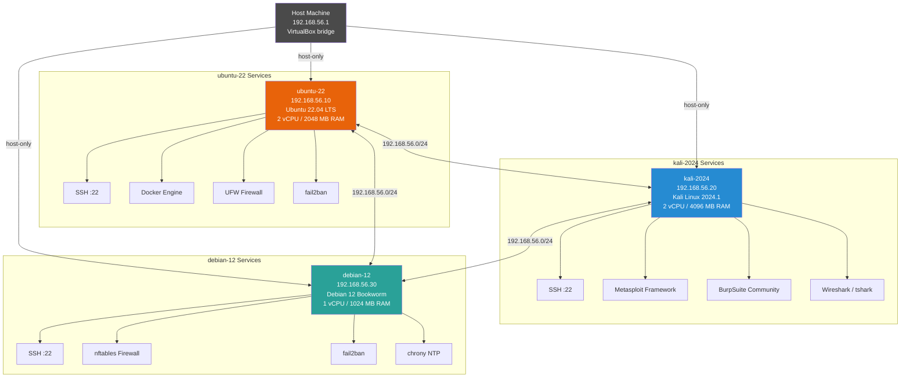

# Multi-OS Lab — Network Topology

## Overview

The lab consists of three virtual machines managed by Vagrant with VirtualBox as the provider. All machines share a private host-only network (`192.168.56.0/24`) and are provisioned with shell scripts plus Ansible playbooks.

---

## ASCII Network Diagram

```
┌─────────────────────────────────────────────────────────────────────┐
│                         HOST MACHINE                                │
│                    (Your laptop/workstation)                        │
│                        192.168.56.1                                 │
└──────────────────────────────┬──────────────────────────────────────┘
                               │  VirtualBox host-only adapter
                               │  Network: 192.168.56.0/24
               ┌───────────────┼───────────────┐
               │               │               │
               ▼               ▼               ▼
  ┌────────────────┐ ┌────────────────┐ ┌────────────────┐
  │  ubuntu-22     │ │  kali-2024     │ │  debian-12     │
  │  192.168.56.10 │ │  192.168.56.20 │ │  192.168.56.30 │
  │                │ │                │ │                │
  │ Ubuntu 22.04   │ │ Kali 2024.1    │ │ Debian 12      │
  │ LTS            │ │ Rolling        │ │ Bookworm       │
  │                │ │                │ │                │
  │ RAM: 2048 MB   │ │ RAM: 4096 MB   │ │ RAM: 1024 MB   │
  │ CPUs: 2        │ │ CPUs: 2        │ │ CPUs: 1        │
  │                │ │                │ │                │
  │ Services:      │ │ Services:      │ │ Services:      │
  │  SSH:22        │ │  SSH:22        │ │  SSH:22        │
  │  Docker        │ │  Metasploit    │ │  nftables      │
  │  UFW           │ │  BurpSuite     │ │  fail2ban      │
  │  fail2ban      │ │  Wireshark     │ │  chrony        │
  │  auditd        │ │  nmap          │ │  unatt-upgr    │
  │  AppArmor      │ │  sqlmap        │ │  AppArmor      │
  └────────────────┘ └────────────────┘ └────────────────┘
         │                   │                   │
         └───────────────────┴───────────────────┘
                    All VMs can communicate
                    within 192.168.56.0/24
```

---

## Mermaid Network Diagram



---

## Vagrant Network Configuration

| VM Name    | Box                  | Private IP     | Memory | CPUs | Role            |
|------------|----------------------|----------------|--------|------|-----------------|
| ubuntu-22  | ubuntu/jammy64       | 192.168.56.10  | 2048MB | 2    | General Purpose |
| kali-2024  | kalilinux/rolling    | 192.168.56.20  | 4096MB | 2    | Security Lab    |
| debian-12  | debian/bookworm64    | 192.168.56.30  | 1024MB | 1    | Stable Server   |

### Network Type: VirtualBox host-only

- **Subnet**: `192.168.56.0/24`
- **Host address**: `192.168.56.1` (automatically assigned by VirtualBox)
- **No external routing**: VMs can only communicate with each other and the host
- **Isolation**: Prevents accidental exposure of security tools to external networks

---

## Firewall Rules Summary

### ubuntu-22 (UFW)
```
Status: active
To                         Action      From
--                         ------      ----
22/tcp                     ALLOW IN    Anywhere
Anywhere                   ALLOW IN    192.168.56.0/24
```

### kali-2024 (iptables default)
```
No restrictive firewall — security research VM
SSH port 22 accessible from host-only network
```

### debian-12 (nftables)
```
table inet filter {
  chain input  { policy drop; ct state established,related accept; }
  Allow: lo, ICMP, TCP:22, src 192.168.56.0/24
  chain forward { policy drop; }
  chain output  { policy accept; }
}
```

---

## Ansible Inventory

```ini
[ubuntu]
192.168.56.10  ansible_user=vagrant  hostname=ubuntu-22

[kali]
192.168.56.20  ansible_user=vagrant  hostname=kali-2024

[debian]
192.168.56.30  ansible_user=vagrant  hostname=debian-12

[all:vars]
ansible_ssh_private_key_file=~/.vagrant.d/insecure_private_key
ansible_ssh_common_args='-o StrictHostKeyChecking=no'
```

---

## Traffic Flows

| Source     | Destination | Port  | Protocol | Purpose                        |
|------------|-------------|-------|----------|--------------------------------|
| Host       | ubuntu-22   | 22    | TCP      | Vagrant SSH / Ansible          |
| Host       | kali-2024   | 22    | TCP      | Vagrant SSH / Ansible          |
| Host       | debian-12   | 22    | TCP      | Vagrant SSH / Ansible          |
| kali-2024  | ubuntu-22   | Any   | TCP/UDP  | Penetration testing exercises  |
| kali-2024  | debian-12   | Any   | TCP/UDP  | Penetration testing exercises  |
| All VMs    | All VMs     | Any   | ICMP     | Connectivity checks            |
| All VMs    | Internet    | 80/443| TCP      | Package updates (via NAT)      |
