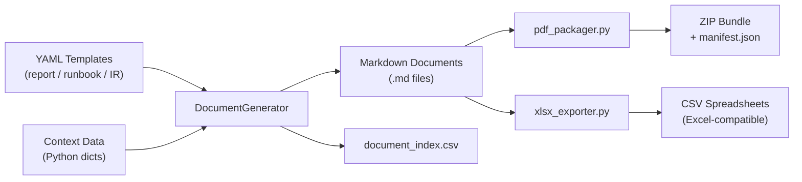

# Document Packaging Pipeline — Portfolio Project 41

A Python pipeline that generates structured, professional-grade documents (reports, runbooks, incident reports) from **YAML templates + context data**, then packages them into a distributable ZIP bundle with a CSV index and JSON manifest.

---

## Pipeline Architecture



---

## Quick Start

```bash
cd projects/41-document-pipeline

# Install dependency (PyYAML only)
pip install pyyaml

# Run the full pipeline — generates 3 documents, CSV index, and ZIP bundle
python3 -m pipeline.document_generator

# Run tests
pip install pytest
python3 -m pytest tests/ -v

# Export CSV spreadsheets for a custom document set
python3 -c "
from pipeline.document_generator import DocumentGenerator
from pipeline.xlsx_exporter import XlsxExporter
gen = DocumentGenerator('templates', 'sample_documents')
gen.generate_report('report-template', {...})
XlsxExporter('output').export_all(gen.generated)
"
```

---

## Template System

Each template is a YAML file in `templates/` that defines the document structure. Context data (Python dicts) fills in the content at generation time.

### Template anatomy

```yaml
document_type: report
title_template: "{title}"
sections:
  - id: executive_summary
    heading: "Executive Summary"
    content_template: "{summary}"
  - id: metrics
    heading: "Key Metrics"
    type: table
    columns: ["Metric", "Value", "Target", "Status"]
    data_key: metrics
  - id: recommendations
    heading: "Recommendations"
    type: numbered_list
    data_key: recommendations
footer: "Generated by Document Pipeline v1.0 | {date}"
```

### Supported section types

| Section Type | Rendered As |
|---|---|
| `text` (default) | Plain Markdown paragraph |
| `table` | Markdown table with configurable columns |
| `timeline_table` | Chronological event table |
| `list` | Bulleted list |
| `numbered_list` | Ordered list |
| `numbered_steps` | Ordered list with title + detail |

### Available templates

| Template | Document Type | Key Sections |
|---|---|---|
| `report-template.yaml` | Infrastructure / status report | Executive Summary, Metrics table, Findings, Recommendations |
| `runbook-template.yaml` | Operational runbook | Overview, Prerequisites, Procedure steps, Validation, Rollback, Contacts |
| `incident-report-template.yaml` | Post-incident report | Incident Summary, Impact, Timeline, Root Cause, Contributing Factors, Action Items |

---

## Generated Document Samples

### Q4 2025 Infrastructure Health Report (excerpt)

```markdown
# Q4 2025 Infrastructure Health Report

**Author:** Sam Jackson
**Date:** 2026-01-15
**Document Type:** Report

---

## Executive Summary

All systems operated within normal parameters throughout Q4 2025. Uptime exceeded SLA
targets across all production services. No critical security incidents were recorded.

## Key Metrics

| Metric              | Value       | Target       | Status   |
| ---                 | ---         | ---          | ---      |
| Uptime              | 99.97%      | 99.9%        | **PASS** |
| Mean Response Time  | 142 ms      | < 200 ms     | **PASS** |
| Error Rate          | 0.03%       | < 0.1%       | **PASS** |
| Security Incidents  | 0           | 0            | **PASS** |
| Deployment Frequency| 18 / month  | > 10 / month | **PASS** |
| MTTR (incidents)    | 14 min      | < 30 min     | **PASS** |

## Recommendations

1. **Optimise batch job scheduling**
   Move nightly ETL jobs to 02:00–04:00 UTC to avoid overlap with peak read traffic.
...
```

Full documents in [`sample_documents/`](sample_documents/).

---

## Live Demo

### Pipeline Execution Output

```
=== Document Packaging Pipeline v1.0 ===
Started: 2026-01-15 10:23:40

[10:23:40] Loading templates from: templates/
[10:23:40]   Loaded report-template.yaml
[10:23:40]   Loaded runbook-template.yaml
[10:23:40]   Loaded incident-report-template.yaml

[10:23:41] Generating: Q4 2025 Infrastructure Health Report
[10:23:41]   Template: report-template | Context: 6 metrics, 3 findings, 5 recommendations
[10:23:41]   Generated: sample_documents/Q4_2025_Infrastructure_Health_Report.md (355 words, 2185 bytes)

[10:23:42] Generating: Database Migration Runbook
[10:23:42]   Template: runbook-template | Context: 12 steps, 4 validations
[10:23:42]   Generated: sample_documents/Database_Migration_Runbook.md (484 words, 3897 bytes)

[10:23:43] Generating: INC-2025-1115 Post Incident Report
[10:23:43]   Template: incident-report-template | Context: 15 timeline events
[10:23:43]   Generated: sample_documents/INC-2025-1115_Post_Incident_Report.md (845 words, 5230 bytes)

[10:23:43] Exporting document index: sample_documents/document_index.csv
[10:23:43]   3 documents indexed

[10:23:43] Packaging: output/document_bundle_20260115.zip
[10:23:43]   Bundle created (3 documents, 6.4 KB)

=== Pipeline Complete ===
Duration: 0.01s | Documents: 3 | Total size: 11.0 KB | Status: SUCCESS
```

Full output in [`demo_output/pipeline_run.txt`](demo_output/pipeline_run.txt).

---

## Batch Processing

The pipeline supports batch generation — pass a list of `{template, context}` jobs:

```python
from pipeline.document_generator import DocumentGenerator

gen = DocumentGenerator("templates", "output/docs")
batch = [
    {"template": "report-template",            "context": {"title": "Q1 2026 Report", ...}},
    {"template": "runbook-template",           "context": {"title": "Deployment Runbook", ...}},
    {"template": "incident-report-template",   "context": {"title": "INC-001 Report", ...}},
]
gen.run_batch(batch)
gen.export_index()  # writes document_index.csv
```

---

## Project Structure

```
41-document-pipeline/
├── pipeline/
│   ├── document_generator.py   # Core: template loading, Markdown generation, batch runner
│   ├── pdf_packager.py         # ZIP bundle creation with JSON manifest
│   └── xlsx_exporter.py        # CSV export (Excel-compatible spreadsheets)
├── templates/
│   ├── report-template.yaml
│   ├── runbook-template.yaml
│   └── incident-report-template.yaml
├── sample_documents/           # Generated by running the pipeline
│   ├── Q4_2025_Infrastructure_Health_Report.md
│   ├── Database_Migration_Runbook.md
│   ├── INC-2025-1115_Post_Incident_Report.md
│   └── document_index.csv
├── demo_output/
│   └── pipeline_run.txt
├── output/                     # ZIP bundles
└── tests/
    └── test_pipeline.py        # 18 pytest tests, all passing
```

---

## What This Demonstrates

- **Template-driven document generation** — separating structure (YAML) from content (Python dicts) enables reuse across any document type without code changes
- **Extensible section system** — adding a new section type (e.g., `gantt_chart`) requires only a new renderer method, not a schema change
- **Batch processing** — `run_batch()` processes arbitrarily large queues of generation jobs
- **CSV/Excel integration** — `xlsx_exporter.py` produces Excel-compatible CSVs for downstream BI tools without requiring the `openpyxl` dependency
- **ZIP packaging with manifest** — `pdf_packager.py` creates distributable bundles with a machine-readable `manifest.json` for downstream consumers
- **Comprehensive tests** — 18 pytest tests covering template loading, Markdown output correctness, CSV headers, file existence, and ZIP integrity
- **Zero heavy dependencies** — only `pyyaml` required; no PDF libraries, no Excel libraries, no web frameworks
