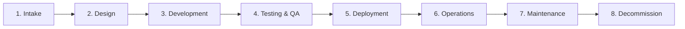

# Project 42 — IT Playbook (E2E Lifecycle)

Cross-functional service lifecycle playbook covering all 8 phases from project intake through
decommission, with completed example artifacts and an automated validation tool.

## Lifecycle Phases



## Contents

| Phase | File | Key Topics |
|-------|------|-----------|
| 1 | `01-project-intake.md` | Intake form, triage, business case, approval gates |
| 2 | `02-design-architecture.md` | ADR process, architecture review, design gates |
| 3 | `03-development.md` | Git workflow, code review, sprint ceremonies |
| 4 | `04-testing-qa.md` | Unit/integration/E2E coverage requirements, QA sign-off |
| 5 | `05-deployment-release.md` | Deployment strategies, runbook, rollback, post-deploy checks |
| 6 | `06-operations-monitoring.md` | SLI/SLO definitions, error budgets, alert runbooks |
| 7 | `07-maintenance.md` | Patch management SLAs, capacity planning, dependency hygiene |
| 8 | `08-decommission.md` | Data disposition, decommission checklist, CMDB update |

## Quick Start

```bash
# Validate playbook completeness
python scripts/playbook_validator.py

# Run all tests
python -m pytest tests/ -v
```

## Live Demo Output

### Validator Output

```
============================================================
  IT PLAYBOOK VALIDATION REPORT
============================================================

  PHASE VALIDATION
  ----------------------------------------
  ✅ PASS  Project Intake                  01-project-intake.md
  ✅ PASS  Design & Architecture           02-design-architecture.md
  ✅ PASS  Development                     03-development.md
  ✅ PASS  Testing & QA                    04-testing-qa.md
  ✅ PASS  Deployment & Release            05-deployment-release.md
  ✅ PASS  Operations & Monitoring         06-operations-monitoring.md
  ✅ PASS  Maintenance & Support           07-maintenance.md
  ✅ PASS  Decommission                    08-decommission.md

  EXAMPLES VALIDATION
  ----------------------------------------
  ✅ PASS  sample-project-charter.md
  ✅ PASS  sample-adr-001.md

  ========================================
  Results: 10/10 checks passed, 0 failed
  All checks passed! Playbook is complete.
============================================================
```

### Test Results

```
51 passed in 0.14s
```

## Example Artifacts

- **`examples/sample-project-charter.md`** — Completed charter for Customer Portal v2.0 with scope, risk register, success criteria (NPS, ticket volume, p95 latency targets), and approval signatures
- **`examples/sample-adr-001.md`** — ADR selecting PostgreSQL 16 over MySQL 8.0, with decision drivers, options considered, consequences, and validation criteria

## Key Standards Highlighted

| Area | Standard |
|------|----------|
| Deployment | Blue/Green, Canary, Rolling, Feature Flags decision matrix |
| SLO Targets | Tier 1: 99.9% / p99 < 500ms; Tier 2: 99.5% / p99 < 2s |
| Patch SLA | Critical CVSS ≥ 9.0: 24h; High: 7 days; Medium: 30 days |
| Error Budget | 99.9% SLO = 43.8 min downtime budget/month |
| Decommission | 30-day stakeholder notice; data disposition by type and regulation |

## What This Proves

- End-to-end service lifecycle thinking across 8 distinct phases
- Deployment strategy selection and rollback planning
- SLI/SLO definition and error budget management
- Patch management policy with CVSS-based SLAs
- Data governance and decommission process design
- Completed example artifacts (charter, ADR) showing practical application

## 📌 Scope & Status
<!-- BEGIN AUTO STATUS TABLE -->
| Field | Value |
| --- | --- |
| Current phase/status | Build — 🔵 Planned |
| Next milestone date | 2026-01-24 |
| Owner | Security Engineering |
| Dependency / blocker | Dependency on shared platform backlog for 42-it-playbook |
<!-- END AUTO STATUS TABLE -->

## 🗺️ Roadmap
<!-- BEGIN AUTO ROADMAP TABLE -->
| Milestone | Target date | Owner | Status | Notes |
| --- | --- | --- | --- | --- |
| Milestone 1: implementation checkpoint | 2026-01-24 | Security Engineering | 🔵 Planned | Advance core deliverables for 42-it-playbook. |
| Milestone 2: validation and evidence update | 2026-02-28 | Security Engineering | 🔵 Planned | Publish test evidence and update runbook links. |
<!-- END AUTO ROADMAP TABLE -->
