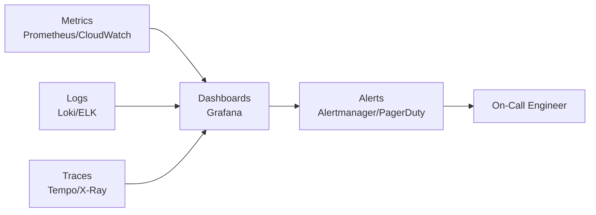

# Playbook Phase 6 — Operations & Monitoring

**Version**: 2.1 | **Owner**: SRE / Platform Engineering | **Last Updated**: 2026-01-10

---

## 1. Purpose

This phase establishes the observability, alerting, and operational response standards
that keep production systems healthy and ensure rapid incident detection and resolution.

---

## 2. Observability Pillars



---

## 3. SLI/SLO Definitions

### Standard SLO Targets

| Service Tier | Availability SLO | Latency SLO (p99) | Error Rate SLO |
|-------------|-----------------|-------------------|----------------|
| Tier 1 (Customer-facing) | 99.9% | < 500ms | < 0.1% |
| Tier 2 (Internal tools) | 99.5% | < 2s | < 1% |
| Tier 3 (Batch/async) | 99.0% | < 30s | < 5% |

### Error Budget Formula

```
Monthly error budget = (1 - SLO) × total minutes per month
  99.9% SLO = 0.1% × 43,800 min = 43.8 minutes downtime allowed/month
  99.5% SLO = 0.5% × 43,800 min = 219 minutes allowed/month
```

---

## 4. Alert Runbooks

### HIGH — Service Availability Below SLO

```
Trigger: availability < 99.9% over 5-minute window
Severity: Page on-call immediately

Response Steps:
1. Check recent deployments (last 2 hours)
2. Review error rate and latency dashboards
3. Identify affected pods/instances via kubectl get pods
4. Check application logs: kubectl logs -l app=SERVICE --tail=100
5. If deployment-related: rollback (kubectl rollout undo deployment/SERVICE)
6. If infrastructure: check node health, disk, memory
7. Update incident ticket with findings
```

### MEDIUM — Latency SLO Breach (p99 > threshold)

```
Trigger: p99 latency > 500ms for 10 minutes
Severity: Ticket + Slack notification

Response Steps:
1. Identify slow endpoints via APM/tracing
2. Check database query performance (slow query log)
3. Check cache hit rates (Redis/Memcached)
4. Review recent code changes for N+1 queries
5. Scale horizontally if load-related: kubectl scale deployment/SERVICE --replicas=N
```

### LOW — Error Rate Elevated

```
Trigger: 5xx error rate > 1% for 5 minutes
Severity: Slack notification

Response Steps:
1. Review application logs for exception patterns
2. Check external dependency health (APIs, databases, queues)
3. Identify affected user segment (if partial outage)
4. Create bug report if no infrastructure cause found
```

---

## 5. Operational Runbooks

### Daily Health Check Procedure

```bash
# Check all services healthy
kubectl get pods --all-namespaces | grep -v Running | grep -v Completed

# Check error rates (last 24h) via CLI
promtool query instant 'sum(rate(http_requests_total{status=~"5.."}[24h]))'

# Check disk usage
df -h | awk '$5 > "80%"'

# Check backup completion
aws s3 ls s3://backups/$(date +%Y-%m-%d)/ | wc -l
```

### On-Call Handoff Template

```
On-Call Handoff — {DATE}

Outgoing: {NAME} | Incoming: {NAME}

Active Incidents: {None / list INC-IDs}

Known Issues:
  - {Issue 1 with ticket ref}
  - {Issue 2}

Scheduled Maintenance:
  - {Date/time, system, CR ref}

Recent Changes (last 48h):
  - {Change 1 with CR ref}

Things to Watch:
  - {Anything unusual}

Error Budget Status:
  - Tier 1 apps: {N minutes used / 43.8 budget this month}
```
