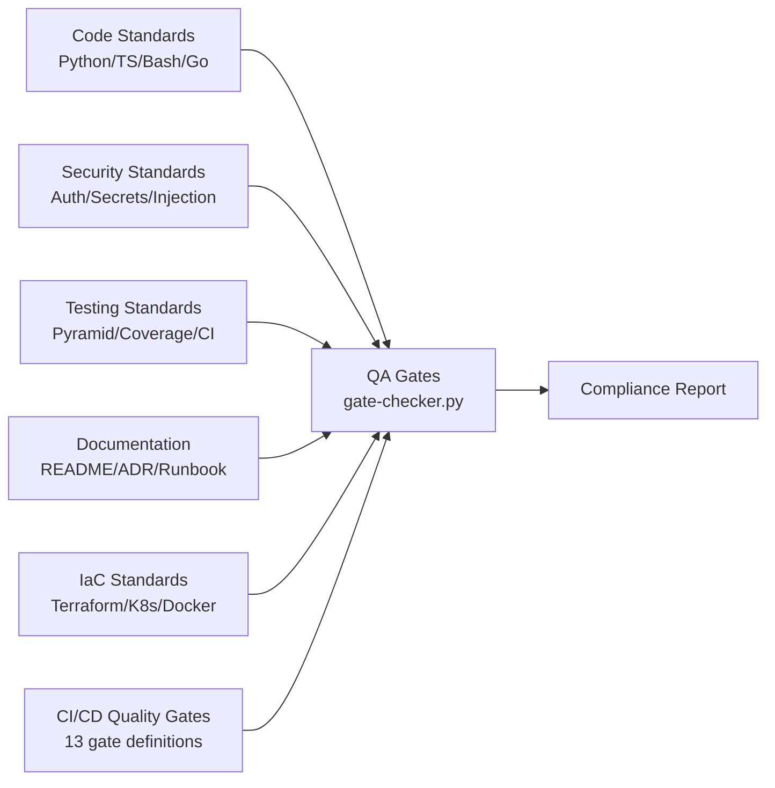

# Project 43 — Engineer's Handbook (Standards & QA Gates)

Practical engineering standards and quality gate reference covering code, security, testing,
documentation, IaC, and CI/CD — with a machine-readable gate checker that validates any project.

## Contents



## Handbook Sections

| File | Topic | Key Standards |
|------|-------|--------------|
| `01-code-standards.md` | Python, TypeScript, Bash, Go | Type hints required, `black` formatting, linting rules |
| `02-security-standards.md` | Auth, secrets, injection | JWT RS256, no hardcoded secrets, parameterised SQL |
| `03-testing-standards.md` | Unit/integration/E2E | ≥ 80% coverage, test pyramid, no production data |
| `04-documentation-standards.md` | README, ADR, runbooks | Required README sections, ADR template |
| `05-iac-standards.md` | Terraform, K8s, Docker | Module structure, security context, non-root user |
| `06-cicd-quality-gates.md` | 13 gates, branch protection | Gate bypass policy, environment promotion |

## Quick Start

```bash
# Run all handbook tests
python -m pytest tests/ -v

# Run QA gate checker against any project
python qa-gates/gate-checker.py /path/to/your/project

# List all gate definitions
python qa-gates/gate-checker.py --list-gates

# Demo mode — runs against the aws-infra project
python qa-gates/gate-checker.py --demo
```

## Live Demo Output

### Gate Checker (demo run against p01-aws-infra)

```
====================================================================
  QA GATE COMPLIANCE REPORT
  Project: p01-aws-infra
====================================================================

  CODE QUALITY
  --------------------------------------------------
  ✅ [GATE-001] Python Format Check
  ✅ [GATE-002] Python Lint
  ✅ [GATE-003] Python Type Check
  ✅ [GATE-011] Terraform Format
       19 Terraform file(s) found
  ✅ [GATE-012] Terraform Validate
       19 Terraform file(s), variables.tf: ✓
  ⚠️  [GATE-013] Dockerfile Lint
       Dockerfile issues: missing USER directive, missing HEALTHCHECK

  TESTING
  --------------------------------------------------
  ✅ [GATE-004] Unit Tests
       5 test file(s) found
  ✅ [GATE-005] Test Coverage
       Coverage gate: ≥ 80% required
  ✅ [GATE-006] Integration Tests
       5 test file(s) found

  SECURITY
  --------------------------------------------------
  ✅ [GATE-007] SAST Security Scan
  ✅ [GATE-008] Dependency Vulnerability Scan
  ⚠️  [GATE-009] Container Image Scan
       Dockerfile issues: missing USER directive, missing HEALTHCHECK
  ✅ [GATE-010] IaC Security Scan

  ==================================================
  Summary: 11 passed, 2 warned, 0 skipped, 0 failed
  ✅ All applicable gates passed — PR eligible for merge.
====================================================================
```

### Test Results

```
48 passed in 0.64s
```

## Gate Definitions Summary

| ID | Gate | Category | Severity |
|----|------|----------|---------|
| GATE-001 | Python Format (black) | code_quality | block |
| GATE-002 | Python Lint (ruff) | code_quality | block |
| GATE-003 | Python Type Check (mypy) | code_quality | block |
| GATE-004 | Unit Tests (pytest) | testing | block |
| GATE-005 | Coverage ≥ 80% | testing | block |
| GATE-006 | Integration Tests | testing | block |
| GATE-007 | SAST (semgrep) | security | block_on_high |
| GATE-008 | Dependency Scan (pip-audit) | security | block_on_high |
| GATE-009 | Container Scan (trivy) | security | block_on_critical |
| GATE-010 | IaC Scan (tfsec) | security | block_on_high |
| GATE-011 | Terraform Format | code_quality | block |
| GATE-012 | Terraform Validate | code_quality | block |
| GATE-013 | Dockerfile Lint (hadolint) | code_quality | warn |

## Example Artifacts

- **`examples/compliant-python-snippet.py`** — 130-line order service demonstrating: full type hints, Pydantic v2 validation, parameterised SQL, environment-sourced secrets, structured logging, custom exception types
- **`examples/compliant-terraform-module/`** — S3 bucket module demonstrating: validation blocks on all variables, named locals for DRY tags, versioning + encryption + public access block + lifecycle policy, outputs with descriptions

## What This Proves

- Engineering standards authorship across 6 domains
- Machine-readable quality gate system with 13 gates
- Python automation: YAML parsing, project type detection, structured reporting
- Security-by-default design (no hardcoded secrets, parameterised SQL, injection prevention)
- IaC best practices: module structure, variable validation, Dockerfile non-root/healthcheck
- CI/CD gate enforcement design with bypass policy and environment promotion criteria

## 📌 Scope & Status
<!-- BEGIN AUTO STATUS TABLE -->
| Field | Value |
| --- | --- |
| Current phase/status | Integration — 🟢 Delivered |
| Next milestone date | 2026-02-27 |
| Owner | SRE Team |
| Dependency / blocker | Dependency on shared platform backlog for 43-engineers-handbook |
<!-- END AUTO STATUS TABLE -->

## 🗺️ Roadmap
<!-- BEGIN AUTO ROADMAP TABLE -->
| Milestone | Target date | Owner | Status | Notes |
| --- | --- | --- | --- | --- |
| Milestone 1: implementation checkpoint | 2026-02-27 | SRE Team | 🟢 Delivered | Advance core deliverables for 43-engineers-handbook. |
| Milestone 2: validation and evidence update | 2026-03-28 | SRE Team | 🔵 Planned | Publish test evidence and update runbook links. |
<!-- END AUTO ROADMAP TABLE -->
