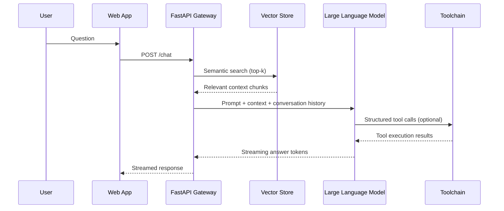

# Project 8: Advanced AI Chatbot

## Overview
A Retrieval-Augmented Generation (RAG) chatbot that indexes portfolio assets, executes tool-augmented workflows, and serves responses through a FastAPI service with WebSocket streaming.

## Architecture


## Key Features
- Hybrid search using dense embeddings and metadata filters
- Memory manager that combines short-term chat history with long-term knowledge base
- Tool orchestration for knowledge graph lookups, deployment automation, and analytics queries
- Guardrail middleware for content filtering and rate limiting

## Running Locally
```bash
pip install -r requirements.txt
uvicorn src.chatbot_service:app --reload
```

## Testing
```bash
# From repository root
python -m pytest projects/8-advanced-ai-chatbot/tests
```

## Deployment Options
- **Primary:** FastAPI container deployed on AWS ECS/Fargate with managed vector database (OpenSearch, Pinecone).
- **Alternative:** Azure OpenAI integration with Cosmos DB + Functions for event-driven actions.
- **Offline Mode:** Local inference using GPT4All or Llama.cpp via plugin architecture.
