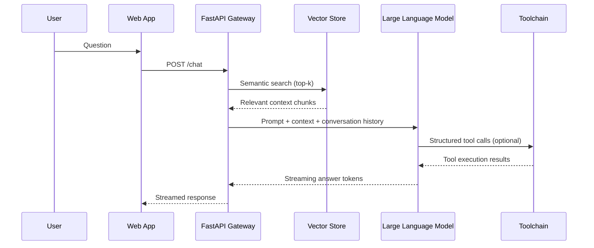

# Project 8: Advanced AI Chatbot

## Documentation
For cross-project documentation, standards, and runbooks, see the [Portfolio Documentation Hub](../../DOCUMENTATION_INDEX.md).


## Live Deployment
| Detail | Value |
| --- | --- |
| Live URL | `https://8-advanced-ai-chatbot.staging.portfolio.example.com` |
| DNS | `8-advanced-ai-chatbot.staging.portfolio.example.com` → `CNAME portfolio-gateway.staging.example.net` |
| Deployment environment | Staging (AWS us-east-1, containerized services) |

### Deployment automation
- **CI/CD:** GitHub Actions [`.github/workflows/ci.yml`](../../.github/workflows/ci.yml) gates builds; [`.github/workflows/deploy-portfolio.yml`](../../.github/workflows/deploy-portfolio.yml) publishes the staging stack.
- **Manual steps:** Follow the project Quick Start/Runbook instructions in this README to build artifacts, apply IaC, and validate health checks.

### Monitoring
- **Prometheus:** `https://prometheus.staging.portfolio.example.com` (example scrape config path: `./prometheus/prometheus.yml`; adjust to your infra repo layout)
- **Grafana:** `https://grafana.staging.portfolio.example.com` (example dashboard JSON path: `./grafana/dashboards/*.json`; actual location may vary by project)

### Live deployment screenshots


## 📊 Portfolio Status Board

🟢 Done · 🟠 In Progress · 🔵 Planned

**Current Status:** 🟢 Done (Implemented)


## Overview
A Retrieval-Augmented Generation (RAG) chatbot that indexes portfolio assets, executes tool-augmented workflows, and serves responses through a FastAPI service with WebSocket streaming.

## Architecture


## Key Features
- Hybrid search using dense embeddings and metadata filters
- Memory manager that combines short-term chat history with long-term knowledge base
- Tool orchestration for knowledge graph lookups, deployment automation, and analytics queries
- Guardrail middleware for content filtering and rate limiting

## Running Locally
```bash
pip install -r requirements.txt
uvicorn src.chatbot_service:app --reload
```

## Deployment Options
- **Primary:** FastAPI container deployed on AWS ECS/Fargate with managed vector database (OpenSearch, Pinecone).
- **Alternative:** Azure OpenAI integration with Cosmos DB + Functions for event-driven actions.
- **Offline Mode:** Local inference using GPT4All or Llama.cpp via plugin architecture.


## Code Generation Prompts

This section contains AI-assisted code generation prompts that can help you recreate or extend project components. These prompts are designed to work with AI coding assistants like Claude, GPT-4, or GitHub Copilot.

### Code Components

#### 1. Core Functionality
```
Create the main application logic for [specific feature], including error handling, logging, and configuration management
```

#### 2. API Integration
```
Generate code to integrate with [external service] API, including authentication, rate limiting, and retry logic
```

#### 3. Testing
```
Write comprehensive tests for [component], covering normal operations, edge cases, and error scenarios
```

### How to Use These Prompts

1. **Copy the prompt** from the code block above
2. **Customize placeholders** (replace [bracketed items] with your specific requirements)
3. **Provide context** to your AI assistant about:
   - Your development environment and tech stack
   - Existing code patterns and conventions in this project
   - Any constraints or requirements specific to your use case
4. **Review and adapt** the generated code before using it
5. **Test thoroughly** and adjust as needed for your specific scenario

### Best Practices

- Always review AI-generated code for security vulnerabilities
- Ensure generated code follows your project's coding standards
- Add appropriate error handling and logging
- Write tests for AI-generated components
- Document any assumptions or limitations
- Keep sensitive information (credentials, keys) in environment variables
