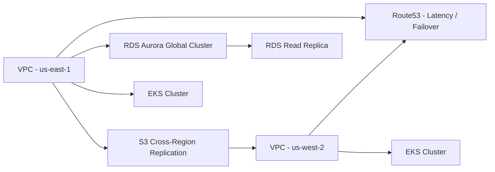

# Project 9: Multi-Region Disaster Recovery Automation

## 📊 Portfolio Status Board

🟢 Done · 🟠 In Progress · 🔵 Planned

**Current Status:** 🟢 Done (Implemented)


## Overview
This project provisions a resilient architecture with automated failover between AWS regions. It synchronizes stateful services, validates replication health, and performs controlled recovery drills.

## Architecture


## Components
- Terraform stack that deploys networking, Aurora Global Database, Route53 health checks, and asynchronous replication.
- AWS Systems Manager Automation runbook for failover.
- Chaos experiment harness to validate RTO/RPO targets.

## Usage
```bash
cd terraform
terraform init
terraform apply -var-file=production.tfvars

# Execute failover drill
../scripts/failover-drill.sh
```

## Runbooks
Detailed runbooks for failover, fallback, and DR testing are located in the `runbooks/` directory.


## Code Generation Prompts

This section contains AI-assisted code generation prompts that can help you recreate or extend project components. These prompts are designed to work with AI coding assistants like Claude, GPT-4, or GitHub Copilot.

### Infrastructure as Code

#### 1. Terraform Module
```
Create a Terraform module for deploying a highly available VPC with public/private subnets across 3 availability zones, including NAT gateways and route tables
```

#### 2. CloudFormation Template
```
Generate a CloudFormation template for an Auto Scaling Group with EC2 instances behind an Application Load Balancer, including health checks and scaling policies
```

#### 3. Monitoring Integration
```
Write Terraform code to set up CloudWatch alarms for EC2 CPU utilization, RDS connections, and ALB target health with SNS notifications
```

### How to Use These Prompts

1. **Copy the prompt** from the code block above
2. **Customize placeholders** (replace [bracketed items] with your specific requirements)
3. **Provide context** to your AI assistant about:
   - Your development environment and tech stack
   - Existing code patterns and conventions in this project
   - Any constraints or requirements specific to your use case
4. **Review and adapt** the generated code before using it
5. **Test thoroughly** and adjust as needed for your specific scenario

### Best Practices

- Always review AI-generated code for security vulnerabilities
- Ensure generated code follows your project's coding standards
- Add appropriate error handling and logging
- Write tests for AI-generated components
- Document any assumptions or limitations
- Keep sensitive information (credentials, keys) in environment variables
