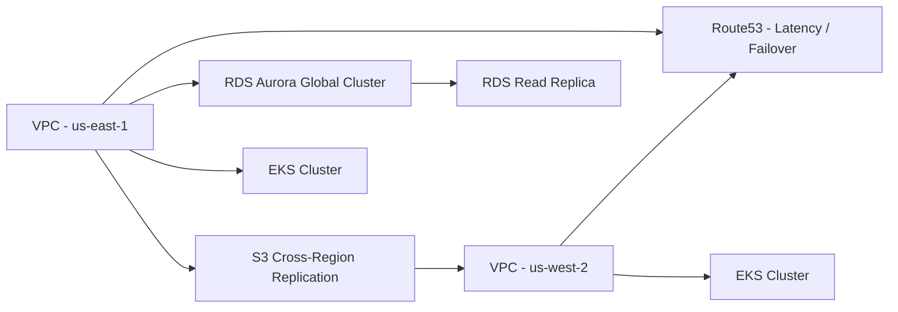

# Project 9: Multi-Region Disaster Recovery Automation

## Overview
This project provisions a resilient architecture with automated failover between AWS regions. It synchronizes stateful services, validates replication health, and performs controlled recovery drills.

## Architecture


## Components
- Terraform stack that deploys networking, Aurora Global Database, Route53 health checks, and asynchronous replication.
- AWS Systems Manager Automation runbook for failover.
- Chaos experiment harness to validate RTO/RPO targets.

## Usage
```bash
cd terraform
terraform init
terraform apply -var-file=production.tfvars

# Execute failover drill
../scripts/failover-drill.sh
```

## Runbooks
Detailed runbooks for failover, fallback, and DR testing are located in the `runbooks/` directory.
