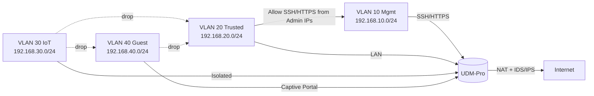

# Logical Network Topology

```mermaid
graph LR
  MGMT[VLAN 10 Mgmt\n192.168.10.0/24]
  TRUST[VLAN 20 Trusted\n192.168.20.0/24]
  IOT[VLAN 30 IoT\n192.168.30.0/24]
  GUEST[VLAN 40 Guest\n192.168.40.0/24]
  WAN[Internet]

  MGMT -->|SSH/HTTPS| Gateway[(UDM-Pro)]
  TRUST -->|LAN| Gateway
  IOT -->|Isolated| Gateway
  GUEST -->|Captive Portal| Gateway
  Gateway -->|NAT + IDS/IPS| WAN

  IOT -. drop .-> TRUST
  IOT -. drop .-> GUEST
  GUEST -. drop .-> TRUST
  TRUST -->|Allow SSH/HTTPS from Admin IPs| MGMT
```

> Layer-3 gateways terminate at the UDM-Pro; inter-VLAN policies enforced by firewall rules noted in `vlan-firewall-dhcp-config.md`.
