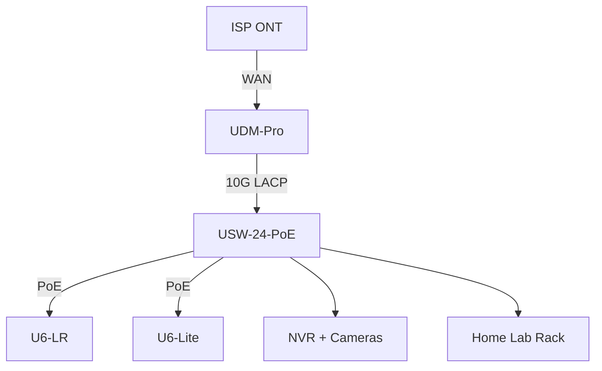

# Physical Topology (Sanitized)

```mermaid
graph TD
  ISP[ISP ONT]
  G1[UDM-Pro]
  SW1[USW-24-PoE]
  AP1[U6-LR]
  AP2[U6-Lite]
  NVR[NVR + Cameras]
  Lab[Home Lab Rack]

  ISP -->|WAN| G1
  G1 -->|10G LACP| SW1
  SW1 -->|PoE| AP1
  SW1 -->|PoE| AP2
  SW1 --> NVR
  SW1 --> Lab
```

> Devices and labels are anonymized to remove serials and MAC addresses.
