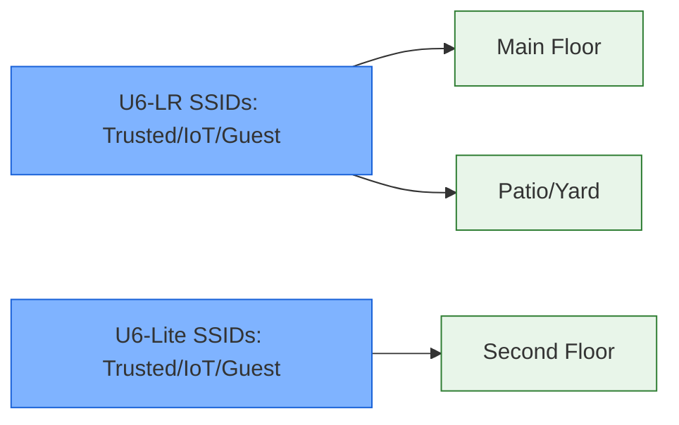

# Wi‑Fi Coverage and SSID Mapping

- **Roaming**: 20 MHz channels on 2.4 GHz, 80 MHz on 5 GHz; minimum RSSI -70 dBm enforced for band steering.
- **Guest**: Captive portal on VLAN 40; rate limited to 10 Mbps down/2 Mbps up.
- **IoT**: Client isolation enabled; multicast enhancement for smart-home devices.
