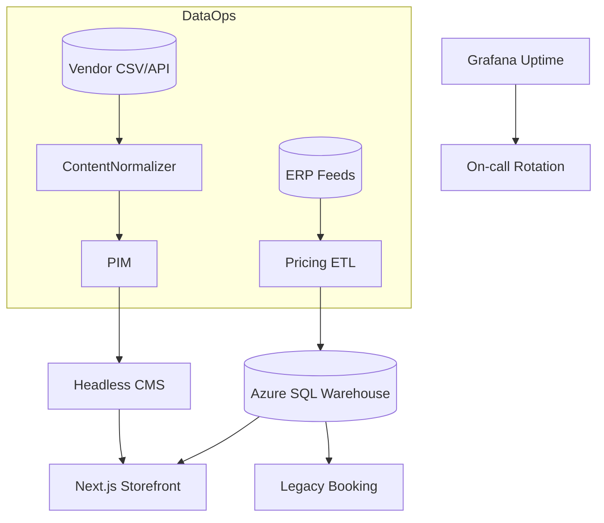

# Commercial E-commerce & Booking Systems

Operations playbook for maintaining high-SKU commerce platforms with automated pricing, content QA, and release governance.

## Solution Map


## Pricing Workflow Notes
- Nightly ETL normalizes vendor feeds (10k+ SKUs) with duplicate detection and currency conversion.
- Approval gates require two-person review before pricing deltas >5% publish to production.
- Automated regression suite compares `price_current` vs `price_previous` to ensure contract floors honored.

## Config & Queries
<details>
<summary>dbt incremental model (pricing)</summary>

```sql
{{ config(materialized='incremental', unique_key='sku_id') }}

with staged as (
  select sku_id,
         source_system,
         latest_price,
         updated_at
  from {{ ref('stg_vendor_prices') }}
)

select s.sku_id,
       s.latest_price,
       coalesce(p.floor_price, s.latest_price) as floor_price,
       current_timestamp as ingested_at
from staged s
left join {{ ref('pricing_policies') }} p
  on s.sku_id = p.sku_id
where {{ incremental_clause('s.updated_at') }};
```
</details>

<details>
<summary>Content QA checklist (excerpt)</summary>

```markdown
# Product Page QA
- [ ] Gallery renders optimized WebP with fallback JPEG
- [ ] ADA compliance: alt text present and descriptive
- [ ] Booking calendar enforces blackout dates
- [ ] Structured data validates via Google Rich Results test
```
</details>

## Release & Incident Process
- **Release train**: Tuesday/Thursday deployments with change request ticket, automated Lighthouse scores, and marketing sign-off.
- **Incident bridge**: Slack channel `#inc-booking` with templated incident timeline doc in shared drive.
- **Data hygiene**: Weekly SQL job to detect orphaned categories; results exported to Airtable for merchandising review.

## Artifacts & Evidence
- Annotated SQL diagrams showing replication between warehouse and OLTP.
- Screenshots of Grafana synthetics & Core Web Vitals dashboards.
- Sanitized incident postmortems highlighting MTTR improvements.
- Airtable export of merchandising audit workflow.
