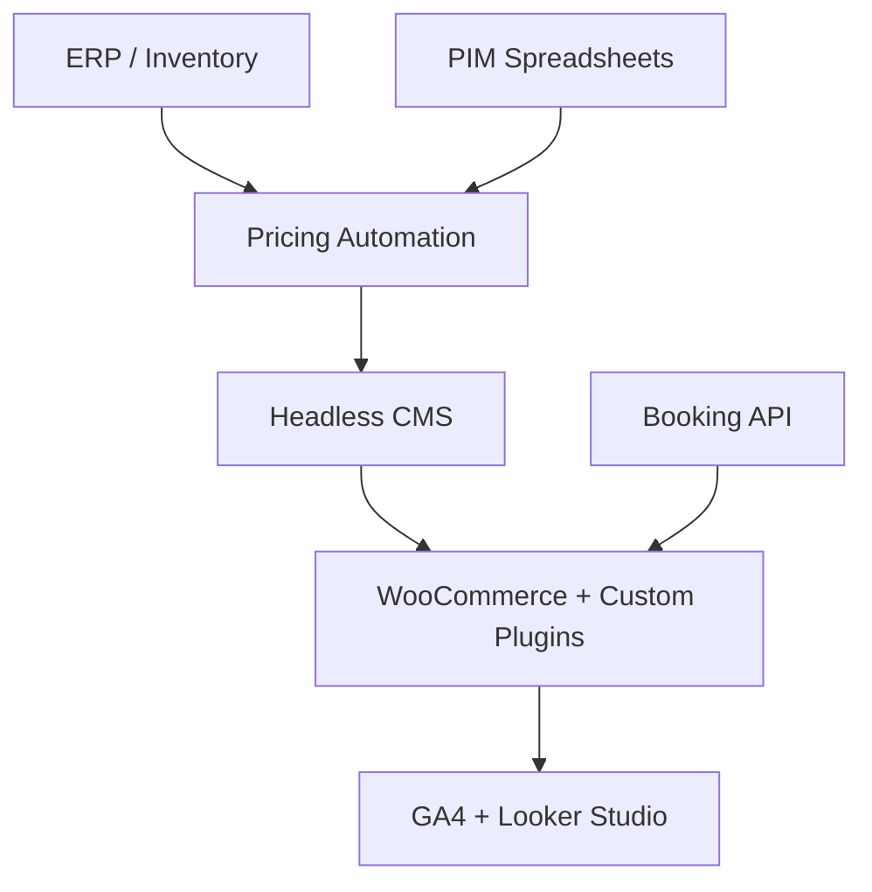

# Commercial E-commerce & Booking Systems

## Overview
Delivered and operated multiple commerce properties: a resort booking platform, a flooring retailer with 40k+ SKUs, and a tours marketplace with complex availability rules. Focus areas were catalog accuracy, price automation, and zero-downtime content releases.

## Systems Landscape

## Operational Processes
- Nightly ETL normalizes supplier CSVs into canonical schema and flags anomalies.
- Automated pricing rules adjust SKUs by margin thresholds and competitor feeds.
- QA playbooks validate booking flows, taxes, fees, and localized content before release.
- Incident guides define RTO/RPO for payment gateway and booking service outages.

## Data Quality Controls
| Control | Frequency | Tooling |
| --- | --- | --- |
| Schema validation | Nightly | Python + Great Expectations |
| Price floor guardrails | Hourly | SQL stored procedures |
| Booking availability diff | 15 min | API comparison job |
| Content regression checklist | Per release | Playwright smoke suite |

## Related Artifacts
- [`catalog-sync-process.md`](./catalog-sync-process.md) — ETL workflow and validation gates.
- [`pricing-automation.sql`](./pricing-automation.sql) — anonymized stored procedure for margin-based adjustments.
- [`incident-playbook.md`](./incident-playbook.md) — booking outage response guide.

## Business Impact
- Reduced pricing errors by 82% by automating competitor parity adjustments.
- Improved booking conversion by 11% after introducing availability diff alerts.
- Delivered new tours marketplace launch in 6 weeks with CI-backed QA gates.
