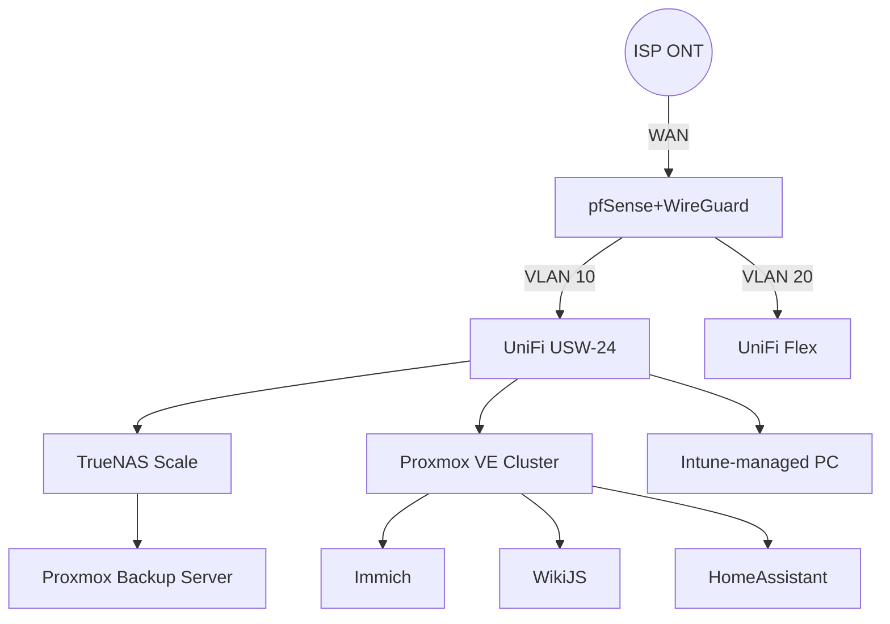

# Homelab & Secure Network Build

Purpose-built homelab rack delivering segmented networking, secure remote access, and hands-off backups for household and lab workloads.

## Architecture Overview


## Network Topology Notes
- **Segmentation**: VLAN 10 (trusted), VLAN 20 (IoT), VLAN 30 (guest), VLAN 99 (management).
- **Identity**: Active Directory tiering with conditional access for admin accounts.
- **Remote Access**: WireGuard tunnels with device posture checks and MFA prompts via Authelia.
- **Monitoring**: Syslog export to Loki, NetFlow sampling to Prometheus exporters.

## Key Config Snippets
<details>
<summary>pfSense VLAN interface & firewall rules</summary>

```conf
# /cf/conf/config.xml (excerpt)
<vlan>
  <if>igb1</if>
  <tag>20</tag>
  <descr>IoT</descr>
</vlan>
<rule>
  <type>pass</type>
  <interface>vlan20</interface>
  <source>
    <network>VLAN20</network>
  </source>
  <destination>
    <alias>iot_allowlist</alias>
  </destination>
  <descr>IoT → services via reverse proxy only</descr>
</rule>
```
</details>

<details>
<summary>UniFi switch port profile (config.gateway.json)</summary>

```json
{
  "ifname": "0/7",
  "name": "Proxmox trunk",
  "native_networkconf_id": "VLAN10",
  "allowed_networkconf_ids": ["VLAN10", "VLAN20", "VLAN30", "VLAN99"]
}
```
</details>

## Operational Runbooks
- **Nightly backups**: Cron job triggers ZFS snapshot + PBS upload at 02:00, with webhook notification to Mattermost.
- **Patch management**: Monthly `ansible-playbook site.yml --tags firmware,security` with pre/post health checks.
- **Disaster recovery drill**: Quarterly restore of Immich VM from PBS snapshot into isolated VLAN 40.

## Evidence & Artifacts
- Rack elevation diagram (Visio export) showing patch-panel labeling.
- Cable test logs with Fluke DSX-5000 certification results.
- Screen captures of VLAN dashboards and WireGuard handshakes.
- Change tickets cross-linking to Confluence change calendar.
