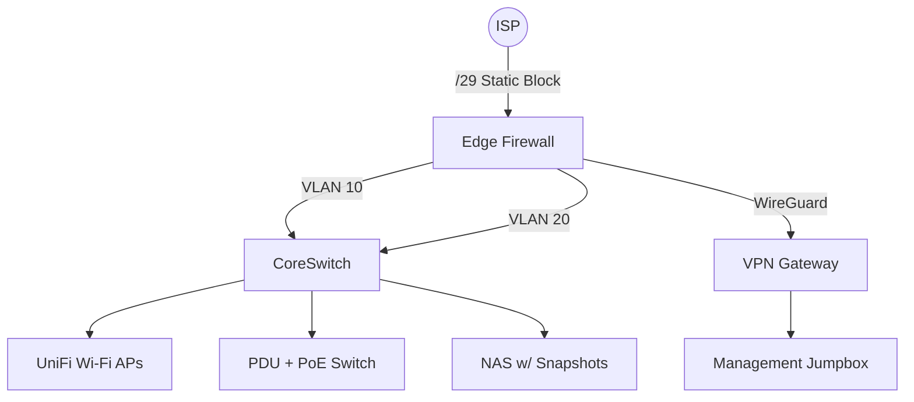

# Homelab & Secure Network Build

## Overview
This homelab project recreates a production-like environment inside a rack-mount home network. It focuses on segmenting traffic, enforcing secure remote access, and codifying network topology so changes can be simulated before touching hardware.

## Architecture Diagram

## VLAN & Subnet Plan
| VLAN | Purpose | Subnet | Notes |
| --- | --- | --- | --- |
| 10 | Trusted LAN | 10.10.10.0/24 | Desktop, servers, NAS |
| 20 | IoT/Guest | 10.10.20.0/24 | Rate-limited, isolated |
| 30 | Management | 10.10.30.0/24 | SSH, IPMI, ADDS |
| 40 | DMZ | 10.10.40.0/24 | Reverse proxy, WAF |

## Implementation Notes
- Cabling documented via rack elevation diagram and patch panel map.
- UniFi controller backup stored nightly to NAS and synced to cloud cold storage.
- WireGuard peers created for each admin device with MFA-protected keys stored in a password manager.
- DHCP reservations exported to git for change history.

## Runbooks
1. **Weekly Change Review**
   - Export UniFi site backup.
   - Diff DHCP reservation file in git.
   - Validate VPN tunnel uptime and rotate any stale keys.
2. **Quarterly DR Drill**
   - Restore firewall config to spare unit.
   - Rebuild UniFi controller from backup archive.
   - Confirm VLAN isolation via nmap scans from each segment.

## Related Artifacts
- [`vlan-plan.yaml`](./vlan-plan.yaml) — machine-readable VLAN definitions for automation.
- [`wireguard-peer-template.md`](./wireguard-peer-template.md) — standardized onboarding checklist.

## Lessons Learned
- Maintain a single source of truth for VLAN IDs to avoid conflicting ACL updates.
- Store diagrams in text-based formats (Mermaid) to version alongside configs.
- Regular DR testing surfaced a misconfigured trunk port before it impacted production.
