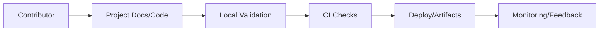
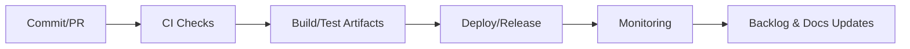

# Project: Internal Net Pentest

> **Status key:** 🟢 Done · 🟠 In Progress · 🔵 Planned · 🔄 Recovery/Rebuild · 📝 Documentation Pending

## 🎯 Overview
This project is part of the Portfolio-Project collection and is documented using the portfolio README standard to keep delivery status, architecture context, and operational evidence consistent for reviewers and maintainers. The project addresses domain-specific implementation goals for Internal Net Pentest while ensuring contributors can understand how to run, validate, and extend the work in a repeatable way. Intended stakeholders include engineering contributors, reviewers, and operators who need quick access to setup steps, quality signals, and recovery guidance. Success for this README is transparent status reporting, clear scope boundaries, and links to verifiable implementation artifacts. Where implementation details are still evolving, this README explicitly marks planned work and documentation follow-ups.

### Outcomes
- Standardized documentation structure aligned with the portfolio template.
- Clear status visibility for implementation, testing, and operations workstreams.
- Reproducible setup/run instructions for local validation.
- Evidence-oriented references to source, tests, and deployment assets.
- Explicit documentation ownership and update cadence.

## 📌 Scope & Status

| Area | Status | Notes | Next Milestone |
|---|---|---|---|
| Core project implementation | 🟠 In Progress | Core project assets exist in this directory; maturity varies by component. | Validate implementation details and update evidence links for current sprint. |
| Ops/Docs/Testing alignment | 📝 Documentation Pending | README standardized; command/test evidence may still require project-specific refresh. | Complete command validation and mark checklist items with executed evidence. |

> **Scope note:** In scope for this documentation pass is README standardization, section completeness, and explicit status signaling. Deferred to project-specific follow-up are deeper implementation narratives, measured SLO evidence, and expanded automated quality gates where not yet available.

## 🏗️ Architecture
This project follows a repository-aligned structure with project assets in the local directory, optional source/runtime components, optional tests, and optional infrastructure/deployment definitions. Contributors change project code/docs, validate with local commands, and propagate updates through repository CI/CD workflows where applicable.

| Component | Responsibility | Key Interfaces |
|---|---|---|
| `./` | Project-level documentation and implementation assets | `README.md`, project files in this directory |
| `./src` (if present) | Application/business logic | Source modules and entrypoints |
| `./tests` (if present) | Automated verification | Unit/integration/e2e test suites |
| `./deployments` or `./terraform` (if present) | Runtime and infra definitions | IaC modules, deployment manifests |
| `../../.github/workflows` | CI/CD automation | Repository workflows and pipeline checks |

## 🚀 Setup & Runbook

### Prerequisites
- Git access to this repository
- Runtime/tooling required by this specific project (for example Node.js, Python, Docker, or Terraform)
- Environment variables/secrets configured as documented in project files

### Commands
| Step | Command | Expected Result |
|---|---|---|
| Inspect project files | `ls` | Displays project assets and subdirectories. |
| Install dependencies | `[project-specific install command]` | Dependencies are installed with no fatal errors. |
| Run project | `[project-specific run command]` | Project starts or executes expected workflow. |
| Validate quality | `[project-specific test/lint command]` | Tests/checks complete and report current status. |

### Troubleshooting
| Issue | Likely Cause | Resolution |
|---|---|---|
| Dependency install failure | Missing runtime/tool version | Align local runtime to project requirements and retry install. |
| Command not found | Wrong working directory or missing toolchain | Run from this project directory and install required CLI/runtime. |
| Test execution errors | Incomplete environment variables or fixtures | Configure required env vars/fixtures and rerun validation command. |

## ✅ Testing & Quality Evidence
Testing strategy for this project should combine fast local checks (unit/lint), workflow-level validation (integration/e2e where applicable), and manual verification for user-visible flows. This standardized section is present to track current evidence quality and call out unvalidated areas explicitly.

| Test Type | Command / Location | Current Result | Evidence Link |
|---|---|---|---|
| Unit | `[project-specific unit command]` | n/a in this standardization pass | `./tests` |
| Integration | `[project-specific integration command]` | n/a in this standardization pass | `./tests` |
| E2E/Manual | `[project-specific e2e/manual steps]` | n/a in this standardization pass | `./README.md` |

### Known Gaps
- Project-specific commands/results should be updated with executed evidence.
- CI artifact links and test reports may need project-level curation.
- Coverage and non-functional testing depth varies across projects.

## 🔐 Security, Risk & Reliability

| Risk | Impact | Current Control | Residual Risk |
|---|---|---|---|
| Documentation drift from implementation | Medium | Standardized README sections with cadence/ownership | Medium |
| Incomplete validation before merges | Medium | CI workflows and checklist-driven review process | Medium |
| Environment/configuration inconsistencies | High | Runbook prerequisites and troubleshooting guidance | Medium |

### Reliability Controls
- Version-controlled documentation and project assets.
- Repository CI/CD workflows for repeatable checks/deploys.
- Project runbook section for failure diagnosis and recovery.
- Explicit roadmap and freshness cadence for continuous updates.

## 🔄 Delivery & Observability

| Signal | Source | Threshold/Expectation | Owner |
|---|---|---|---|
| Build success rate | CI workflows | Target stable successful builds | Project maintainers |
| Test pass rate | Project test suites | Target no regressions on required suites | Project maintainers |
| Availability/health | Runtime monitoring/runbook checks | Target service/project-specific objective | Project maintainers |

## 🗺️ Roadmap

| Milestone | Status | Target | Owner | Dependency/Blocker |
|---|---|---|---|---|
| Align README with portfolio standard | 🟢 Done | Current update | Project maintainers | None |
| Replace placeholder commands with validated commands/results | 🟠 In Progress | Next sprint | Project maintainers | Project-specific runtime/test readiness |
| Expand quality/observability evidence links | 🔵 Planned | Upcoming milestone | Project maintainers | CI/reporting integration depth |

## 📎 Evidence Index
- [README.md](./README.md)
- [terraform](./terraform)
- [GitHub workflows](../../.github/workflows)
- [Project directory](.)
- [Project directory](.)

## 🧾 Documentation Freshness

| Cadence | Action | Owner |
|---|---|---|
| Per major merge | Update status, roadmap, and evidence links | Project maintainers |
| Weekly | Validate commands and evidence link health | Project maintainers |
| Monthly | Audit README against portfolio template | Project maintainers |

## 11) Final Quality Checklist (Before Merge)

- [x] Status legend is present and used consistently
- [x] Architecture diagram renders in GitHub markdown preview
- [ ] Setup commands are runnable and validated
- [ ] Testing table includes current evidence
- [x] Risk/reliability controls are documented
- [x] Roadmap includes next milestones
- [x] Evidence links resolve correctly
- [x] README reflects current implementation state
