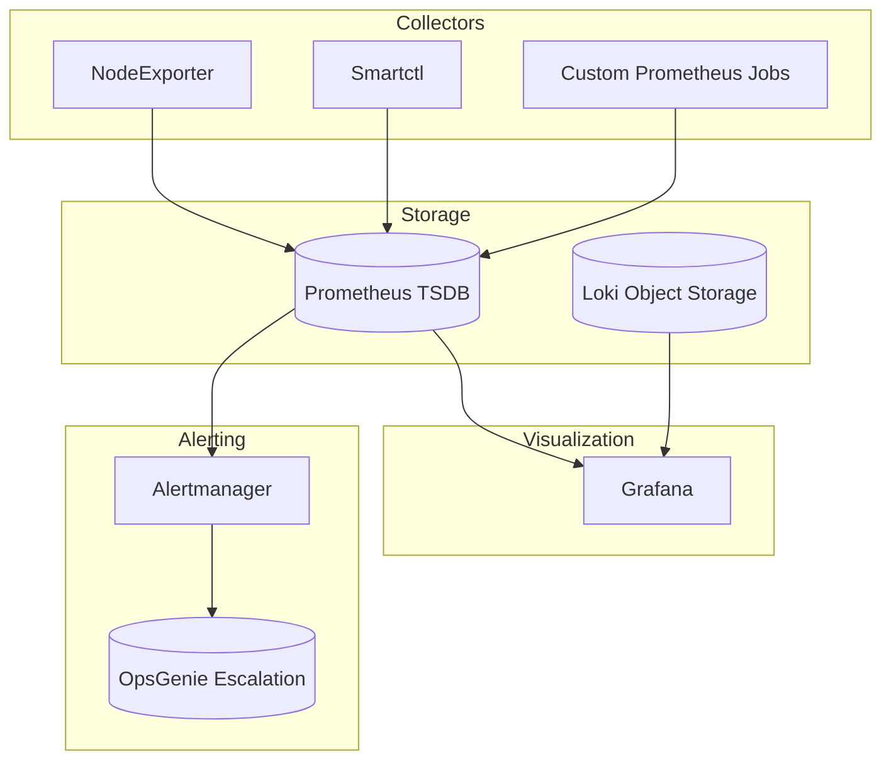

# Observability & Backup Monitoring Stack

## Overview
Unified telemetry for the homelab and virtualization clusters using Prometheus, Grafana, Loki, and Alertmanager. Pipelines capture metrics, logs, and backup job results, generating actionable alerts with documented runbooks.

## Stack Diagram

## Key Dashboards
- **Golden Signals:** latency, traffic, errors, saturation for ingress and application pods.
- **Backup Assurance:** last run duration, exit codes, bytes transferred, dataset diffs.
- **Hardware Health:** SMART status, temperature trends, power usage via SNMP.

## Alerting Strategy
| Alert | Trigger | Runbook |
| --- | --- | --- |
| `BackupJobFailed` | Borg exit code != 0 | See [`backup-alert-playbook.md`](./backup-alert-playbook.md) |
| `NASPoolDegraded` | ZFS pool status != ONLINE | Escalate to storage on-call; follow ZFS resilver checklist |
| `IngressLatencyHigh` | 95th percentile > 1.5s for 5m | Scale replica set, check Traefik middleware | 

## Operational Notes
- Alertmanager routes: business hours to OpsGenie primary, after-hours to SMS fallback.
- Loki retention set to 30 days; archival logs shipped to S3 via `logcli` export job.
- Grafana dashboards are provisioned from JSON in git to guarantee parity across environments.

## Related Artifacts
- [`backup-alert-playbook.md`](./backup-alert-playbook.md) — guided incident response for failed backups.
- [`grafana-dashboards.md`](./grafana-dashboards.md) — dashboard catalog and ownership matrix.
- [`alertmanager-routes.yaml`](./alertmanager-routes.yaml) — routing tree for notifications.

## Continuous Improvement
- Added synthetic probes to catch TLS misconfigurations before human traffic suffers.
- Reduced alert fatigue by merging redundant node CPU alerts and adding auto-remediation suggestions.
- Automated screenshot exports of Grafana SLO panels for stakeholder reports.
