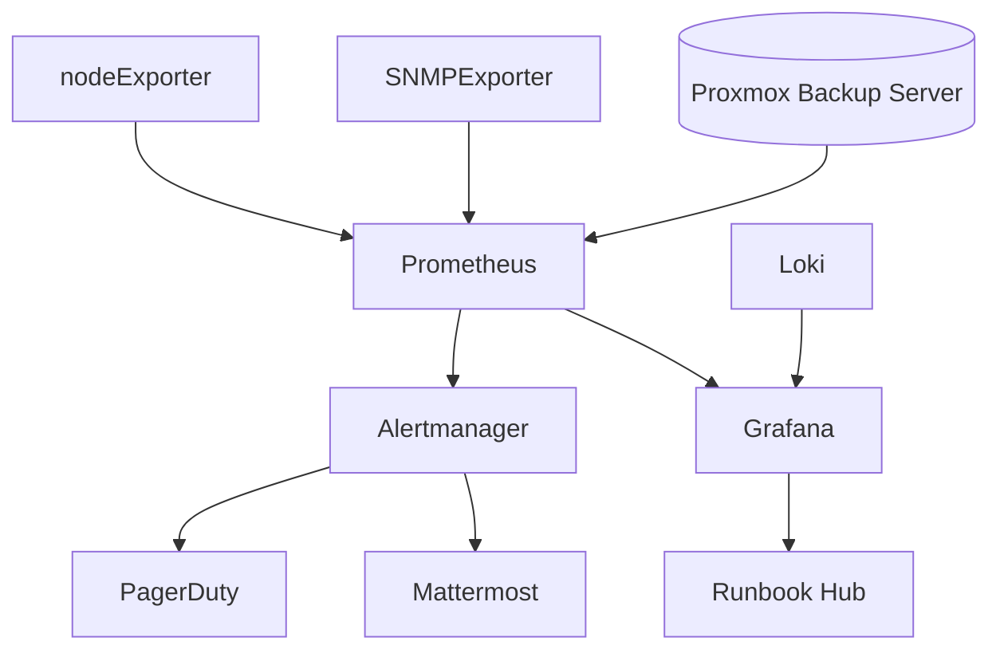

# Observability & Backups Stack

Unified monitoring, logging, and alerting pipeline with SLO-driven alert strategy and recovery automation.

## Stack Diagram


## Metrics & Logging Topology
- **Metrics**: Prometheus federation from homelab cluster to production-like collector; recording rules for latency budgets and backup job success rates.
- **Logs**: Loki multi-tenant setup with per-namespace retention policies; GEL limits tuned for NAS ingestion bursts.
- **Tracing**: OpenTelemetry Collector shipping spans from API gateway into Tempo.
- **Backups telemetry**: PBS exposes job metrics scraped via `/metrics`; Grafana panel overlays success vs. duration trends.

## Configuration Snippets
<details>
<summary>Prometheus federation rule</summary>

```yaml
# prometheus-federation-rules.yaml
record: job:backup_success:ratio
expr: |
  sum(rate(pbs_job_success_total[1h]))
    /
  sum(rate(pbs_job_attempt_total[1h]))
labels:
  slo: "99.5"
```
</details>

<details>
<summary>Alertmanager playbook mapping</summary>

```yaml
routes:
  - matchers:
      - severity = "critical"
    receiver: pagerduty-primary
    continue: true
  - matchers:
      - service = "backups"
    receiver: mattermost-backup-room
    group_interval: 5m
receivers:
  - name: pagerduty-primary
    pagerduty_configs:
      - routing_key: ${PAGERDUTY_KEY}
        severity: critical
  - name: mattermost-backup-room
    webhook_configs:
      - url: https://chat.internal/hooks/pbs
```
</details>

## Alert Response Playbooks
1. **Backup failure (critical)**
   - Acknowledge in PagerDuty, confirm job ID from PBS UI.
   - Run `pbs-client job resume <job>`; capture logs and attach to incident.
   - If second retry fails, execute failover script `ansible-playbook backup-fallback.yml` to target NAS replication.
2. **Latency budget burn**
   - Review Grafana "Latency Budget" dashboard; check for saturating network interfaces.
   - Trigger synthetic API checks to confirm customer impact; escalate to virtualization on-call if virtualization layer degraded.
3. **Disk utilization >85%**
   - Inspect Loki retention; rotate indexes and verify compactor health.
   - Execute `truenas prune --dataset observability/logs --retain 21d` as necessary.

## Documentation & Artifacts
- Grafana dashboard JSON exports stored in `/dashboards` with change history.
- Alert simulations recorded as Loom videos linked from Confluence.
- PBS job reports (PDF) archived quarterly.
- Loki throughput diagrams derived from Flowmon sampling.
