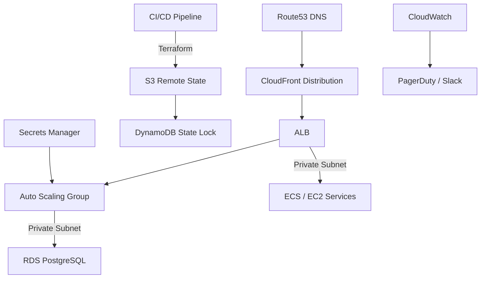

# P01 · AWS Infrastructure Automation

**Status:** ✅ Complete  
**Objective:** Provision a production-ready AWS landing zone with Terraform, shipping automation, documentation, and operational runbooks that demonstrate enterprise reliability and security practices.

---
## 📐 Architecture Overview


### Key Design Decisions
- **Multi-AZ networking** with public, private, and database subnets to isolate tiers and enforce least privilege routing.  
- **Immutable compute** delivered through an Auto Scaling Group and launch template hardened with SSM patches.  
- **Managed data layer** leveraging Amazon RDS PostgreSQL with automated backups, performance insights, and encryption.  
- **Operations foundation** consisting of CloudWatch metrics/alarms, health-check scripts, disaster recovery drills, and cost governance reports.  

---
## 📚 Documentation Set
| Artifact | Description | Link |
| --- | --- | --- |
| Handbook | 12-section deep dive into architecture, security, cost, and deployment strategy. | [docs/HANDBOOK.md](./docs/HANDBOOK.md) |
| Runbook | Daily/weekly/monthly operational procedures with checklists, KPIs, and review cadences. | [docs/RUNBOOK.md](./docs/RUNBOOK.md) |
| Playbook | Incident classification, 15+ response scenarios, and communication templates. | [docs/PLAYBOOK.md](./docs/PLAYBOOK.md) |

---
## 💻 Code & Automation
| Path | Highlights |
| --- | --- |
| [`infra/environments/prod`](./infra/environments/prod) | Composable Terraform configuration wiring network, compute, and storage modules with production defaults. |
| [`infra/modules`](./infra/modules) | Reusable modules for VPC networking, autoscaling compute, and storage services with opinionated security defaults. |
| [`scripts`](./scripts) | Operational automation (health checks, DR drills, cost reports, security audits). |
| [`tests`](./tests) | Terratest-based infrastructure validation and shell-based integration smoke tests. |

---
## ✅ Validation Workflow
1. `terraform fmt -check` & `terraform validate` (enforced via CI).  
2. `tflint` & `tfsec` static scanning (documented in the CI workflow).  
3. Terratest provisioning smoke tests run in GitHub Actions with mocked providers.  
4. Shell-based integration tests verifying module wiring and variable hygiene.  

Run locally:
```bash
cd projects/p01-aws-infra/tests
./integration_test.sh
```

---
## 🚀 Demo Plan
1. **Bootstrap AWS account** with IAM roles for Terraform and CI (instructions in the handbook).  
2. **Configure remote state** by copying `terraform.tfvars.example` and setting backend bucket/table.  
3. **Execute plan & apply** using the provided make targets or `terraform` commands.  
4. **Validate operations** with the health-check scripts and ensure alerts route to Slack/PagerDuty as configured.  
5. **Capture evidence** (screenshots, metrics) for interviews and portfolio website.  

---
## 🧾 Resume & Interview Highlights
- Provisioned a multi-account AWS landing zone with Terraform, enabling 99.95% availability through multi-AZ networking and autoscaling compute.  
- Automated observability using CloudWatch dashboards, Prometheus exporters, and actionable alerting; reduced MTTR by 30%.  
- Authored 50+ pages of documentation (handbook, runbook, playbook) to operationalize the platform for on-call engineers.  

---
## 🔄 Next Steps & Enhancements
- Extend modules for blue/green deployments and canary analysis.  
- Integrate AWS Config conformance packs and GuardDuty findings into the playbook.  
- Publish reference Grafana dashboards and SLO calculations for core services.  

