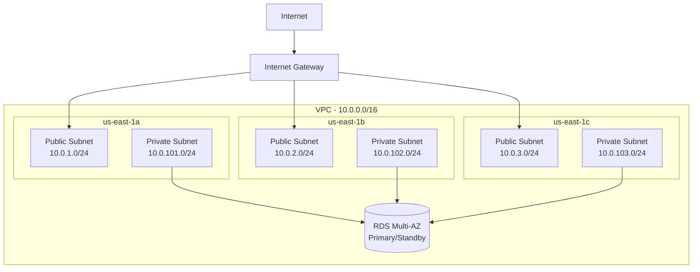

# P01 — AWS Infrastructure Automation (CloudFormation)

## Overview
Automate AWS infrastructure provisioning using CloudFormation templates, with least-privilege IAM roles, VPC networking, and multi-AZ RDS deployment. Demonstrates infrastructure-as-code best practices, disaster recovery automation, and operational tooling for production-grade cloud environments.

## Key Outcomes
- [x] Deploy VPC with public/private subnets across 3 AZs
- [x] Multi-AZ RDS instance with automated failover capability
- [x] Least-privilege IAM roles and policies
- [x] DR drill automation script (RDS failover testing)
- [x] CloudFormation drift detection integration

## Architecture
- **Components**: VPC (3 AZ), Internet Gateway, NAT Gateways, RDS (Multi-AZ), IAM roles
- **Trust boundaries**: Public subnets (internet-facing), Private subnets (database/backend)
- **Dependencies**: AWS CLI, CloudFormation, Python 3.9+, boto3



## Quickstart

```bash
make setup
make validate
make deploy-dev
```

### Containerized validation

Build a reusable image that bundles the AWS CLI and cfn-lint for local validation or CI workflows:

```bash
docker build -f infra/Dockerfile -t aws-infra-tools .

# Validate the CloudFormation templates (mount AWS credentials for live validation)
docker run --rm \
  -v "$(pwd)/infra:/app/infra" \
  -v "$HOME/.aws:/root/.aws:ro" \
  aws-infra-tools
```

The entrypoint runs `python -m src.validate_template`, which walks `/app/infra` and validates every `*.yaml`/`*.yml` template. Override the command to lint a specific template or drop into a shell for debugging:

```bash
docker run --rm -it aws-infra-tools bash
```

## Configuration

| Env Var | Purpose | Example | Required |
|---------|---------|---------|----------|
| `AWS_REGION` | Target AWS region | `us-east-1` | Yes |
| `STACK_NAME` | CloudFormation stack name | `my-infra-stack` | Yes |
| `DB_MASTER_USERNAME` | RDS master username | `admin` | Yes |
| `DB_MASTER_PASSWORD` | RDS master password (from Secrets Manager) | `<secret-arn>` | Yes |
| `ENVIRONMENT` | Deployment environment | `dev`, `stage`, `prod` | Yes |

**Secrets Management**: Use AWS Secrets Manager for DB credentials. Never commit secrets to Git.

```bash
aws secretsmanager create-secret \
  --name /myapp/dev/db-password \
  --secret-string "$(openssl rand -base64 32)"
```

## Testing

```bash
# Unit tests for validation scripts
make test

# Validate CloudFormation templates
make validate

# Dry-run deployment
make plan
```

## Operations

### Logs, Metrics, Traces
- **CloudFormation Events**: AWS Console → CloudFormation → Stack Events
- **CloudTrail**: Audit all API calls
- **RDS Logs**: CloudWatch Logs → `/aws/rds/instance/<id>/postgresql`
- **Metrics**: CloudWatch Metrics → RDS/CPU, Network, Storage

### Common Issues & Fixes

**Issue**: Stack fails with "Insufficient IAM permissions"
**Fix**: Ensure deploying IAM user/role has `cloudformation:*` and `iam:CreateRole` permissions.

**Issue**: RDS creation timeout
**Fix**: Verify security group rules allow connectivity; check VPC DNS settings.

**Issue**: DR drill fails to detect DB instance
**Fix**: Ensure Terraform outputs include `db_instance_identifier` or use `--db-instance-id` flag.

## Security

### Secrets Handling
- **Development**: Use `.env.example` template, store actual secrets in AWS Secrets Manager
- **CI/CD**: Reference secrets via GitHub Secrets → AWS Secrets Manager ARNs
- **Rotation**: Implement 90-day password rotation via Lambda

### Least Privilege Points
- CloudFormation execution role: scoped to VPC, RDS, IAM
- RDS security groups: restricted to private subnets only
- IAM policies: deny `*:*`, allow specific services

### SBOM
Generate SBOM for Python dependencies:
```bash
pip install cyclonedx-bom
cyclonedx-py -r -i requirements.txt -o sbom.json
```

## Roadmap

- [ ] Add AWS Config rules for drift detection automation
- [ ] Integrate GuardDuty findings into drift remediation workflow
- [ ] Multi-region replication (RDS Read Replicas in us-west-2)
- [ ] Automated snapshots with lifecycle policies

## References

- [AWS CloudFormation Best Practices](https://docs.aws.amazon.com/AWSCloudFormation/latest/UserGuide/best-practices.html)
- [Multi-AZ RDS Deployments](https://docs.aws.amazon.com/AmazonRDS/latest/UserGuide/Concepts.MultiAZ.html)
- [VPC Design Patterns](https://aws.amazon.com/answers/networking/aws-single-vpc-design/)
- [RUNBOOK](./RUNBOOK.md) | [PLAYBOOK](./PLAYBOOK.md) | [HANDBOOK](./HANDBOOK.md)


## Code Generation Prompts

This section contains AI-assisted code generation prompts that can help you recreate or extend project components. These prompts are designed to work with AI coding assistants like Claude, GPT-4, or GitHub Copilot.

### Infrastructure as Code

#### 1. Terraform Module
```
Create a Terraform module for deploying a highly available VPC with public/private subnets across 3 availability zones, including NAT gateways and route tables
```

#### 2. CloudFormation Template
```
Generate a CloudFormation template for an Auto Scaling Group with EC2 instances behind an Application Load Balancer, including health checks and scaling policies
```

#### 3. Monitoring Integration
```
Write Terraform code to set up CloudWatch alarms for EC2 CPU utilization, RDS connections, and ALB target health with SNS notifications
```

### How to Use These Prompts

1. **Copy the prompt** from the code block above
2. **Customize placeholders** (replace [bracketed items] with your specific requirements)
3. **Provide context** to your AI assistant about:
   - Your development environment and tech stack
   - Existing code patterns and conventions in this project
   - Any constraints or requirements specific to your use case
4. **Review and adapt** the generated code before using it
5. **Test thoroughly** and adjust as needed for your specific scenario

### Best Practices

- Always review AI-generated code for security vulnerabilities
- Ensure generated code follows your project's coding standards
- Add appropriate error handling and logging
- Write tests for AI-generated components
- Document any assumptions or limitations
- Keep sensitive information (credentials, keys) in environment variables

## Evidence & Verification

Verification summary: Baseline evidence captured to validate the latest quickstart configuration and document supporting artifacts for audits.

**Evidence artifacts**
- [Screenshot](./docs/evidence/screenshot.svg)
- [Run log](./docs/evidence/run-log.txt)
- [Dashboard export](./docs/evidence/dashboard-export.json)
- [Load test summary](./docs/evidence/load-test-summary.txt)

### Evidence Checklist

| Evidence Item | Location | Status |
| --- | --- | --- |
| Screenshot captured | `docs/evidence/screenshot.svg` | ✅ |
| Run log captured | `docs/evidence/run-log.txt` | ✅ |
| Dashboard export captured | `docs/evidence/dashboard-export.json` | ✅ |
| Load test summary captured | `docs/evidence/load-test-summary.txt` | ✅ |
