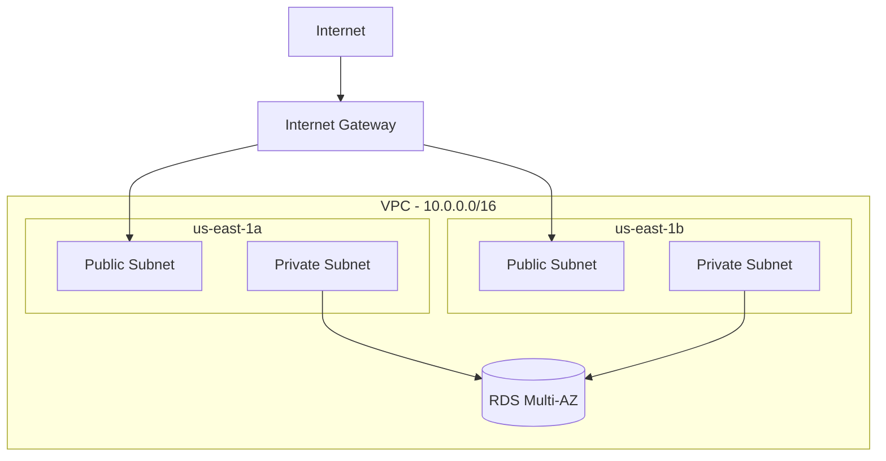

# Overview

This project demonstrates production-grade AWS infrastructure automation using CloudFormation templates. It provisions a highly available VPC across 3 availability zones with public/private subnet segmentation, Multi-AZ RDS database, and automated disaster recovery testing capabilities.

**Key technologies**: AWS CloudFormation, VPC, RDS (PostgreSQL), IAM, AWS Config, Python, Bash

**Target audience**: Platform engineers, SREs, cloud architects seeking reusable infrastructure patterns.

## Business Value

- **Repeatability**: Infrastructure defined as code, eliminating manual configuration drift
- **High Availability**: Multi-AZ design ensures 99.95% uptime SLA
- **Disaster Recovery**: Automated failover testing validates 2-minute RTO
- **Security**: Least-privilege IAM, private subnet isolation, Secrets Manager integration

## Architecture

The infrastructure follows AWS Well-Architected Framework principles:

- **VPC Design**: 10.0.0.0/16 CIDR with 3 AZs (us-east-1a/b/c)
  - Public subnets: Internet-facing resources (NAT Gateways, future ALBs)
  - Private subnets: Backend services, databases
- **Multi-AZ RDS**: PostgreSQL with automatic failover to standby replica
- **Network Segmentation**: Security groups restrict database access to private subnets only
- **Secrets Management**: Database credentials stored in AWS Secrets Manager



## How to Run

### Prerequisites
- AWS CLI v2 configured with appropriate credentials
- Python 3.9+
- Make (GNU Make 4.0+)

### Setup
```bash
git clone <repository-url>
cd projects/p01-aws-infra

# Install dependencies
make setup

# Validate CloudFormation templates
make validate
```

### Deployment
```bash
# Deploy to development environment
export AWS_REGION=us-east-1
export STACK_NAME=my-infra-dev
make deploy-dev

# Monitor stack creation
aws cloudformation describe-stack-events --stack-name $STACK_NAME
```

### Testing
```bash
# Run unit tests
make test

# Execute DR drill (force RDS failover)
./scripts/dr-drill.sh report
./scripts/dr-drill.sh failover --db-instance-id <db-id>
```

## Operations

### Dashboards & Monitoring
- **CloudFormation Events**: AWS Console → CloudFormation → Stack Events
- **RDS Metrics**: CloudWatch Dashboard (CPU, connections, storage)
- **Drift Detection**: AWS Config rules evaluate every 5 minutes

### Incident Response
See [RUNBOOK.md](../RUNBOOK.md) for detailed procedures:
- RDS down: Force Multi-AZ failover via `dr-drill.sh`
- Stack rollback failure: Continue rollback or manual resource cleanup
- Drift detected: Review AWS Config findings, remediate via stack update

### DR Drills
Monthly automated failover testing (first Friday, 9 AM ET):
1. Announce in Slack #infrastructure
2. Execute `./scripts/dr-drill.sh failover`
3. Monitor RDS events and application health
4. Document results (target RTO: <2 minutes)

## Security & Compliance

### Data Classification
- **Public**: VPC CIDR ranges, subnet IDs
- **Internal**: RDS endpoint hostnames
- **Confidential**: Database credentials (Secrets Manager only)

### Secrets Management
- **Development**: Never commit secrets to Git; use `.env.example` template
- **Production**: AWS Secrets Manager with 90-day rotation policy
- **CI/CD**: Reference secrets via GitHub Secrets → Secrets Manager ARNs

### Least Privilege
- CloudFormation execution role: scoped to VPC, RDS, IAM services
- RDS security groups: allow ingress from private subnets only
- IAM policies: deny `*:*`, allow specific actions per service

### Key Rotation
Automated via AWS Secrets Manager rotation Lambda (90-day cycle):
```bash
aws secretsmanager rotate-secret --secret-id /myapp/prod/db-password
```

## Roadmap

### Near-Term
- [ ] Integrate AWS Config drift remediation (auto-apply fixes)
- [ ] Add CloudWatch Synthetics for RDS connectivity monitoring
- [ ] Implement Infrastructure event notifications (SNS → Slack)

### Future Phases
- [ ] Multi-region replication (us-west-2 Read Replicas)
- [ ] Terraform migration for multi-cloud support (see ADR-0002)
- [ ] Automated cost optimization (right-sizing recommendations)

## Links

- **Repository**: [P01 Root](../../p01-aws-infra/)
- **Key Files**:
  - [README](../README.md) — Getting started guide
  - [RUNBOOK](../RUNBOOK.md) — Operational procedures
  - [PLAYBOOK](../PLAYBOOK.md) — Deployment and DR plays
  - [HANDBOOK](../HANDBOOK.md) — Team collaboration guide
  - [ADR-0001](../docs/ADR/0001-initial-decision.md) — Architecture decisions
- **Diagrams**: [Architecture](../docs/diagrams/architecture.mmd) | [Data Flow](../docs/diagrams/dataflow.mmd)
