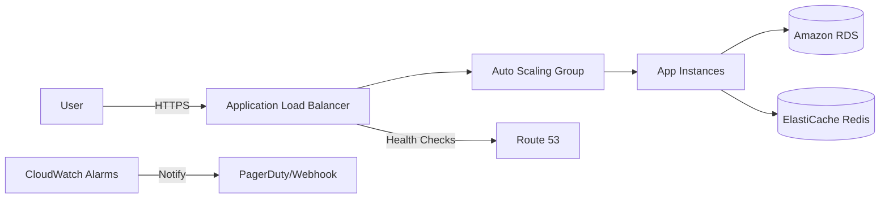
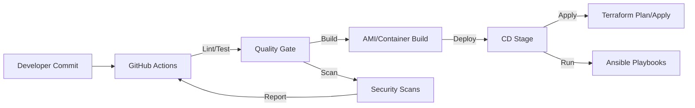
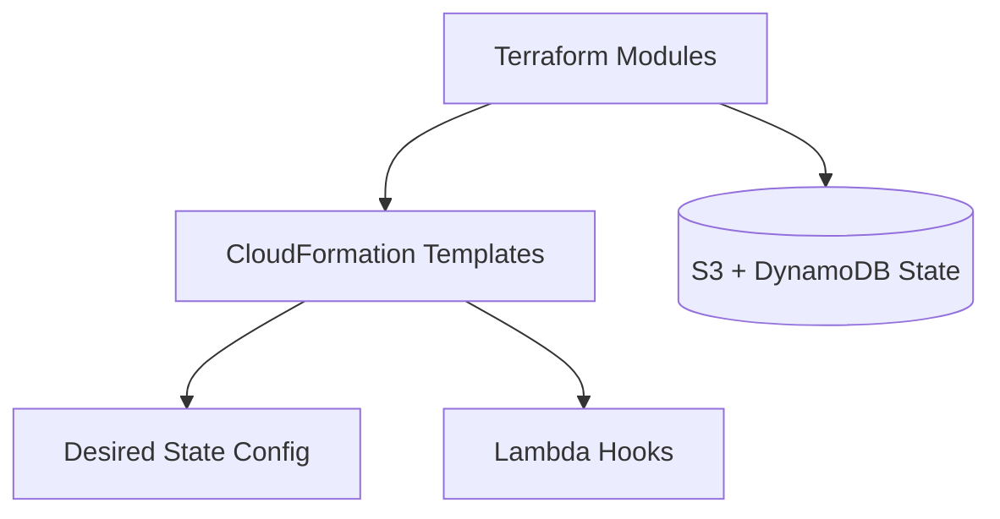

# P01 – Diagrams

## System Topology (Mermaid)


## System Topology (ASCII)
```
User --> Route53 --> ALB ==> ASG -> App Nodes -> RDS
                          \--> CloudWatch Alarms -> SNS/PagerDuty
                          \--> Redis Cache
```

## CI/CD Flow (Mermaid)


## CI/CD Flow (ASCII)
```
Dev commit -> GitHub Actions -> Lint/Test -> Security Scan -> Build Artifact -> CD Stage
        -> Terraform plan/apply -> Ansible config -> Notify
```

## IaC Layering (Mermaid)


## IaC Layering (ASCII)
```
Terraform modules -> CloudFormation stack -> Desired state configs
         |-> Remote state (S3/DynamoDB)
         |-> Lambda hooks
```
