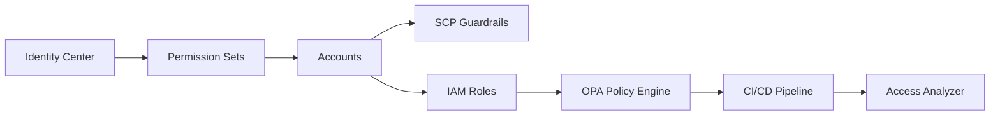

# P02 · IAM Security Hardening

**Status:** 🟠 In Progress  
**Objective:** Implement zero-trust identity and access management across AWS accounts using policy-as-code, automated reviews, and continuous compliance scanning.

---
## 📐 Architecture Snapshot

---
## 📚 Documentation
| Artifact | Description |
| --- | --- |
| [docs/HANDBOOK.md](./docs/HANDBOOK.md) | Deep-dive into IAM architecture, zero-trust principles, and policy design. |
| [docs/RUNBOOK.md](./docs/RUNBOOK.md) _(planned)_ | Operational cadence for access reviews, break-glass management, and compliance attestations. |
| [docs/PLAYBOOK.md](./docs/PLAYBOOK.md) _(planned)_ | Incident response for IAM events (compromised credentials, privilege escalation). |

