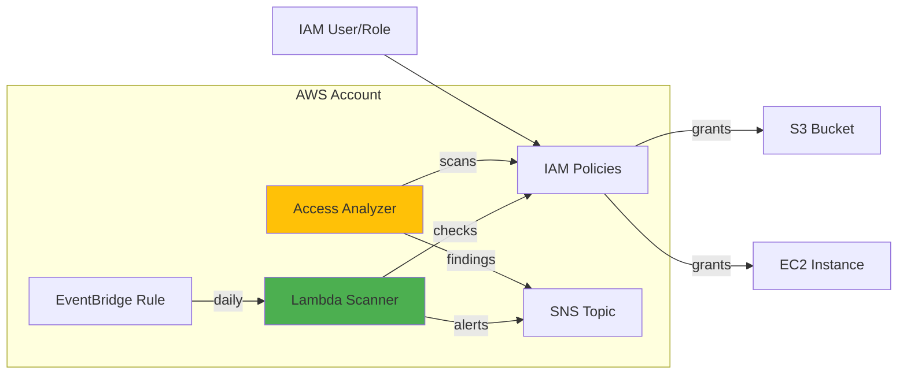

# P02 — IAM Security Hardening

## Overview
Implement least-privilege IAM policies, automated access reviews, and security best practices for AWS accounts. Demonstrates IAM policy design, AWS IAM Access Analyzer integration, and automated compliance checking for production-grade identity and access management.

## Key Outcomes
- [x] Least-privilege IAM policies for common roles (admin, developer, read-only)
- [x] Automated IAM Access Analyzer scans for overly permissive policies
- [x] Policy diff tool for change review before deployment
- [x] MFA enforcement automation
- [x] Unused credential detection and alerting

## Architecture
- **Components**: IAM policies, Access Analyzer, Lambda functions, EventBridge rules
- **Trust boundaries**: Cross-account assume role policies, external access detection
- **Dependencies**: AWS CLI, Python 3.9+, boto3, PolicySim



## Quickstart

```bash
make setup
make validate-policies
make deploy-policies
```

## Configuration

| Env Var | Purpose | Example | Required |
|---------|---------|---------|----------|
| `AWS_ACCOUNT_ID` | Target AWS account | `123456789012` | Yes |
| `AWS_REGION` | AWS region | `us-east-1` | Yes |
| `ANALYZER_NAME` | Access Analyzer name | `org-analyzer` | No (default: `default-analyzer`) |
| `ALERT_EMAIL` | Security alert recipient | `security@example.com` | Yes |

## Testing

```bash
# Validate policy syntax
make validate-policies

# Simulate policy permissions
make simulate POLICY=policies/developer-role.json ACTION=s3:GetObject RESOURCE=arn:aws:s3:::mybucket/*

# Run compliance checks
make test
```

## Operations

### Dashboards & Alerts
- **IAM Access Analyzer**: AWS Console → Access Analyzer → Findings
- **CloudWatch Metrics**: Unused credentials count, MFA non-compliance
- **Alerts**: SNS → Email for critical findings (external access, overly permissive policies)

### Common Issues & Fixes

**Issue**: Access Analyzer finding: "Bucket policy allows external access"
**Fix**: Review bucket policy, add `aws:PrincipalOrgID` condition to restrict to organization.

**Issue**: User cannot assume role (AccessDenied)
**Fix**: Verify trust policy allows user's account/principal, check MFA requirement.

## Security

### Policy Review Process
1. Create policy in `policies/` directory
2. Run `make validate-policies` to check syntax
3. Run `make policy-diff POLICY=policies/new-policy.json` to compare with existing
4. Run `make simulate` to test permissions
5. Deploy via `make deploy-policies`

### Access Analyzer Integration
Access Analyzer continuously scans for:
- External access (cross-account, public resources)
- Overly broad permissions (wildcards in actions/resources)
- Unused access (unused roles, credentials)

### SBOM
```bash
pip install cyclonedx-bom
cyclonedx-py -r -i requirements.txt -o sbom.json
```

## Roadmap

- [ ] Automated remediation for common findings (auto-revoke unused credentials)
- [ ] Integration with AWS Organizations SCPs (Service Control Policies)
- [ ] Custom IAM policy generator based on CloudTrail logs (least-privilege discovery)

## References

- [IAM Best Practices](https://docs.aws.amazon.com/IAM/latest/UserGuide/best-practices.html)
- [Access Analyzer User Guide](https://docs.aws.amazon.com/IAM/latest/UserGuide/what-is-access-analyzer.html)
- [RUNBOOK](./RUNBOOK.md) | [PLAYBOOK](./PLAYBOOK.md) | [HANDBOOK](./HANDBOOK.md)


## Code Generation Prompts

This section contains AI-assisted code generation prompts that can help you recreate or extend project components. These prompts are designed to work with AI coding assistants like Claude, GPT-4, or GitHub Copilot.

### Security Automation

#### 1. IAM Policy
```
Create an AWS IAM policy that follows principle of least privilege for a Lambda function that needs to read from S3, write to DynamoDB, and publish to SNS
```

#### 2. Security Scanning
```
Generate a Python script that scans Docker images for vulnerabilities using Trivy, fails CI/CD if critical CVEs are found, and posts results to Slack
```

#### 3. Compliance Checker
```
Write a script to audit AWS resources for CIS Benchmark compliance, checking security group rules, S3 bucket policies, and IAM password policies
```

### How to Use These Prompts

1. **Copy the prompt** from the code block above
2. **Customize placeholders** (replace [bracketed items] with your specific requirements)
3. **Provide context** to your AI assistant about:
   - Your development environment and tech stack
   - Existing code patterns and conventions in this project
   - Any constraints or requirements specific to your use case
4. **Review and adapt** the generated code before using it
5. **Test thoroughly** and adjust as needed for your specific scenario

### Best Practices

- Always review AI-generated code for security vulnerabilities
- Ensure generated code follows your project's coding standards
- Add appropriate error handling and logging
- Write tests for AI-generated components
- Document any assumptions or limitations
- Keep sensitive information (credentials, keys) in environment variables

